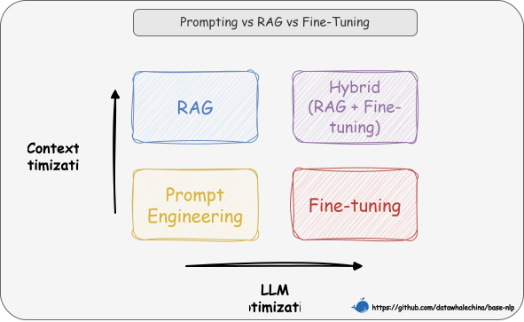

# 第四节 Qwen2.5 微调私有数据

在前几节的学习中，我们已经构建起一套完整的参数高效微调知识体系。手握“道”（PEFT 理论）与“器”（`peft` 库）之后，本节将以 Qwen2.5 模型为例，应用 QLoRA 技术进行微调实战。

在开始之前，需要先对模型有一定的了解。模型的架构范式、关键组件（如注意力机制的实现、激活函数的选择）以及预训练时采用的技巧——从根本上决定了微调的正确“姿势”。例如，在上一节对 Pythia 模型的微调中，我们在 `LoraConfig` 里指定了 `target_modules=["query_key_value", "dense"]`。这个参数并非随意设置，而是由 Pythia 模型的具体结构决定的。如果将这套配置原封不动地用于 Qwen2.5，结果很可能是失败的。基于以上讨论，下面我们先了解一下 Qwen2.5 的架构特点。

## 一、Qwen2.5 模型要点解析

Qwen2.5 是阿里巴巴开源的高性能大语言模型家族，涵盖了从 0.5B 到 72B 的多种参数规模，以满足不同场景的需求。它不仅是一个单独的模型，更是一个强大的基础平台，在其之上衍生出了 Qwen2.5-Math、Qwen2.5-Coder 等专业模型 [^1]。

在图 11-12 中展示了 Qwen 系列模型（从 Qwen1.5-72B 到 Qwen2.5-72B）的性能与其预训练数据量之间的正相关关系。随着数据规模从 3 万亿 Token 增长至 18 万亿 Token，模型在 MMLU、BBH、MBPP 和 Math 等多个关键基准测试上的得分均稳步提升。这证明，海量、高质量的预训练让 Qwen2.5 拥有了强大的通用能力。

<p align="center">
  
  <br />
  <em>图 11-12 Qwen系列模型性能随预训练数据量增长</em>
</p>

### 1.1 预训练奠定能力

Qwen2.5 强大的基础能力源于在高达 **18 万亿 Token** 的高质量、多样化数据上的预训练。这不仅是一个量的堆砌，更是在关键领域上的策略性强化：

- **通用知识**：涵盖了广泛的常识、百科知识，为模型的通用对话和理解能力奠定基础。
- **专业领域**：重点加强了 **代码** 和**数学** 相关数据的训练，使得 Qwen2.5 在这两个领域具有天然的优势。

了解模型的“学前教育”背景，能帮助我们更好地判断它是否适合我们的微调目标。

### 1.2 Decoder-only 架构

Qwen2.5 的核心是一个标准的、仅包含解码器的 Transformer 架构。它的工作方式就是给定一段文本，模型从左到右依次读取，并在每一步都尽力预测下一个最可能的 Token。

其关键架构组件与 Llama 类似，这些技术我们在 [**“手搓一个大模型”**](https://github.com/datawhalechina/base-nlp/blob/main/docs/chapter6/16_handcraft_llama2.md) 中基本已经有过介绍，可以回顾一下：

- **分组查询注意力**：在保证模型性能的同时，有效降低 KV 缓存的占用，提升长序列推理效率。
- **SwiGLU 激活函数**：作为 FFN 的非线性激活（实现上常体现为 SiLU 激活的门控前馈，模型打印时显示为 `SiLUActivation`），已被证明可以提升性能。
- **旋转位置编码**：用于对序列中的位置信息进行编码，在处理长序列时很重要。
- **RMSNorm**：在每个 Transformer 子层之前进行预归一化，以确保训练过程的稳定性。
- **QKV 偏置 (Bias)**：在注意力机制的查询（Query）、键（Key）、值（Value）投影中加入了偏置项，以增强模型表达能力。

### 1.3 分词器与对话模板

如果说模型架构是“大脑”，那么分词器和对话模板就是它与世界沟通的“语言和语法规则”。用错了规则，模型就会“误解”我们的意图。

- **分词器 (Tokenizer)**：Qwen2.5 采用 **字节级 BPE (Byte-level Byte-Pair Encoding, BBPE)** 分词器，其词表大小为 151,643。BBPE 能够有效处理多语言和未登录词。
- **对话模板 (Chat Template)**：这是指导模型理解多轮对话结构的关键。Qwen2.5 的 `tokenizer` 内置了官方推荐的模板，我们可以通过 `apply_chat_template` 方法来自动应用它。

一个典型的多轮对话，在 Qwen2.5 的模板下，会被格式化成类似下面的字符串（其中 `<|im_start|>` 和 `<|im_end|>` 是特殊 token，用于界定角色和内容的边界）：

```
<|im_start|>system
You are a helpful assistant.<|im_end|>
<|im_start|>user
你好，请介绍一下你自己。<|im_end|>
<|im_start|>assistant
你好，我是通义千问...<|im_end|>
```
这可以确保模型能正确理解“谁在说话”、“指令是什么”、“应该从哪里开始回答”。

## 二、制定 Qwen2.5 微调策略

在投入 GPU 资源开始训练之前，必须基于对模型的理解来制定微调策略。这能帮助我们明确配置、正确处理数据，并最大化微调效果。整个策略的制定，可以围绕以下四个问题展开。

1.  首先需要明确最基础的模型架构。Qwen2.5 是一个标准的 **Decoder-only** 架构，唯一的预训练任务就是 **从左到右预测下一个词 (Causal Language Modeling)**。这一“天性”决定了我们的微调必须遵循它的规则：在配置 `LoraConfig` 时，`task_type` 参数必须设为 `"CAUSAL_LM"`；同时，所有微调数据都必须被构造成 `[输入/提示] -> [期望的输出]` 的因果序列格式，让模型学习在给定“因”之后，生成我们期望的“果”。

2.  要确保我们与模型之间的“沟通语言”是正确无误的。模型通过 **分词器 (Tokenizer)** 和 **对话模板 (Chat Template)** 来理解输入。任何偏差都会导致灾难性的误解。因此，数据预处理的核心，就是将我们的原始数据，如问答对，**严格地转换** 为 Qwen2.5 的官方对话模板格式。这不仅是简单的字符串拼接，而是要使用 `<|im_start|>` 和 `<|im_end|>` 等特殊 Token，精确地构建出模型能够理解的结构化内容。最可靠的方法是调用 `transformers` 库提供的 `apply_chat_template` 函数，它能保证格式的绝对正确。

3.  我们需要决定将 LoRA 适配器“注入”到模型的哪些部位。为了最高效地影响模型的行为，我们应将目标对准其计算最密集的“核心组件”：**自注意力 (Self-Attention)** 和 **前馈网络 (FFN)** 模块。这要求我们在 `LoraConfig` 中，将 `target_modules` 参数优先指向这些模块中的线性层，例如注意力模块中的查询、键、值、输出投影层（`q_proj`, `k_proj`, `v_proj`, `o_proj`），以及前馈网络中的门控、上行和下行投影层（`gate_proj`, `up_proj`, `down_proj`）。

4.  微调策略的选择应充分利用模型的“先天优势”。微调并非从零开始，而是对一位博学的“通才”进行专业“深造”。Qwen2.5 在海量数据上进行了预训练，并在 **知识、代码和数学** 等领域得到了特别强化。这意味着模型已具备了强大的先验知识。如果我们的微调目标恰好与这些领域相关，例如构建一个特定领域的代码助手或知识问答机器人，那么 Qwen2.5 便是一个绝佳的起点。此时，微调过程将事半功倍，因为我们是在模型已有的强大能力之上，引导它去适应我们特定的任务需求。

通过以上四个方面的考量，我们对 Qwen2.5 的微调有了一个初步的规划。

## 三、构建私有微调数据集

虽然已经大致确定了微调流程，但是好像还缺点什么🤔。我们还没有数据！为了更清晰的了解整个过程，我们将不再使用已有的数据集，这次选择构建自己的私有数据集来完成整个微调过程。

### 3.1 微调前的能力评估

在投入资源微调前，必须先摸清基础模型的底细，确认微调的必要性。这里选择游戏《黑神话：悟空》进行效果测试。

> [评估完整代码](https://github.com/datawhalechina/base-nlp/blob/main/code/C11/04_qwen2.5_test.ipynb)

#### 3.1.1 加载量化模型与分词器

为了在消费级硬件上运行模型，我们选择 `Qwen2.5-7B-Instruct` 作为基础模型并以 4-bit 量化的方式加载模型和对应的分词器。

```python
import torch
from transformers import AutoModelForCausalLM, AutoTokenizer, BitsAndBytesConfig

# 定义模型 ID
model_id = "Qwen/Qwen2.5-7B-Instruct"

# 加载分词器
tokenizer = AutoTokenizer.from_pretrained(model_id)

# 定义4-bit量化配置
bnb_config = BitsAndBytesConfig(load_in_4bit=True)

# 加载模型
model = AutoModelForCausalLM.from_pretrained(
    model_id,
    quantization_config=bnb_config,
    device_map="cuda:0",
)
```

接下来可以打印一下模型实例，看看具体的网络结构。

```bash
Qwen2ForCausalLM(
  (model): Qwen2Model(
    (embed_tokens): Embedding(152064, 3584)
    (layers): ModuleList(
      (0-27): 28 x Qwen2DecoderLayer(
        (self_attn): Qwen2Attention(
          (q_proj): Linear4bit(in_features=3584, out_features=3584, bias=True)
          (k_proj): Linear4bit(in_features=3584, out_features=512, bias=True)
          (v_proj): Linear4bit(in_features=3584, out_features=512, bias=True)
          (o_proj): Linear4bit(in_features=3584, out_features=3584, bias=False)
        )
        (mlp): Qwen2MLP(
          (gate_proj): Linear4bit(in_features=3584, out_features=18944, bias=False)
          (up_proj): Linear4bit(in_features=3584, out_features=18944, bias=False)
          (down_proj): Linear4bit(in_features=18944, out_features=3584, bias=False)
          (act_fn): SiLUActivation()
        )
        (input_layernorm): Qwen2RMSNorm((3584,), eps=1e-06)
        (post_attention_layernorm): Qwen2RMSNorm((3584,), eps=1e-06)
      )
    )
    (norm): Qwen2RMSNorm((3584,), eps=1e-06)
    (rotary_emb): Qwen2RotaryEmbedding()
  )
  (lm_head): Linear(in_features=3584, out_features=152064, bias=False)
)
```

通过结构可以看到，注意力模块（`self_attn`）和前馈网络（`mlp`）中的所有线性层（如 `q_proj`, `v_proj`, `gate_proj` 等）都已被替换为 `Linear4bit`，这说明 4-bit 量化已成功应用。这些层的名称也是后续进行 LoRA 微调时需要关注的目标模块。

#### 3.1.2 定义推理函数

接着，定义一个 `chat` 函数，该函数负责将我们的提问，通过 Qwen2.5 的对话模板（Chat Template）格式化后，再送入模型进行推理。

```python
def chat(user_message, system_message="你是《黑神话：悟空》领域助手，回答准确、简明。"):
    messages = [
        {"role": "system", "content": system_message},
        {"role": "user", "content": user_message}
    ]
    
    # 应用对话模板
    text = tokenizer.apply_chat_template(
        messages,
        tokenize=False,
        add_generation_prompt=True
    )
    
    model_inputs = tokenizer([text], return_tensors="pt").to(model.device)
    
    # 模型生成
    generated_ids = model.generate(
        input_ids=model_inputs.input_ids,
        attention_mask=model_inputs.attention_mask,
        max_new_tokens=256
    )
    
    # 解码时跳过 prompt 部分
    generated_ids = [
        output_ids[len(input_ids):] for input_ids, output_ids in zip(model_inputs.input_ids, generated_ids)
    ]
    
    response = tokenizer.batch_decode(generated_ids, skip_special_tokens=True)[0]
    
    return response
```

> 你可能已经注意到，我们使用的模型 `Qwen/Qwen2.5-7B-Instruct` 带有一个 `-Instruct` 后缀。这个后缀是区分“基础模型”和“指令微调模型”的标识。
>
> *   **基础模型 (Base Model)**，如 `Qwen/Qwen2.5-7B`，是经过海量文本预训练的，擅长文本续写，但通常不直接用于对话或问答。
> *   **指令/对话模型 (Instruct/Chat Model)**，如我们使用的 `-Instruct` 版本，是在基础模型之上，用高质量的“指令-回答”数据对进行额外微调的产物。这个过程会教会模型如何遵循指令、扮演特定角色并以对话形式进行交流。
>
> 像 `Qwen2.5-Instruct` 这样的指令微调模型，它们在训练时接收的不是纯粹的文本，而是一种带有 **特殊格式的对话结构**。这就像一种“语法”，模型通过它来理解不同角色（如系统 `system`、用户 `user`、助手 `assistant`）之间的对话流程。
>
> Qwen2.5 的“语法”就包含像 `<|im_start|>` 和 `<|im_end|>` 这样的特殊标记。如果模型在推理时收到的输入不符合这个格式，它就无法很好地理解指令，也就不能产生预期的、高质量的回答。
>
> `tokenizer.apply_chat_template` 函数的作用，就是 **自动、准确地将我们输入的对话列表转换成模型训练时所使用的这种标准格式**。

#### 3.1.3 执行评估

我们向模型提出两个关于《黑神话：悟空》的问题，来检验它的知识储备。

**问题一：“我该怎么成为天命人？”**

```python
question_1 = "我该怎么成为天命人？"
answer_1 = chat(question_1)
print(f"问题: {question_1}\n回答:\n{answer_1}")
```

```text
问题: 我该怎么成为天命人？
回答:
在《黑神话：悟空》的设定中，成为天命人需要满足特定条件和经历一系列考验。具体步骤包括：

1. **选对道路**：游戏中选择正确的道路至关重要，不同道路会影响角色的发展方向。
2. **完成任务**：跟随游戏主线和支线任务，完成各种挑战和任务。
...
最终是否能成为天命人取决于玩家的选择和表现。请注意，《黑神话：悟空》尚未正式发布，上述内容基于已知的游戏设定进行推测。实际游戏中可能有所不同。
```

**问题二：“如何获得并合成出云棍？”**

```python
question_2 = "如何获得并合成出云棍？"
answer_2 = chat(question_2)
print(f"问题: {question_2}\n回答:\n{answer_2}")
```

```text
问题: 如何获得并合成出云棍？
回答:
在《黑神话：悟空》中，云棍可以通过完成特定任务和击败特定 boss 获得材料，然后在炼器炉中合成。

具体步骤如下：
1. **获取材料**：首先需要通过游戏中的特定任务或击败特定 boss 来获得制作云棍所需的材料。
...
请注意，《黑神话：悟空》目前尚未正式发布，上述信息基于游戏设定和预告片内容，具体细节可能会有所调整。
```

可以看出 `Qwen2.5-7B-Instruct` 对于《黑神话：悟空》的具体知识存在明显的 **细节缺失和偏差**，无法正确的回答关于黑猴的问题。

### 3.2 通过 LLM 构建数据集

评估完成后，我们正式进入数据集构建阶段。我们将利用一个更强大的“教师”模型，将非结构化的游戏介绍文档，自动化地加工成结构化的指令微调数据集。

> [数据构建完整代码](https://github.com/datawhalechina/base-nlp/blob/main/code/C11/04_dataset_gen.ipynb)

#### 3.2.1 初始化与配置

首先，我们进行环境配置，初始化 API 客户端，并定义输入输出路径。笔者选用的是 `Qwen/Qwen3-235B-A22B-Instruct-2507` 作为“教师模型”来生成数据，如果本地算力支持也可以在本地进行推理。

> **什么是“教师模型”？**
>
> “教师模型”指的是一个能力强大、知识渊博的大语言模型。利用它的高级推理和语言生成能力，来为我们 **自动化地生产高质量的训练数据**。
>
> 这个过程类似于聘请一位领域专家（教师），让他阅读原始材料（`blackwukong.md`），然后根据这些材料编写一本高质量的练习册（我们的 `(instruction, output)` 数据集）。这本练习册随后将被用来训练一个更专注、更小型的“学生模型”（我们微调的 Qwen2.5-7B）。通过这种方式，可以将“教师模型”的通用知识和强大能力，“蒸馏”或迁移到特定任务中，从而提升数据构建的效率和质量。

```python
import os, re, json, datetime, time, random, glob
from openai import OpenAI

# 路径与配置
DATA_DIR = "./data"
SRC_MD = f"{DATA_DIR}/blackwukong.md"
TS = datetime.datetime.now().strftime("%Y%m%d_%H%M%S")
OUT_BASE_JSONL = f"{DATA_DIR}/wukong_base_{TS}.jsonl"
OUT_JSONL = f"{DATA_DIR}/wukong_dataset_{TS}.jsonl"

# 注意：此处为演示方便，不推荐在生产环境硬编码敏感信息
BASE_URL = "https://api.siliconflow.cn/v1"
MODEL_ID = "Qwen/Qwen3-235B-A22B-Instruct-2507"
API_KEY = "sk-..." 

client = OpenAI(api_key=API_KEY, base_url=BASE_URL)
```

这里选用的是一个性能强大的 `235B` 模型作为“教师”，主要是为了最大化单次生成数据的质量，避免因模型能力不足导致需要反复调整 Prompt 或修正数据，从而节省宝贵的时间和精力。也就是“金钱换时间”。在实际应用中，可以根据自己的预算和需求，选用一个更小、更经济的模型来完成这项任务。虽然可能需要进行 Prompt 进行打磨，但同样能够生成高质量的数据集。

#### 3.2.2 读取与切分源数据

本次选取的文档 `blackwukong.md` 处理自百度百科中的“黑神话：悟空”词条。下面读取这个 Markdown 作为知识来源，并按二级或三级标题切分成不同的知识片段。

```python
with open(SRC_MD, "r", encoding="utf-8") as f:
    raw_markdown = f.read()

# 按标题切分
matches = list(re.finditer(r"(?m)^(#{2,3})\\s+(.+)$", raw_markdown))
sections = []
# ... (此处省略切分与去重逻辑) ...
for i, m in enumerate(matches):
    s = m.start()
    e = matches[i + 1].start() if i + 1 < len(matches) else len(raw_markdown)
    block = raw_markdown[s:e].strip()
    if len(block) >= 100:
        sections.append(block)
# ...
print(f"sections={len(sections)}")
```

输出如下：

```bash
sections=14
```

#### 3.2.3 生成初始问答对

我们设计的核心是 `System Prompt`，它会指导“教师”模型如何将知识片段转化为 `(instruction, output)` 问答对。

```python
SYS_PROMPT = (
    "你是《黑神话：悟空》的资深资料整理者。"
    "将给定原文片段转写为一条训练样本，严格输出JSON："
    '{"instruction":"用户问题","output":"权威完整答案"}。'
    "要求："
    "1. instruction 是自然语言问题；"
    "2. output 仅依据原文，不要臆测；"
    "3. 禁止任何额外说明或代码块。"
)
```

然后，遍历所有知识片段，调用教师模型 API 生成基础问答对，并存入 `wukong_base_{TS}.jsonl` 文件。

```python
os.makedirs(os.path.dirname(OUT_BASE_JSONL), exist_ok=True)
base_written = 0
with open(OUT_BASE_JSONL, "w", encoding="utf-8") as fbase:
    for seg in sections:
        # ... (此处省略 API 调用与重试逻辑) ...
        try:
            resp = client.chat.completions.create(
                model=MODEL_ID,
                messages=[
                    {"role": "system", "content": SYS_PROMPT},
                    {"role": "user", "content": seg},
                ],
                temperature=0.2,
                max_tokens=600,
                response_format={"type": "json_object"},
            )
            # ... (解析与写入逻辑) ...
            obj = json.loads(resp.choices[0].message.content)
            ins = (obj.get("instruction") or "").strip()
            out = (obj.get("output") or "").strip()
            if ins and out:
                fbase.write(json.dumps({"instruction": ins, "output": out}, ensure_ascii=False) + "\n")
                base_written += 1
        except Exception:
            continue

print(f"base saved: {base_written} -> {OUT_BASE_JSONL}")
```

输出如下：

```bash
base saved: 14 -> ./data/wukong_base_20251109_201117.jsonl
```

这段代码的逻辑是遍历每一个切分后的 Markdown 文本片段（`sections`），并让“教师”模型为每一个片段生成一个核心的 `(instruction, output)` 对。最后生成的 `14` 条基础问答对，与前面切分出的 `14` 个文本片段对应。

#### 3.2.4 通过数据增强生成多样化提问

为了让模型能应对各种不同的提问方式，我们对每个基础问题进行“数据增强”，让教师模型生成 14 种不同的问法（此处以 14 为例，可根据需求调整），并写入最终的数据集文件。

```python
NUM_VARIANTS = 14
written = 0
# ...
with open(IN_BASE_JSONL, "r", encoding="utf-8") as fr, open(OUT_JSONL, "w", encoding="utf-8") as fw:
    for line in fr:
        # ...
        base_q = (json.loads(line).get("instruction") or "").strip()
        answer = (json.loads(line).get("output") or "").strip()

        # 设计用于数据增强的 Prompt
        paraphrase_prompt = (
            "严格输出 JSON 对象：{\\\"paraphrases\\\": [\\\"...\\\"]}；"
            "禁止任何额外文本/代码块/前后缀。"
            "每项必须是可直接回答的等价问法..."
        )
        
        # ... (API 调用与重试逻辑) ...
        r2 = client.chat.completions.create(...)
        
        # ... (解析与写入逻辑) ...
        arr = json.loads(r2.choices[0].message.content).get("paraphrases", [])
        for s in arr:
            # ... (去重与格式化) ...
            fw.write(json.dumps({"instruction": s, "output": answer}, ensure_ascii=False) + "\n")
            written += 1
            
print(f"saved: {written} -> {OUT_JSONL}")
```

现在，我们高效地将一篇文档，加工成了一百多条指令微调数据。可能数据质量不高，不过已经能够满足使用需要。

## 四、模型微调与评估

拥有数据集后，就进入了最后的模型微调与评估阶段。我们将使用上一节生成的 `wukong_dataset_*.jsonl` 文件，对 `Qwen/Qwen2.5-7B-Instruct` 模型进行 QLoRA 微调。

[QLoRA 微调完整代码](https://github.com/datawhalechina/base-nlp/blob/main/code/C11/04_qwen2.5_qlora.ipynb)

### 4.1 QLoRA 微调

#### 4.1.1 加载数据集、分词器与模型

首先，加载所有必需的库并加载之前准备好的数据集，接着初始化 Qwen2.5 的分词器。

```python
import os, glob, json, torch
from datasets import load_dataset
from transformers import AutoTokenizer, AutoModelForCausalLM, BitsAndBytesConfig
from peft import prepare_model_for_kbit_training

# ... (路径与配置) ...

# 加载数据集
train_set = load_dataset("json", data_files=train_jsonl, split="train")

# 加载分词器，并处理 pad_token
tokenizer = AutoTokenizer.from_pretrained(checkpoint_id, trust_remote_code=True)

tokenizer.pad_token, tokenizer.eos_token, tokenizer.pad_token_id, tokenizer.eos_token_id
```

输出如下：
```bash
('<|endoftext|>', '<|im_end|>', 151643, 151645)
```

在批量训练时，需要用一个 `pad_token` 将序列填充到相同长度。所以，在加载分词器后，打印出它的关键 token 可以帮助我们确认其默认配置。通过输出可以看到，Qwen2.5 分词器自带了 padding 功能所需的所有设置：`pad_token` 被设为 `<|endoftext|>` (ID 151643)，与 `eos_token` `<|im_end|>` (ID 151645) 相区分。说明我们可以直接在后续数据处理中使用 `tokenizer.pad_token_id`。

接下来，我们着手加载模型。这部分是 QLoRA 实现的核心，分为两个步骤：

1.  **定义量化配置**：通过 `BitsAndBytesConfig`，精确地告诉 `transformers` 库如何对模型进行量化。`load_in_4bit=True` 激活 4-bit 量化；`bnb_4bit_quant_type="nf4"` 指定使用正态浮点（NormalFloat）4-bit 类型，这是一种专为正态分布权重优化的数据类型；`bnb_4bit_use_double_quant=True` 启用双重量化，进一步节省显存；`bnb_4bit_compute_dtype=torch.bfloat16` 设置计算时使用的数据类型为 `bfloat16`，以在保持精度的同时加速计算。
2.  **加载量化模型并进行预处理**：使用 `bnb_cfg` 以 4-bit 加载；随后调用 `prepare_model_for_kbit_training` 做 k-bit 训练准备（启用输入梯度/可选梯度检查点、将部分归一化层上调为 float32 提升稳定性），不改变基础权重的可训练性。

> 为帮助读者区分 LoRA 与 QLoRA 的实现差异，这里进行总结：
> 
> - **LoRA**：方法本体是冻结基础权重，仅训练注入的低秩适配器。上一节示例将其与 **8-bit** 量化加载结合，并以 FP16 训练。LoRA 本身不限定基础模型精度，也可以在 **4-bit** 量化的基础模型上使用；但当采用 NF4/双重量化等特定 4-bit 配置，并仅以 16-bit 训练适配器时，通常称为 QLoRA。
> - **QLoRA**：是在 LoRA 框架下的一套具体工程方案。标准做法是将冻结的基础权重量化为 **4-bit（常用 NF4）**，启用 **双重量化** 与 **分页优化器（PagedAdamW）**，同时仅以 **16-bit（推荐 BF16）** 训练 LoRA 适配器，以在极低显存下保持较高性能。

```python
# 4-bit 量化配置
bnb_cfg = BitsAndBytesConfig(
    load_in_4bit=True,
    bnb_4bit_quant_type="nf4",
    bnb_4bit_use_double_quant=True,
    bnb_4bit_compute_dtype=torch.bfloat16,
)
base_model = AutoModelForCausalLM.from_pretrained(
    checkpoint_id,
    trust_remote_code=True,
    quantization_config=bnb_cfg,
    device_map="cuda:0",
)

# k-bit 训练预处理
base_model = prepare_model_for_kbit_training(base_model)
```

#### 4.1.2 定义 LoRA 配置

在上一节中，我们通过手动指定模块名列表（如 `['query_key_value']`）的方式来设置 `target_modules`。这种方法精确但需要人工检查。`peft` 库为了简化这一过程，提供了一种便捷的方式。它内置了一个映射表，包含了对多种主流模型推荐的 `target_modules` 配置。可以直接从这个映射中获取针对 `qwen2` 模型的推荐值，以确保 LoRA 被应用到最关键的层上。这个映射表的源码可以在 [peft/utils/constants.py](https://github.com/huggingface/peft/blob/main/src/peft/utils/constants.py#L66)  中找到。

```python
from peft import LoraConfig, get_peft_model
from peft.utils import TRANSFORMERS_MODELS_TO_LORA_TARGET_MODULES_MAPPING

# LoRA 配置
lora_cfg = LoraConfig(
    r=16,
    lora_alpha=32,
    lora_dropout=0.05,
    bias="none",
    task_type="CAUSAL_LM",
    target_modules=TRANSFORMERS_MODELS_TO_LORA_TARGET_MODULES_MAPPING["qwen2"],
)
peft_model = get_peft_model(base_model, lora_cfg)
peft_model.print_trainable_parameters()
```

#### 4.1.3 格式化数据集

在训练前，需要将问答对数据严格按照 Qwen2.5 的对话模板进行格式化，并生成用于计算损失的 `labels`。我们只对“回答”部分计算损失，而将“问题”部分的 `labels` 设置为 `-100` 以忽略。

```python
def format_sample_for_qwen(record):
    # ... 
    # 构造不包含答案的 prompt
    msgs_no_assist = [
        {"role": "system", "content": "..."},
        {"role": "user", "content": instr},
    ]
    prompt_ids = tokenizer.apply_chat_template(msgs_no_assist, ...)

    # 构造包含答案的完整对话
    msgs_full = msgs_no_assist + [{"role": "assistant", "content": ans}]
    full_ids = tokenizer.apply_chat_template(msgs_full, ...)

    # 生成 labels，仅保留答案部分的 token
    cut = len(prompt_ids)
    labels = [-100] * cut + full_ids[cut:]

    return {"input_ids": full_ids, "labels": labels}

# 对整个数据集应用格式化函数
proc_train = train_set.map(format_sample_for_qwen, ...)
```

#### 4.1.4 定义训练器并开始训练

最后一步配置 `TrainingArguments`，实例化 `Trainer` 并开始训练。

```python
from transformers import TrainingArguments, Trainer

args = TrainingArguments(
    output_dir=run_dir, # run_dir 为动态生成的检查点目录
    per_device_train_batch_size=1,
    gradient_accumulation_steps=8,
    learning_rate=1e-3,
    num_train_epochs=4,
    lr_scheduler_type="linear",
    warmup_ratio=0.03,
    logging_steps=1,
    optim="adamw_torch",
    bf16=True, # 如果支持，优先使用 bf16
)

trainer = Trainer(
    model=peft_model,
    args=args,
    train_dataset=proc_train,
    data_collator=collator,   # collator 为自定义的数据整理器
)

# 开始训练并保存 LoRA 适配器
train_output = trainer.train()
peft_model.save_pretrained(run_dir)
```

可以看到这里使用了 `bf16=True` 这个参数。它用于启用 **BFloat16 混合精度训练**。与常规的 FP16 相比，BF16 拥有与 FP32 几乎相同的动态范围，但在精度显存节省和计算加速，又能有效上有所牺牲。这一特性使得 BF16 在现代 GPU（如 NVIDIA Ampere 架构及更新版本）上进行深度学习训练时，既能享受到混合精度带来的避免 FP16 中常见的梯度下溢（vanishing gradients）问题，从而让训练过程更加稳定。因此，如果硬件支持，`bf16` 是比 `fp16` 更优先的选择。

### 4.2 效果评估与迭代

微调完成后，用同样的问题再次进行测试，检验微调的成果。

```python
peft_model.eval()
TEST_QUERIES = [ "我该怎么成为天命人？", "如何获得并合成出云棍？" ]

@torch.no_grad()
def infer_one(question: str) -> str:
    # ...（推理逻辑，构造prompt并调用 peft_model.generate）
    return tokenizer.decode(out_ids, skip_special_tokens=True).strip()

for q in TEST_QUERIES:
    ans = infer_one(q)
    print(f"Q: {q}\nA: {ans}\n" + "-" * 60)
```

```bash
Q: 我该怎么成为天命人？
A: 想要成为天命之人，首先你需要收集“部分灵根”，然后在特定地点（如石卵处）激活它们，之后才能解锁通往黄风岭、狼烟堡等地点的通行权，并进行后续剧情。
------------------------------------------------------------
Q: 如何获得并合成出云棍？
A: 在“黄风岭-挟魂崖”找到6个佛目珠后，前往“挟魂崖-枕石坪”BOSS石先锋所在区域，使用佛目珠召唤并击败BOSS石敢当，获得材料“铁石心”，之后即可解锁铸造出云棍。
------------------------------------------------------------
```

通过这个结果可以看出微调效果显著。模型成功地“吸收”了投喂的游戏知识，能够准确回答游戏相关问题。需要提醒的是，本例侧重演示流程，未系统控制过拟合风险。若数据量较小、训练步数/学习率设置不当，模型可能对训练样例“背题记忆”。

## 五、何时选择微调

我们已经完成了微调的初步学习，但何时需要进行微调呢？整个技术选型路径应遵循成本效益原则，从低到高依次为**提示词工程 (Prompt Engineering) -> 检索增强生成 (RAG) -> 微调 (Fine-tuning)**。

我们可以从两个维度来理解这些技术的区别。如图 11-13 所示，**横轴代表“LLM 优化”**，即对模型本身进行多大程度的修改。从左到右，优化的程度越来越深，其中提示工程和 RAG 完全不改变模型权重，而微调则直接修改模型参数。**纵轴代表“上下文优化”**，是对输入给模型的信息进行多大程度的增强。从下到上，增强的程度越来越高，其中提示工程只是优化提问方式，而 RAG 则通过引入外部知识库，极大地丰富了上下文信息。

<p align="center">
  
  <br />
  <em>图 11-13 技术选型路径图</em>
</p>

基于这个框架，我们的选择路径就很清晰了。我们应先尝试成本最低的“上下文优化”策略，通过精心设计提示词来引导模型，适用于任务简单、模型已有相关知识的场景。如果模型缺乏特定或实时知识而无法回答，下一步应尝试使用 RAG，通过外挂知识库为大模型提供上下文信息。这两种方法的核心是“引导”和“提供知识”，能解决大部分问题，但无法从根本上改变模型的“行为”或“技能”。

当上述方法都无法满足需求时，就需要成本较高也是效果最好的微调登场。微调通过在高质量示例上继续训练，直接修改模型权重，从根本上重塑其能力。它并非用于灌输新知识（这是 RAG 的强项），而是用于传授特定的“技能”或“行为模式”。例如，让模型学会严格遵循某种独特的输出格式（如特定的 JSON 结构）、模仿特定人物的对话风格、深度适配某个专业领域的“行话”，或者将极其复杂的指令“蒸馏”进模型权重中以优化 API 调用。总结而言，当我们的目标是改变模型“如何做”而不是“知道什么”时，微调就是最终且最合适的选择。

## 六、本章小结

本章系统性地探讨了参数高效微调（PEFT）技术，从理论基础到实战应用，构建了一幅完整的知识图景。我们从大模型时代全量微调所面临的成本、存储与稳定性三大困境出发，引出了 PEFT 这一核心解决方案。

我们的探索遵循着 PEFT 技术的发展脉络：
1.  **作用于激活值的“加法”思路**：我们首先学习了以 **Adapter Tuning** 为代表的早期方法，它通过在模型内部插入小型“适配器”模块来适应新任务。随后，我们转向了更为非侵入式的 **Prompt Tuning** 及其演进，包括 **Prefix-Tuning** 和 **P-Tuning v2**。这些方法的核心思想是在不触碰原始模型权重的前提下，通过添加可学习的“软提示”来引导模型的行为，影响其激活值。
2.  **重参数化权重的“手术刀”思路**：接着，我们深入研究了当前社区最主流的 **LoRA** 技术。它另辟蹊径，不再“绕道”激活值，而是基于“权重更新低秩”的假设，直接通过低秩分解来模拟权重更新矩阵，实现了性能与效率的平衡，并解决了 Adapter 的推理延迟问题。我们还进一步学习了其两大重要变体：引入SVD思想和重要性评分机制、实现参数预算动态分配的 **AdaLoRA**；以及通过4-bit量化、双重量化和分页优化器等技术，将显存效率推向极致的 **QLoRA**。

在掌握了理论之后，我们将目光投向实践。我们学习了如何利用 Hugging Face 的 `peft` 库，它通过 `PeftConfig` 和 `get_peft_model` 等简洁的接口，将复杂的 PEFT 技术标准化，大大降低了应用门槛。通过对 `pythia-2.8b` 模型的 LoRA 微调实战，我们完整地走过了从加载量化模型、配置 LoRA 参数，到数据处理和使用 `Trainer` 进行训练的全过程。

最后，在 Qwen2.5 的 QLoRA 微调案例中，我们将所有知识融会贯通。这个案例不仅是一个综合性的实战，更强调了**模型理解**在微调策略制定中的地位——只有深入了解模型架构（如注意力模块构成）、分词器和对话模板，才能正确地设置 `target_modules` 和处理数据。同时，我们还实践了如何利用“教师模型”高效构建私有数据集，并最终通过微调，让模型掌握了特定领域的专业知识，验证了 PEFT 技术的强大威力。

在结束本章时，我们还建立了一个技术选型的决策框架，**提示词工程 -> RAG -> 微调**。应优先尝试成本最低的提示工程；当模型缺乏知识时，采用 RAG 为其“开卷考试”；只有当目标是改变模型的“行为模式”、传授“技能”（如遵循特定格式、模仿特定风格）时，才是微调登场的最佳时机。PEFT 不仅仅是一系列节约资源的技术，更是一种全新的、与大模型高效协作的范式，它让每一位开发者都有机会驾驭大模型的强大力量。

## 参考文献

[^1]: [Qwen Team. (2024). *Qwen2.5 Technical Report*. arXiv preprint arXiv:2407.10671.](https://arxiv.org/abs/2407.10671)
