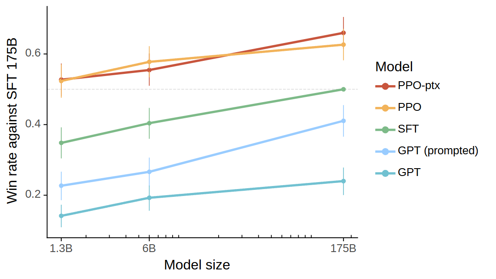
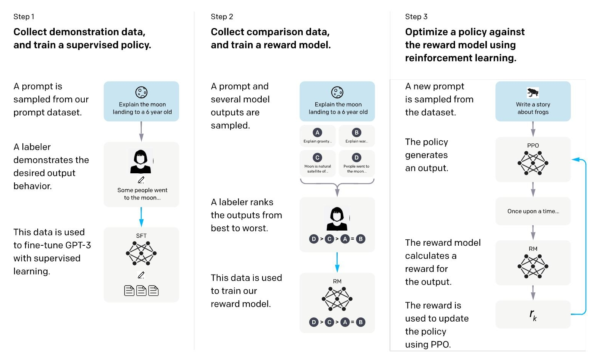
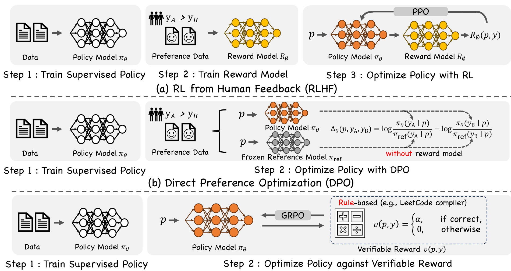
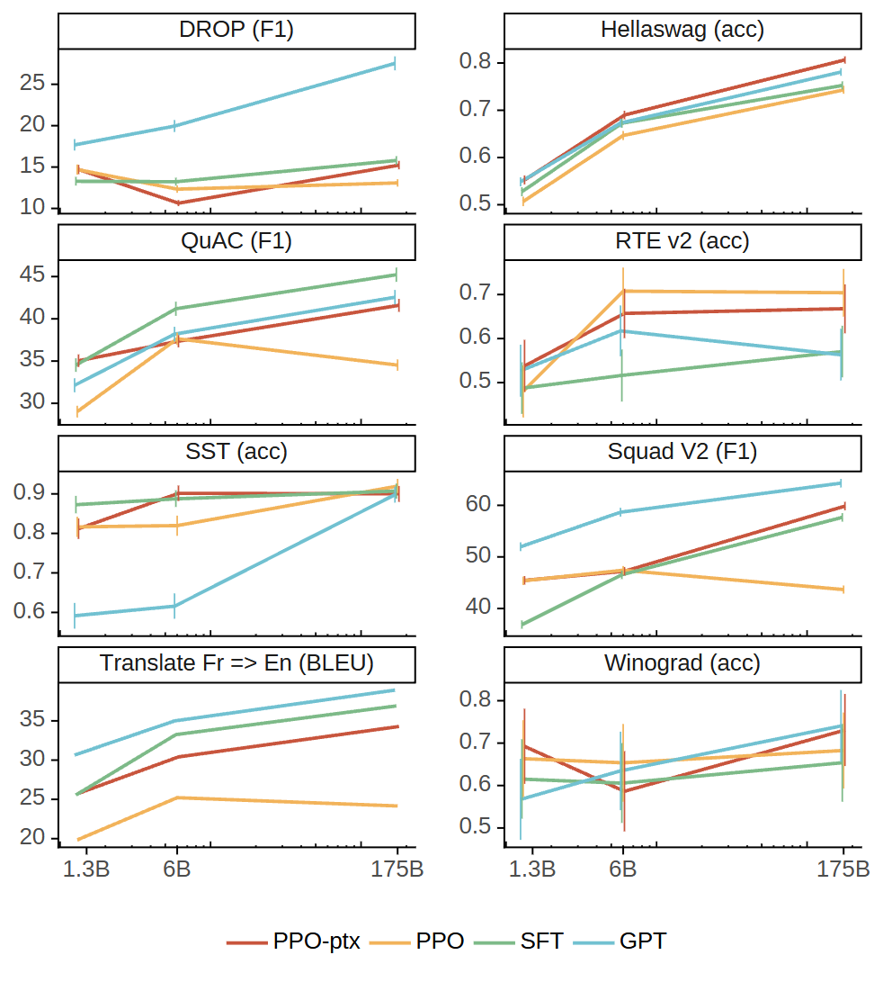
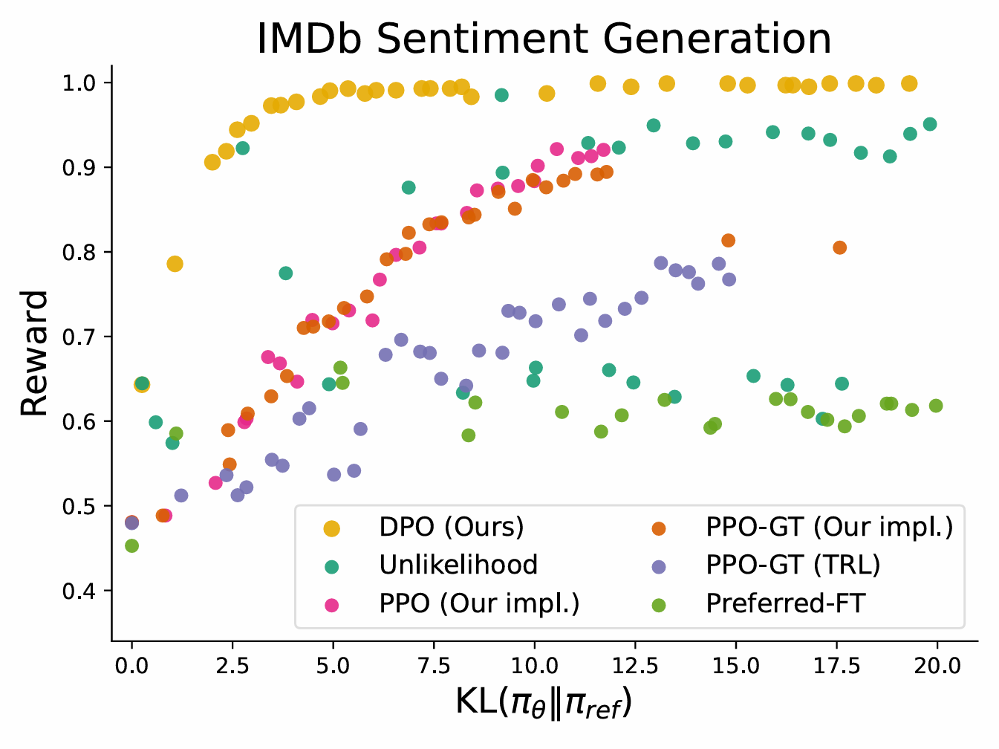
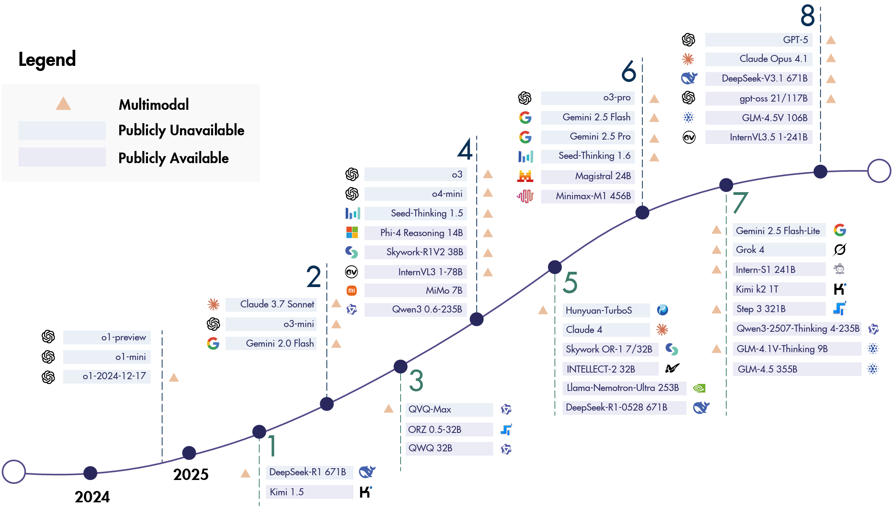

# 第一节 RLHF 技术详解

通过前面的学习，我们已经知道如何通过 PEFT，用较低的成本让大语言模型适应下游任务。无论是 PEFT 还是全量微调，主要方法大多是**有监督微调（Supervised Fine-tuning, SFT）**，即用成对的“(指令, 回答)”数据来训练模型。但是，SFT 存在一个重要的局限。它教会模型**模仿**高质量的范例，但无法让模型理解**人类的偏好**。一个 SFT 模型或许能很好地回答“中国的首都是哪里？”，但当面对更开放、更复杂的指令，如“为我的项目写一个既专业又有创意的介绍”时，SFT 的局限性就暴露无遗：

- **缺乏泛化能力**：模型只能很好地响应数据集中出现过的指令模式，无法覆盖用户千奇百怪的真实意图。
- **“对齐”不足**：模型的回答可能在事实上正确，但在风格、语气、安全性或有用性上，并不符合人类的期望。它只知道“正确答案”，却不知道“更好的答案”。

## 一、模型对齐的必要性

为了跨越从“遵循指令”到“理解偏好”的鸿沟，我们需要一种新的训练范式。**基于人类反馈的强化学习（Reinforcement Learning from Human Feedback, RLHF）** 正是解决这一问题的关键技术。它的核心目标就是让模型超越简单的模仿学习，真正理解并内化人类复杂的价值观，使其输出更符合我们的期望。

表 12-1 总结了 SFT 与 RLHF 在核心理念与实现方式上的关键差异：

<table border="1" style="margin: 0 auto;">
<tr>
  <td style="text-align: center;"><strong>对比维度</strong></td>
  <td style="text-align: center;"><strong>监督微调 (SFT)</strong></td>
  <td style="text-align: center;"><strong>人类反馈强化学习 (RLHF)</strong></td>
</tr>
<tr>
  <td style="text-align: center;"><strong>核心目标</strong></td>
  <td style="text-align: center;">模仿正确答案（指令遵循）</td>
  <td style="text-align: center;">对齐人类偏好（有用/无害/诚实）</td>
</tr>
<tr>
  <td style="text-align: center;"><strong>数据需求</strong></td>
  <td style="text-align: center;">高质量的 <code>(指令, 回答)</code> 对</td>
  <td style="text-align: center;">提示词 <code>(Prompt)</code> + 偏好排序/评分</td>
</tr>
<tr>
  <td style="text-align: center;"><strong>学习方式</strong></td>
  <td style="text-align: center;">填鸭式教学（拟合分布）</td>
  <td style="text-align: center;">探索式学习（试错与反馈）</td>
</tr>
<tr>
  <td style="text-align: center;"><strong>优化信号</strong></td>
  <td style="text-align: center;">Token 级预测概率（交叉熵）</td>
  <td style="text-align: center;">整句生成质量评分（标量奖励）</td>
</tr>
<tr>
  <td style="text-align: center;"><strong>泛化能力</strong></td>
  <td style="text-align: center;">局限于训练数据分布</td>
  <td style="text-align: center;">可泛化到未见过的复杂指令</td>
</tr>
</table>

<em>表 12-1 SFT 与 RLHF 核心差异对比</em>

如图 12-1 所示，RLHF 的有效性在实践中得到了强有力的验证。在 InstructGPT 的研究中 [^1]，经过 RLHF 对齐后，仅有 13 亿参数的模型，在人类评估中的表现甚至超过了 1750 亿参数的原始 GPT-3 模型。这说明，让模型“懂”人类偏好，比单纯增加参数规模更能提升其实用性。

  
   
  <em>图 12-1 InstructGPT 与 GPT-3 人类偏好对比</em>

## 二、通往对齐模型的三大阶段

在实践中，对齐训练通常划分为三个阶段，分别面向通用语言能力、指令遵循与偏好对齐：

### 2.1 基础模型预训练

在大规模（万亿级 Token）无标注文本数据（网页、书籍、代码等）上进行自回归预训练。

-   **目标**：预测下一个词。
-   **结果**：得到基础语言模型，具备广泛的语料知识和生成能力，但未进行指令/偏好对齐。
-   **成本与难点**：训练成本高，且需在超大规模数据与模型上保证稳定收敛。

### 2.2 有监督指令微调

使用少量（千到几万条）高质量“指令-回答”对，对基础模型进行有监督微调，使其学会理解并执行人类指令。

**目标**：在指令上下文中进行条件生成，提升指令遵循与任务完成能力。  
**数据**：常见格式为 `(prompt, response)` 对，可结合 QLoRA 等参数高效化技术构造与训练。  
**输出**：获得“指令模型”（Instruction-tuned LM），在指定任务与约束条件下更可控。

#### 2.2.1 SFT 数据集分类

高质量的 SFT 数据集是模型能力养成的关键。根据目标的不同，数据集可以分为两类：

1.  **任务型指令数据集**：如 `WizardLM Evol‑Instruct 70k` (AI 生成) 和 `Dolly-15k` (专家编写)，它们主要由单轮的“指令-回答”构成，核心目标是教会模型如何“做事”，准确地遵循指令完成特定任务。

2.  **对话型数据集**：这类数据集的代表作就是 **OpenAssistant (OASST)**。它专注于教会模型如何“聊天”，其独特性和重要性体现在：
    *   **来源真实且多样**：数据由超过 1.3 万名真实志愿者众包贡献，覆盖了广泛的话题和真实的语言风格，而非 AI 生成或专家编写的固定模式。
    *   **专注于多轮对话**：OASST 的核心是**多轮对话树**，完整记录上下文、分支和用户的追问。这对于训练模型理解上下文、进行连贯的长对话至关重要。
    *   **丰富的反馈信号**：数据不仅包含对话文本，还有人工标注的质量评分和多种标签（可作为偏好学习/奖励建模的有益信号）。这使其不仅是优秀的 SFT 数据，也是训练奖励模型（Reward Model）、进行 RLHF 的宝贵材料。

简单来说，任务型数据集教会模型“智商”，而以 OASST 为代表的对话型数据集则赋予模型“情商”，使其更接近一个真正能与人交流的智能助手。

### 2.3 基于人类反馈的强化学习

该阶段基于人类偏好信号进一步优化策略，不再依赖固定的“标准答案”，而是让模型学习“更被偏好”的行为模式。

1. **目标**：在“有用性（helpfulness）”“无害性（harmlessness）”“诚实性（honesty）”等维度实现与人类偏好的对齐。  
2. **方法**：采用强化学习框架，以奖励模型提供的标量奖励或等价的偏好约束为信号，优化语言模型策略。

## 三、RLHF 的形式化定义

在深入具体步骤之前，我们需要理解为什么文本生成任务可以被建模为强化学习问题。在 RLHF 框架中，将 Token 生成过程建模为 **“片段的（Episodic）马尔可夫决策过程（MDP）”** 是连接 NLP 与 RL 的核心桥梁。

这个“片段”特指“从接收用户提示到生成完整输出”的单次生成任务。

- **状态 (State, $s_t$)**：当前已生成的上下文，包括用户提示 $x$ 和已生成的 Token 序列 $y_{<t}$。即 $s_t = (x, y_1, ..., y_{t-1})$。
- **动作 (Action, $a_t$)**：模型在当前时间步生成的下一个 Token $y_t$。
- **策略 (Policy, $\pi_\theta$)**：即我们的大语言模型。$\pi(a_t|s_t)$ 对应模型在当前上下文下预测下一个 Token 的概率分布。
- **奖励 (Reward, $R$)**：通常在整个回答生成完毕（Episode 结束）后，由奖励模型给予一个标量反馈 $R(x, y)$。中间步骤的奖励通常为 0。

在这个定义下，RLHF 的目标就是寻找一个最优策略 $\pi_\theta$，使得生成的完整序列期望奖励最大化：

$$
\max_\pi \mathbb{E}_{x \sim \mathcal{D}, y \sim \pi(\cdot|x)} [R(x, y)]
$$

理解了这一形式化定义，我们就能明白为什么 PPO 等算法可以通过试错（Sampling）和反馈（Reward）来调整模型参数，从而让模型生成的“轨迹”（文本）更符合人类偏好。

## 四、RLHF 的核心步骤

如图 12-2 所示，RLHF 的流程主要包含三个核心步骤。首先通过有监督微调得到初始策略模型；然后，收集人类偏好数据训练一个奖励模型；最后，使用奖励模型作为信号，通过强化学习算法（如 PPO）进一步优化策略模型。

  
   
  <em>图 12-2 RLHF 经典三步法示意图</em>

### 4.1 训练奖励模型 (Training a Reward Model, RM)

在 RLHF 中，我们需要一个“裁判”，用来评判模型的哪个回答更好；这个“裁判”就是奖励模型（RM）。RM 的目标是学习一个函数 $r(x, y)$，输入提示 $x$ 和回答 $y$，输出一个标量分数，代表人类对该回答的偏好程度。在 InstructGPT 的实践中，RM 数据集约含 33k 个训练提示（由此衍生出数量级更大的成对比较样本）。接下来，分别介绍一下如何收集人类偏好数据，以及训练奖励模型。

#### 4.1.1 收集人类偏好数据

第一步需要准备一个指令（prompt），可从真实用户请求中选取，也可由标注员设计；让 SFT 模型针对该指令生成多个（InstructGPT 中为 4-9 个）不同的回答；由人工标注员对这些回答进行**排序（Ranking）**，从最好到最差。相比于给每个回答打一个绝对分数，排序是一种对人类更友好、也更一致的标注方式。这些排序数据构成了偏好数据集 $\mathcal{D} = \{(x, y_w, y_l)\}_{i=1}^N$，其中 $y_w$ 是比 $y_l$ 更受偏好的回答 (winner)，$y_l$ 是较差的回答 (loser)。

#### 4.1.2 训练奖励模型

训练奖励模型的常见做法包括以下几点。

-   将一个包含 K 个回答的排序数据，转换成 $\binom{K}{2}$ 个成对的比较数据。例如，(回答A > 回答B)、(回答A > 回答C)、(回答B > 回答C)...

-   奖励模型（RM）通常和我们正在优化的语言模型结构类似（但可以小得多），它的任务不是生成文本，而是**输入 `(prompt, response)`，输出一个标量分数 `reward`**。

-   训练 RM 的目标是，让它给人类偏好的回答打出更高的分数。这通常基于 **Bradley-Terry 模型**，该模型假设人类对两个回答的偏好概率可以用它們的潜在奖励分数通过 Sigmoid 函数来建模：

    $$
    P(y_w \succ y_l | x) = \sigma(r(x, y_w) - r(x, y_l))
    $$
    
    其损失函数（负对数似然）如下：

    $$
    \text{loss}(\theta) = - \mathbb{E}_{(x, y_w, y_l) \sim \mathcal{D}} \left[ \log(\sigma(r_\theta(x, y_w) - r_\theta(x, y_l))) \right]
    $$

    其中 $r_\theta$ 是奖励模型，$y_w$ 是比 $y_l$ 更受偏好的回答，$\sigma$ 是 Sigmoid 函数。这个损失函数旨在最大化偏好回答与非偏好回答之间的分数差距。

经过训练，RM 能够逼近人类偏好函数，作为自动化的偏好评估器，为后续策略优化提供稳定的标量奖励信号。

### 4.2 使用策略优化算法微调模型

有了“裁判”（或者隐式的偏好信号），就可以开始真正的“强化学习”训练了。这个阶段的目标是更新语言模型的**策略**，使其生成的回答能够获得更高的奖励。

传统的强化学习算法存在高方差、训练不稳定的问题。因此，学术界和工业界发展出了一系列更先进的策略优化算法，其中 PPO、DPO 和 GRPO 是目前的主流。

如图 12-3 所示，不同的对齐范式在流程设计上有所侧重。经典的 **RLHF** 范式依赖奖励模型和 PPO 进行在线优化；**DPO** 直接基于偏好数据进行离线优化；而 **RLVR** 则利用确定性的验证器（如代码执行器）结合 **GRPO** 进行训练。

  
   
  <em>图 12-3 不同强化学习对齐范式的对比（RLHF / DPO / RLVR）</em>

#### 4.2.1 PPO 与“对齐税”

**近端策略优化（Proximal Policy Optimization, PPO）** 是 RLHF 中最经典的算法 [^2]。PPO 的主要思路是，在尝试最大化奖励的同时，通过一个约束项来限制新旧策略的差异范围，继而避免单步更新过大导致训练崩溃。它通过优化一个“替代目标函数”（Surrogate Objective）来实现这一点。PPO 最常用的替代目标是 **Clipped Surrogate Objective**:

$$
L^{CLIP}(\theta) = \hat{\mathbb{E}}_t \left[ \min\left(r_t(\theta)\hat{A}_t, \text{clip}(r_t(\theta), 1-\epsilon, 1+\epsilon)\hat{A}_t\right) \right]
$$

其中，$r_t(\theta) = \frac{\pi_\theta(a_t|s_t)}{\pi_{\theta_{\text{old}}}(a_t|s_t)}$ 是新旧策略的概率比，$\hat{A}_t$ 是优势函数估计，$\epsilon$ 是一个限制更新范围的超参数（通常为 0.2）。这个裁剪操作有效地构建了一个悲观的下界，防止策略更新过于激进。

如图 12-4 是 PPO 裁剪代理目标函数 $L^{CLIP}$ 的单步示意图。当优势 $\hat{A}_t>0$ 时（左），目标函数随概率比 $r_t(\theta)$ 的增加而增加，但增长被限制在 $1+\epsilon$ 处；当 $\hat{A}_t<0$ 时（右），目标函数随 $r_t(\theta)$ 的增加而减小，但减小幅度被限制在 $1-\epsilon$ 处，从而约束了策略更新的步长。

  
   
  <em>图 12-4 PPO 的裁剪代理目标函数</em>

但研究者发现，单纯用 PPO 优化奖励模型，可能会导致模型在某些传统 NLP 任务（如 SQuAD）上的性能下降，这种现象被称为 **“对齐税”（Alignment Tax）**。

为了解决这个问题，InstructGPT 提出了一种名为 **PPO-ptx** 的变体，它在优化奖励的同时，混合了一部分预训练数据的梯度，其优化目标为：

$$
\text{objective}(\phi) = \mathbb{E}_{(x, y) \sim D_{\pi_\phi^{RL}}} [r_\theta(x, y) - \beta \log(\pi_\phi^{RL}(y|x) / \pi^{SFT}(y|x))] + \gamma \mathbb{E}_{x \sim D_{pretrain}}[\sum_t \log(\pi_\phi^{RL}(x_t|x_{<t}))]
$$

其中：
-   PPO 主目标项（奖励 + KL 约束）：在当前策略生成的数据分布 $D_{\pi_\phi^{RL}}$ 上，最大化奖励模型分数 $r_\theta(x,y)$，并用每 token KL 约束惩罚新策略 $\pi_\phi^{RL}$ 偏离参考模型 $\pi^{SFT}$，以抑制灾难性漂移。

-   预训练保留项（ptx）：在预训练语料 $D_{pretrain}$ 上进行最大似然学习 $\sum_t \log \pi_\phi^{RL}(x_t|x_{<t})$，用于保留通用语言能力与知识面，缓解“对齐税”。

-   符号说明：$\beta$ 控制 KL 约束强度；$\gamma$ 控制 ptx 项权重；$D_{\pi_\phi^{RL}}$ 为在线由当前策略采样的数据分布；$D_{pretrain}$ 为静态预训练语料；KL 为每 token KL 散度。

通过图 12-5 可以看到 PPO-ptx 缓解了 RLHF 在部分公开 NLP 数据集上的性能下降（对齐税）问题。图中 PPO-ptx 模型（红色）代表混合了预训练梯度，而 PPO 模型（橙色）则没有。在 SQuADv2、DROP 等多个任务上，PPO-ptx 的性能显著优于单纯的 PPO。

  
   
  <em>图 12-5 PPO-ptx 缓解对齐税</em>

#### 4.2.2 直接偏好优化

尽管 PPO 效果很好，但它流程复杂（需要训练奖励模型、价值模型，并进行在线采样），训练成本高且不稳定。**直接偏好优化（Direct Preference Optimization, DPO）** 是一项创新的技术 [^3]，它巧妙地绕过了显式的奖励模型训练和复杂的强化学习过程。

-   **主要思路**：DPO 证明了，我们可以从人类偏好数据 $\mathcal{D} = \{(x, y_w, y_l)\}$ 中，直接推导出最优策略，而无需先拟合一个奖励模型。它将问题转化为一个简单的分类任务，**不需要显式训练奖励模型，也无需在线采样**，所以更稳定、高效。

-   **优化目标**：
    DPO 的损失函数直接最大化模型对“更好”回答的偏好概率，同时用 KL 散度进行约束：

    $$
    \mathcal{L}_{\text{DPO}}(\pi_\theta; \pi_{\text{ref}}) = - \mathbb{E}_{(x, y_w, y_l) \sim \mathcal{D}} \left[ \log \sigma \left( \beta \log \frac{\pi_\theta(y_w|x)}{\pi_{\text{ref}}(y_w|x)} - \beta \log \frac{\pi_\theta(y_l|x)}{\pi_{\text{ref}}(y_l|x)} \right) \right]
    $$

    其中 $\pi_{\text{ref}}$ 是参考模型（通常是 SFT 模型），$\sigma$ 是 Sigmoid 函数。这个损失函数简洁地鼓励模型提高 $y_w$ 的概率，降低 $y_l$ 的概率。

-   **训练动力学**：DPO 的梯度更新有一个直观的解释。它会给那些**被隐式奖励模型错误排序的样本（即认为 $y_l$ 比 $y_w$ 更好）更大的权重**，从而集中火力修正模型的“判断失误”。这个隐式奖励由下式定义：
    $$
    \hat r_\theta(x,y)=\beta \log \frac{\pi_\theta(y|x)}{\pi_{\mathrm{ref}}(y|x)}
    $$

-   **优势**：由于其简单、稳定且高效，DPO 及其变种正在迅速成为 RLHF 的新范式。

如图 12-6，该图展示了在 IMDb 情感生成任务中，不同偏好学习算法的 Reward-KL 效率前沿。DPO（黄色散点）在所有 KL 散度值上都获得了最高的期望奖励，表明 DPO 能够更有效地在最大化奖励和与参考模型的 KL 散度约束之间进行权衡，其优化效果优于 PPO 等基线方法。

  
   
  <em>图 12-6 DPO 与 PPO 的 Reward-KL 效率前沿对比</em>

#### 4.2.3 群体相对策略优化

**群体相对策略优化（Group Relative Policy Optimization, GRPO）** 是 DeepSeek 在 2024 年发布的 DeepSeekMath 中提出的一种高效算法 [^4]。此时 DPO (2023) 虽已流行，但主要用于偏好对齐；而在数学、代码等**带可验证奖励（Reinforcement Learning with Verifiable Rewards, RLVR）**的场景中，模型更需要通过在线探索（Online Exploration）来寻找正确路径，而非仅仅拟合静态数据。

**RLVR 的核心逻辑**是用确定性的验证器（Validator）取代主观的奖励模型（如通过代码测试用例 $v(x, y) \in \{0, 1\}$ 直接判断正误）。这种强反馈消除了 Reward Hacking 中“欺骗人类”的可能性，并驱动模型通过**自我博弈（Self-Play）**涌现出思维链（CoT）等高级推理能力。然而，传统的 PPO 算法需要维护一个与策略模型规模相当的价值网络（Critic），在训练千亿参数模型时显存开销巨大。

GRPO 的核心创新在于 **“去 Critic 化”**，它通过组内统计量来替代 Critic 的基线估计功能：

-   **组采样 (Group Sampling)**：对于同一个提示词 $x$，利用旧策略 $\pi_{\theta_{old}}$ 采样生成一组输出 $\{y_1, y_2, ..., y_G\}$。

-   **组内优势估计 (Group Relative Advantage)**：利用奖励模型或验证器对这组输出打分。关键在于，GRPO 不使用额外的 Critic 来预测基线，而是直接使用**组内奖励的均值**作为动态基线。这种方法不仅显著降低了显存占用（无需维护与策略模型同等规模的 Critic），还有效利用了组内对比来降低方差。对于每个输出，其优势 $A_i$ 通常通过标准化计算得出：

    $$
    A_i = \frac{r_i - \text{mean}(\{r_1, ..., r_G\})}{\text{std}(\{r_1, ..., r_G\})}
    $$

-   **KL 散度正则化**：与 PPO 通常在奖励函数中直接扣除 KL 惩罚不同，GRPO 将 KL 散度 $D_{KL}(\pi_\theta || \pi_{ref})$ 直接加入损失函数中作为正则项。这样做的好处是保持了优势估计的纯粹性，使其仅反映组内输出的相对好坏，而不会被 KL 惩罚项混淆。

通过这种设计，GRPO 既保留了 PPO 在线探索的能力（适合推理任务），又享受了类似 DPO 的低资源消耗，成为 DeepSeek-R1 等推理模型背后的关键技术。

如图 12-7 所示的时间线展现了使用强化学习训练的代表性推理模型的发展。这一过程囊括了各类开源与闭源的语言模型、多模态模型以及智能体模型。其中，OpenAI o1 与 DeepSeek-R1 作为推理模型领域的关键里程碑，有力证明了可验证奖励训练的重要性。通过这种训练，模型得以掌握包括规划、反思及自我纠错在内的长链推理能力。

  
   
  <em>图 12-7 基于强化学习训练的推理模型</em>

#### 4.2.4 算法选择指南

- **PPO（稳定性与通用性）**: PPO 适用于各类需与环境交互的通用任务（如游戏 AI、机器人控制）。在 LLM 领域，当你的系统已经有了成熟的 RL 框架，或者需要对模型行为进行**极细粒度的控制**（如复杂的指令遵循、多轮对话策略）时，PPO 仍然是首选。它通过显式的 Critic 模型进行价值估计，能够处理更复杂的奖励信号，但计算成本较高。

- **DPO（效率与数据利用）**: DPO 是**样本数据稀缺**或**追求高训练效率**场景下的利器。由于它绕过了显式的奖励建模和在线采样，直接利用离线偏好数据进行优化，因此非常适合快速迭代或计算资源有限的项目（如对话风格微调、摘要生成）。它能高效利用有限的标注数据，但在缺乏大规模探索的情况下，上限可能不如 RL 方法。

- **GRPO（推理与长序列奖励）**: 针对**奖励常在序列末尾给出**（如数学最终答案、代码运行结果）的场景，GRPO 是最佳选择。它解决了 PPO 难以给每个 Token 精确分配价值的难题，通过**组采样（Group Sampling）**和组内优势估计来优化策略。GRPO 去除了 Critic 模型，显著降低了显存占用，非常适合需要**在线探索**以涌现思维链（CoT）能力的复杂推理任务（如 DeepSeek-R1）。

### 4.3 RLHF 的实际效果

以 InstructGPT 为例，RLHF 带来了显著且复杂的影响。如图 12-8 展示了模型在 TruthfulQA 基准上的真实性表现。其中，灰色柱表示“真实性（truthfulness）”，彩色柱表示“真实性与信息量（truthfulness and informativeness）”。整体来看，经过 RLHF 的 InstructGPT 模型（PPO-ptx/PPO）在 TruthfulQA 上相较 GPT-3 基线更真实且更具信息量。但需注意，原论文报告 1.3B 的 PPO-ptx 模型在 TruthfulQA 上略低于同尺寸 GPT-3。

  
   
  <em>图 12-8 InstructGPT 在 TruthfulQA 上的真实性表现</em>

更具体地说，这些效果体现在以下几个方面：

-   **提升真实性**：在 TruthfulQA 等基准上，模型生成真实、信息丰富答案的频率提升了约一倍，且在封闭问答中“捏造事实”的比例减半。

-   **降低有害性**：当被明确指示要“尊重地”回答时，模型产生有毒输出的比例比原始 GPT-3 减少了约 25%。

-   **偏见问题依然存在**：在衡量社会偏见的数据集（如 Winogender）上，RLHF 并没有带来明显改善。

-   **仍会犯错**：模型有时仍会盲目遵循错误的指令前提（例如，回答“为什么要饭后吃袜子”），或者在简单问题上过度“耍滑头”、含糊其辞。

### 4.4 RLHF 的实践挑战与前沿方向

尽管 RLHF 效果显著，但它也面临着巨大的挑战，许多问题仍在探索之中。一篇近期的综述论文 [^5]系统性地梳理了 RLHF 在文化、多模态和效率等方面的各项挑战：

-   **奖励过拟合 (Reward Hacking)**: 这是 RLHF 的核心挑战之一。模型可能会学会利用奖励模型的漏洞，生成一些能获得高分但实际质量堪忧的回答。例如，过分追求详细而导致啰嗦、避而不答、或生成“听起来不错”的无意义内容。这要求在数据收集和模型训练中进行仔细的权衡和约束。

-   **评估困境**: 如何准确评估一个模型是否真的与人类价值观“对-齐”是一个开放性问题。现有的基准测试可能无法完全覆盖人类偏好的广度和深度，而 LLM-as-a-Judge 的方法也存在自身的偏见和提示敏感性问题。

-   **多模态对齐**: 当前 RLHF 主要集中在文本。如何将其有效扩展到视频、音频等多模态场景，解决**视觉幻觉（Visual Hallucination）、时序理解**等新问题，是一个重要方向。

-   **文化与价值观对齐**: 主流的偏好数据大多来自单一文化背景，这使得模型可能无法理解和尊重多样化的文化、价值观和人口特征，甚至会放大偏见。构建更能反映全球多样性的偏好数据集是该领域的一个难题。

-   **效率与成本（低延迟对齐）**: RLHF 流程，特别是基于 PPO 的方法，计算成本高昂。探索更轻量级的对齐方法（例如在**推理时进行对齐**）和更高效的算法，是降低成本、实现低延迟响应的关键。

针对上述挑战，学术界和工业界正探索更先进的对齐路径。其中具有代表性的方向包括：

1.  **RLAIF (Reinforcement Learning from AI Feedback)**：使用更强大的 AI 模型产生偏好信号，作为人类标注的补充或替代，以降低收集成本并缓解主观偏见。

2.  **迭代式后训练 (Iterative Post-training)**：如 LLaMA 3 的做法，不再是一次性的 RLHF，而是将“采样 -> 偏好标注 -> DPO/PPO 训练”作为一个循环不断迭代。前一轮的最优模型成为下一轮的数据生成器，实现模型的持续自我进化。

3.  **从对话到推理 (Reasoning Models)**：以 **OpenAI o1** 和 **DeepSeek-R1** 为代表，通过引入 RLVR 和长思维链（CoT），让模型在后训练阶段不仅仅是对齐偏好，更是通过强化学习探索复杂的逻辑推理路径，实现“慢思考”能力的涌现。这标志着 RLHF 正从单纯的“对齐”工具，演变为激发模型深层智能的关键手段。

---

## 参考文献

[^1]: [Ouyang, L., Wu, J., et al. (2022). *Training language models to follow instructions with human feedback*.](https://arxiv.org/abs/2203.02155)

[^2]: [Schulman, J., Wolski, F., et al. (2017). *Proximal policy optimization algorithms*. arXiv preprint arXiv:1707.06347.](https://arxiv.org/abs/1707.06347)

[^3]: [Rafailov, R., Zong, A., et al. (2023). *Direct preference optimization: Your language model is secretly a reward model*.](https://arxiv.org/abs/2305.18290)

[^4]: [Shao, Z., Wang, P., et al. (2024). *DeepSeekMath: Pushing the Limits of Mathematical Reasoning in Open Language Models*.](https://arxiv.org/abs/2402.03300)

[^5]: [Cui, B., Lu, Y., et al. (2024). *RLHF: A Comprehensive Survey for Cultural, Multimodal and Low Latency Alignment Methods*.](https://arxiv.org/abs/2401.05583)
