# 第二节 LLaMA-Factory RLHF（DPO）实战

我们在上一节详细介绍了 RLHF 的原理以及目前主流的 **DPO（Direct Preference Optimization）** 算法。相比于传统的 PPO，DPO 省去了训练独立的奖励模型（Reward Model）和复杂的强化学习采样过程，直接在偏好数据上优化策略，更加稳定且高效。

本节我们将使用开源社区流行的微调框架 **LLaMA-Factory**，配合阿里发布的轻量级指令模型 **Qwen2.5-0.5B-Instruct**，在单张消费级显卡（甚至 CPU）上跑通 DPO 对齐流程。

## 一、LLaMA-Factory 简介

LLaMA-Factory 是一个简洁高效的大型语言模型（Large Language Model）训练与微调平台，旨在让开发者能够“零代码”地完成大模型的定制化训练。它具有以下特点：

*   **广泛的模型支持**：支持业界主流的开源模型，如 LLaMA、Qwen（通义千问）、Baichuan（百川）、ChatGLM、Mistral、Yi 等。
*   **全流程覆盖**：涵盖了从 **预训练（Pre-Training）**、**指令监督微调（SFT）** 到 **RLHF**（包含奖励模型建模、PPO、DPO、KTO、ORPO 等）的完整训练阶段。
*   **高效的微调技术**：内置了 LoRA、QLoRA、DoRA、GaLore 等多种参数高效微调（PEFT）方法，大幅降低了显存需求。
*   **易用的交互界面**：提供名为 **LLaMA-Board** 的 Web UI 界面，通过可视化操作即可配置训练参数、监控训练进度以及进行模型对话测试。
*   **硬件友好**：支持 DeepSpeed、FlashAttention 等加速技术，并支持 4-bit/8-bit 量化训练，使得普通消费级显卡也能运行大模型训练。

## 二、环境搭建

### 2.1 拉取代码并安装依赖

1. **克隆 LLaMA-Factory 仓库**

    ```bash
    git clone https://github.com/hiyouga/LLaMA-Factory.git
    cd LLaMA-Factory
    ```

2. **激活 Conda 环境**

    ```bash
    conda activate peft
    ```

3. **安装依赖**

    ```bash
    pip install -e .[metrics]
    ```

4. **验证安装**

    ```bash
    llamafactory-cli version
    ```

    如果安装成功后，能够看到类似下面的输出：

    ```bash
    ----------------------------------------------------------
    | Welcome to LLaMA Factory, version 0.9.4.dev0           |
    |                                                        |
    | Project page: https://github.com/hiyouga/LLaMA-Factory |
    ----------------------------------------------------------
    ```

### 2.2 启动 Web UI 界面

LLaMA-Factory 提供了一个简单易用的 Web UI 界面，可以用于训练、评估和聊天。

```bash
llamafactory-cli webui
```

启动后，将看到如下输出：

```text
Visit http://ip:port for Web UI, e.g., http://127.0.0.1:7860
* Running on local URL:  http://0.0.0.0:7860
* To create a public link, set `share=True` in `launch()`.
```

访问 `http://localhost:7860`，就能看到如图 12-7 所示界面：

<p align="center">
  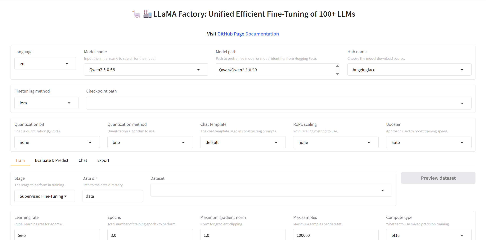
  <br />
  <em>图 12-7 LLaMA-Factory Web UI 界面</em>
</p>

## 三、DPO 训练准备

RLHF (DPO) 通常是在模型已经具备一定指令遵循能力的基础上进行的。由于我们直接使用已经经过指令微调的 **`Qwen2.5-0.5B-Instruct`** 版本，因此可以直接进入 DPO 阶段。

### 3.1 配置模型

进入 WebUI 后，可以根据自己熟悉的语言切换界面语言（目前支持 en、ru、zh、ko、ja 等）。然后在下拉框中选择 **`Qwen2.5-0.5B-Instruct`**（聊天 / 指令版本）并设置**下载源**。默认为 `Hugging Face`，如果遇到网络问题，可以切换为 `ModelScope` 或 `OpenMind` 进行下载。

<p align="center">
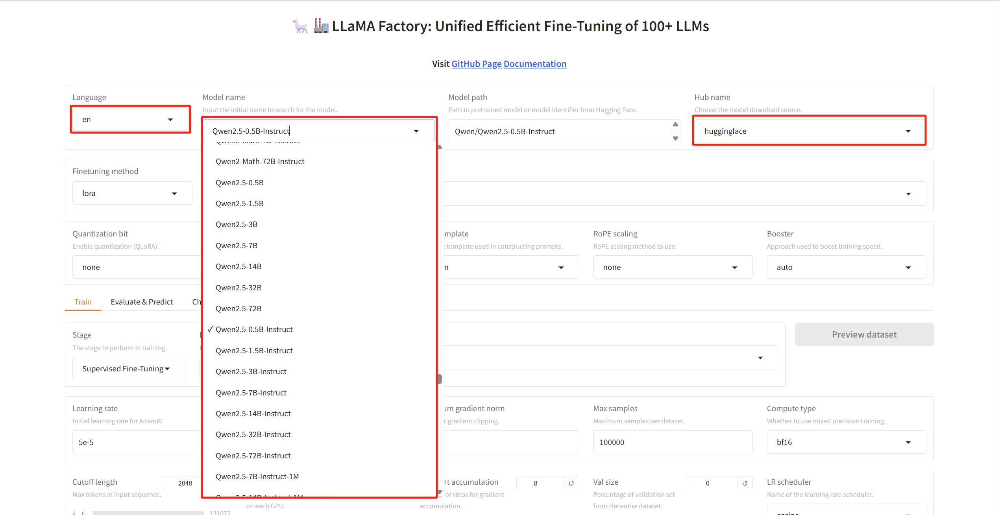
<br />
<em>图 12-8 模型选择与配置</em>
</p>

### 3.2 配置微调参数

*   **微调方法**：保持默认的 `lora`。
*   **量化配置**：对于显存较小的设备，可以选择将 `Quantization bit` 设置为 `8` 或 `4`，启用量化训练（QLoRA）。**如果显存充足或希望获得更好的效果，可以保持默认（不量化）**。
*   **其他参数**：
    *   `Quantization method`: 量化方法，默认为 `bnb`（bitsandbytes）。
    *   `Chat template`: 对话模板。
        *   对于 **Base** 模型，可选择 `default`, `alpaca`, `vicuna` 等。
        *   对于 **Instruct/Chat** 模型，**务必选择对应的模板**（例如 Qwen 系列选择 `qwen`）。
        *   训练和推理时必须使用**相同**的模板。
    *   `RoPE scaling`: 旋转位置编码缩放，用于扩展上下文长度。
    *   `Booster`: 加速库，默认 `auto` 即可，它会自动选择最适合的加速后端（如 FlashAttention）。

如图 12-9 ，我们设置了 LoRA 微调，并手动指定了对话模板为 `qwen`，其余选项保持默认。

<p align="center">
  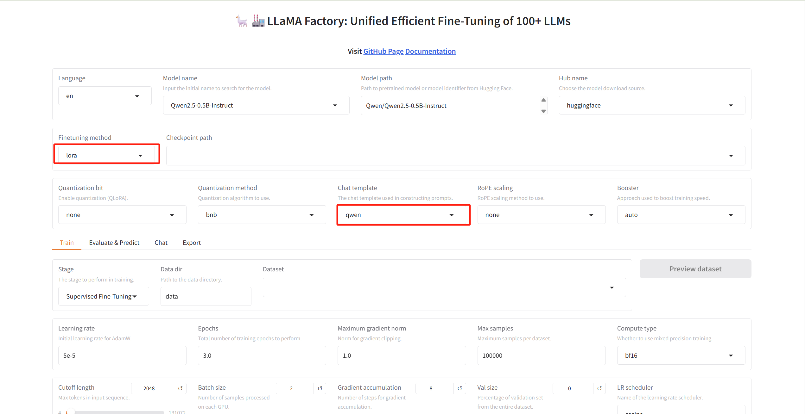
  <br />
  <em>图 12-9 微调方法与量化配置</em>
</p>

### 3.3 配置数据集

如图 12-10 需要先在左上角的 Stage 下拉菜单中选择 `DPO`。接着，在“数据集”一栏中，选择需要的训练数据。我们将使用 LLaMA-Factory 自带的 DPO 演示数据集 **`dpo_zh_demo`**。这个数据集包含了偏好对比（chosen vs rejected）的数据对。选中数据集后，可以点击右上角的 **Preview dataset** 按钮预览数据格式，确认数据无误。

<p align="center">
  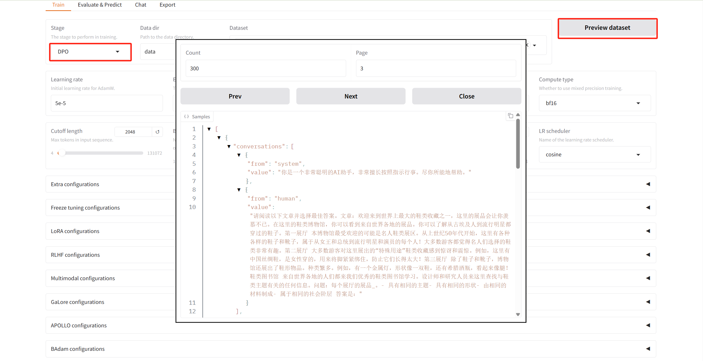
  <br />
  <em>图 12-10 数据集选择与预览</em>
</p>

## 四、启动 DPO 训练

### 4.1 设置训练参数

笔者根据自己的机器情况设置了如图 12-11 所示的配置。

<p align="center">
  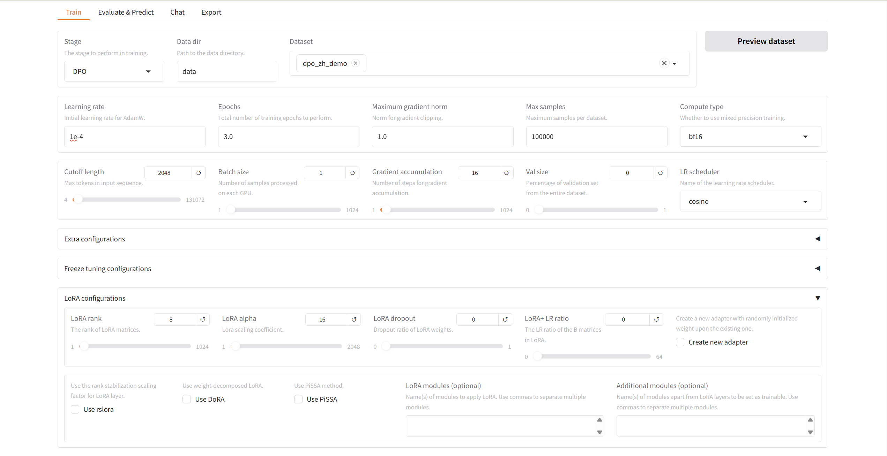
  <br />
  <em>图 12-11 训练参数配置</em>
</p>

*   **关键参数说明**：
    *   `Learning rate`: `1e-4` （学习率）
    *   `Epochs`: `3.0` （训练轮数）
    *   `Compute type`: `fp16` （兼容性好，若显卡适配可选 `bf16`）
    *   `Cutoff length`: `2048`
    *   `Batch size`: `1` （取决于显存）
    *   `Gradient accumulation`: `16` （建议 Batch size × Gradient accumulation ≈ 16 或 32）
    *   `LoRA rank`: `8` （LoRA 的秩，决定微调参数量，8 是默认配置）
    *   `LoRA alpha`: `16` （缩放系数，默认设置为 Rank 的 2 倍）

### 4.2 启动训练

如图 12-12 设置好输出目录后，可以点击 **Preview command** 预览训练命令，确认无误后直接点击 **Start** 开始训练。

<p align="center">
  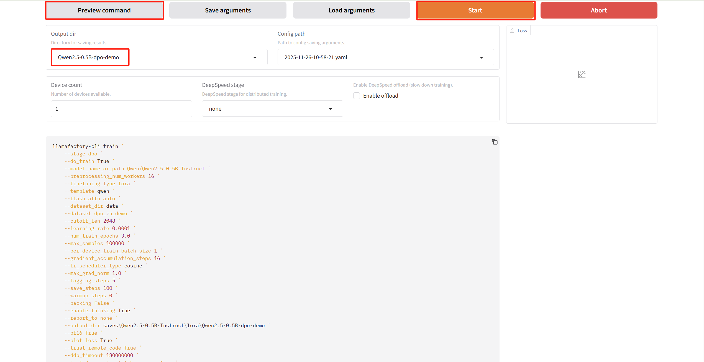
  <br />
  <em>图 12-12 预览命令并启动训练</em>
</p>

训练完成后，适配器（Adapter）权重将保存在 `saves/Qwen2.5-0.5B-Instruct/lora/Qwen2.5-0.5B-dpo-demo` 目录下。我们也可以在 **Train** 面板中看到如图 12-13 的训练过程 Loss 曲线，观察模型收敛情况。

<p align="center">
  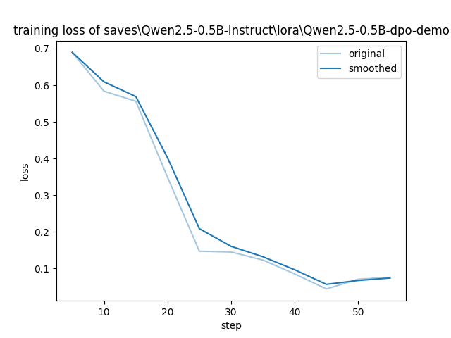
  <br />
  <em>图 12-13 训练 Loss 曲线</em>
</p>

## 五、效果测试与对比

在训练完成后，本来还应进行评估的步骤（这步也可以直接通过可视化界面的 **Evaluate & Predict** 面板进行），但是由于没有准备测试数据集，所以这一步就省略了。我们将直接使用 **LLaMA-Board** 的 `Chat` 功能来测试模型的对话效果。

### 5.1 加载模型进行对话

如图 12-14 所示，切换到 **Chat** 栏。在训练开始前，我们可以先不选择任何 Adapter，直接点击 **Load model** 加载原始的 `Qwen2.5-0.5B-Instruct` 模型，测试一下未训练时的模型表现。

<p align="center">
  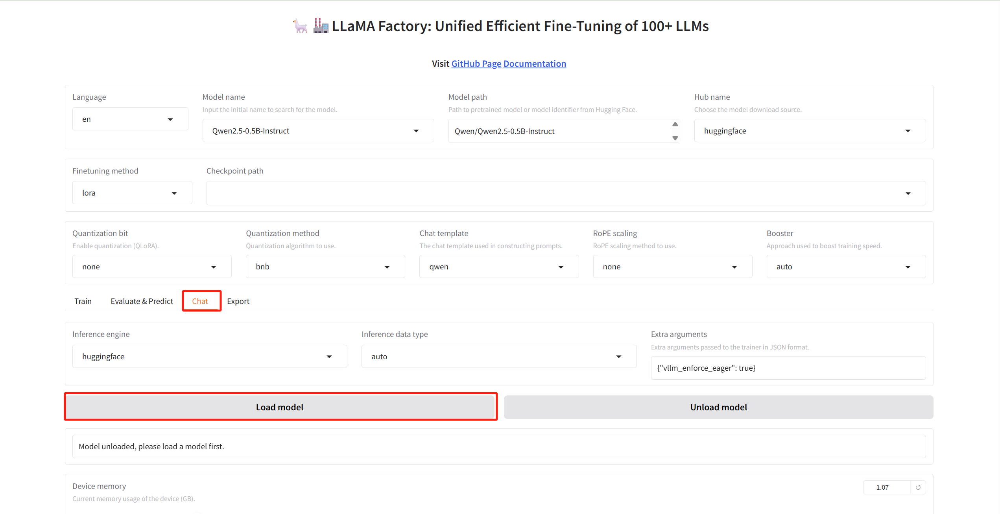
  <br />
  <em>图 12-14 加载模型进行对话测试</em>
</p>

加载成功后，在页面下方的对话框中输入测试问题，查看原始模型的回答情况（如图 12-14）。

**测试配置：**

*   **System prompt**: `您是一名AI助手。用户会给您一个任务。您的目标是尽量忠实地完成任务。在执行任务时，要逐步思考并合理地解释您的步骤。`
*   **Input**:
    ```text
    体重增加是一个复杂的问题。但毫无疑问，西方国家当前的食物环境——大量含有高度加工的咸、甜和油脂食品——起着重要作用。我们饮食中摄入的大部分盐都是在制造过程中添加的。这与大多数食物中天然存在的少量盐或在餐桌上或在家里烹饪时添加的盐形成对比。盐可以增加食物的可口性，帮助保鲜；这就是为什么它通常被添加到加工食品中。盐和脂肪的结合被认为是促进食物被 passively 过量消费的强大组合。想想看，咸薯片有多令人回味。对咸和油脂食物更喜欢与整体摄入更多千焦耳、不受控制的饮食和儿童超重有关。食物过量摄入与其盐度程度之间的联系被认为比对甜和油脂食物的喜好更强。从进一步揭示盐可能如何影响对油脂食物的过量摄入，Deakin 大学的感官研究人员招募了 48 名健康成年人参加品尝小组。在四个午餐时间段（在那天早上进行了标准早餐后），每个人都吃了一顿经过脂肪和盐含量调整的通心粉奶酪餐。四种餐食组合分别是低脂/低盐、低脂/高盐、高脂/低盐和高脂/高盐。鼓励参与者吃到饱为止。还记录了进食速度、餐食的可口性以及主观评价的饥饿感和饱腹感。盐促进过量进食当食用含盐量高的餐食时，摄入的千焦耳增加了 11%。而这与脂肪含量高低无关。餐食的脂肪含量并没有导致人们按重量摄入更多食物，但由于其更高的能量密度，这意味着摄入了更多千焦耳。问题：那些习惯于喜欢高热量密度饮食的人可能经常食用高盐食品吗？=== 上述问题的答案是 可选项： (1). 一周以上。 (2). 大多数时候通心粉奶酪被提供时。 (3). 没有足够的信息 (4). 通常在午餐时间。 答案：
    ```

<p align="center">
  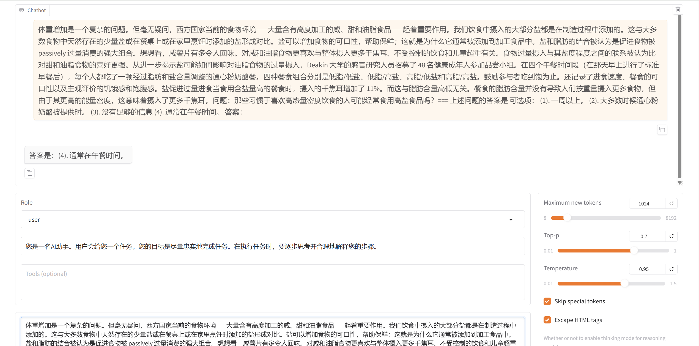
  <br />
  <em>图 12-15 原始模型对话测试</em>
</p>

在图 12-15 中，原始模型给出的答案**简短且武断**。虽然我们在 System Prompt 中要求它“逐步思考并合理地解释步骤”，但它忽略了这一指令，直接给出了一个基于表面关联（文中提到午餐）的猜测性结论。这种倾向于“快速给出答案”而非“深思熟虑”的风格，在未经过偏好对齐的模型中很常见。

### 5.2 验证 DPO 效果

当 DPO 训练完成后，如图 12-15 需要选择 `Checkpoint path` 为我们刚刚训练好的 Adapter（位于 `saves/Qwen2.5-0.5B-Instruct/lora/Qwen2.5-0.5B-dpo-demo`），然后再次点击 **Load model** 加载混合了 DPO 权重的模型。

<p align="center">
  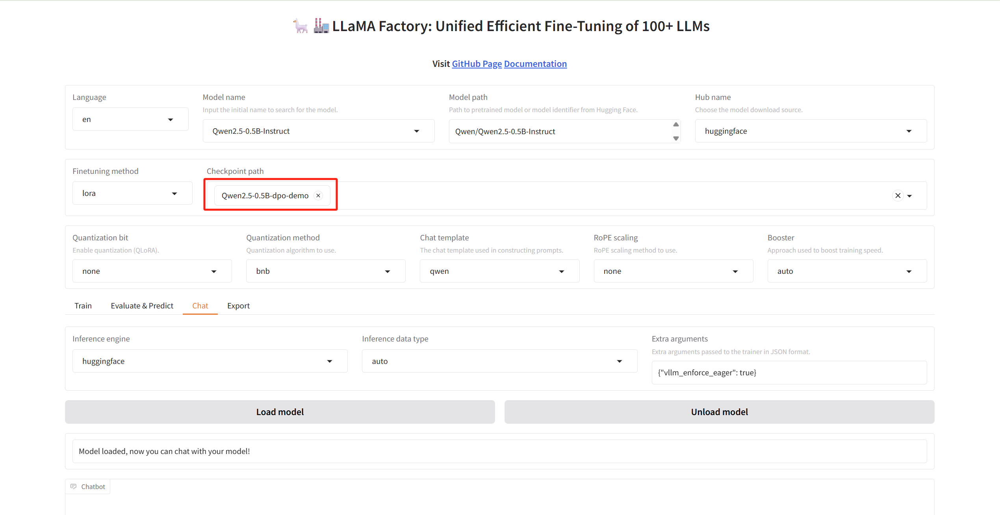
  <br />
  <em>图 12-16 加载 DPO 训练后的 Adapter</em>
</p>

对比图 12-15 和图 12-17，我们可以看到 DPO 训练带来的**行为风格变化**：

*   **原始模型**：回答简短、直接，但缺乏解释，倾向于“猜测”答案，表现出一种“急于完成任务”但缺乏严谨性的风格。
*   **DPO 模型**：回答更加**严谨**。它不仅给出了选项，还忠实地执行了 System Prompt 中“解释步骤”的要求，明确指出了原文信息的局限性（“缺乏关于这些人群饮食习惯的直接证据”）。相比于原始模型的一句话猜测，DPO 模型的回答展示了**推理过程**，这更符合我们对角色的期待。

<p align="center">
  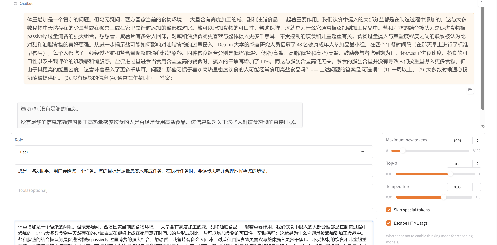
  <br />
  <em>图 12-17 DPO 模型对话测试</em>
</p>

这就是 RLHF 的核心价值——不仅仅是让模型“做对题”，更是让模型学会人类偏好的**交互风格**。通过 `dpo_zh_demo` 数据集的训练，模型初步对齐了数据集这种“诚实且严谨”的偏好风格。

## 本章小结

本章我们探讨了让大语言模型“更懂人类”的技术——RLHF。我们先在理论层面剖析了模型对齐的必要性，介绍了从 SFT 到 RLHF 的进阶之路，并重点讲解了 PPO 与 DPO 两种主流算法的原理与区别。DPO 以其无需显式奖励模型、训练稳定的特性，成为了当前对齐领域的新宠。

在实战环节，我们借助 LLaMA-Factory 这一高效框架，成功在消费级硬件上完成了 Qwen2.5 模型的 DPO 训练。通过对比训练前后的对话效果，我们直观地看到了模型在行为风格上的转变，即从简单武断的回答，进化为能够遵循复杂指令、展示推理过程的严谨回复。这不仅验证了 DPO 算法的有效性，也展示了如何通过偏好数据低成本地定制模型的“性格”。此外，虽然可视化界面便于上手，但在实际使用中，开发者往往更倾向于使用命令行方式，以获取对训练过程更细致的控制。
