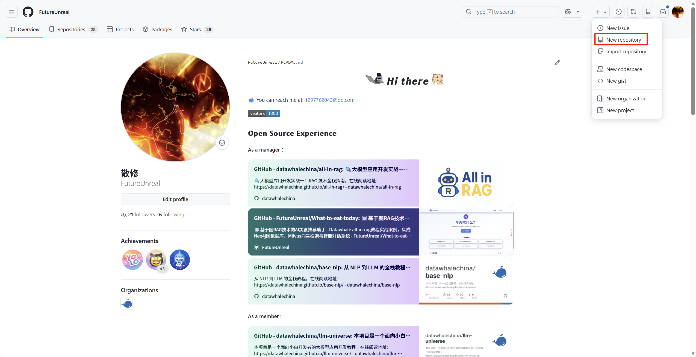
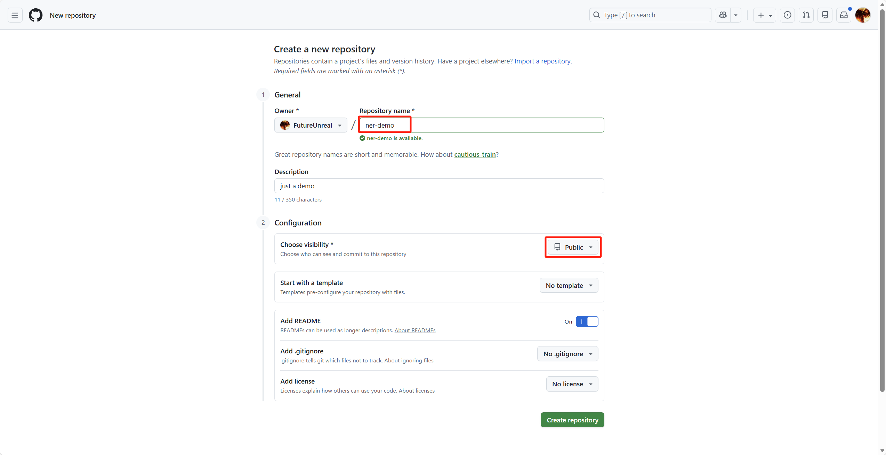
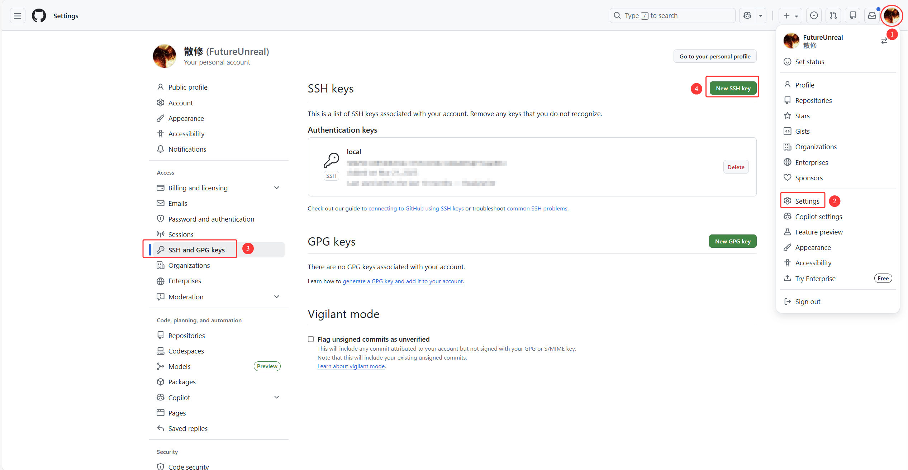
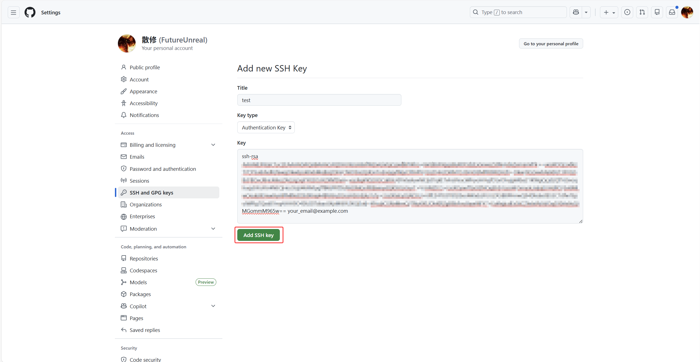
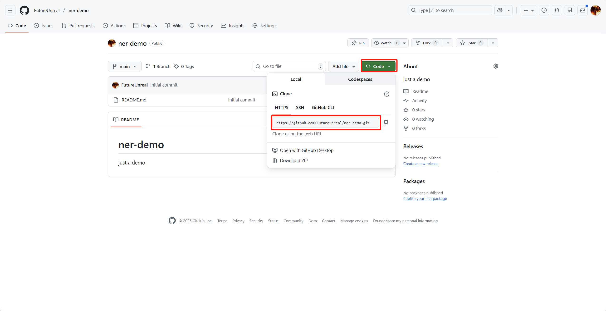

# 第一节 Git 与 GitHub 版本控制基础

上一章，我们成功利用 Docker 和 Docker Compose 将 NER 模型服务进行了容器化封装。实现了“一次构建，随处运行”的目标，缓解了环境不一致的问题。但是，随着业务发展，我们的项目代码每天都在更新。每次修改完代码，都需要手动在本地构建镜像、推送到服务器、登录服务器、停止旧容器、启动新容器……如果像某些互联网大厂那样，一天需要发版十几次，或者服务器集群有几十台，这种手动操作的方式显然效率极低，而且一旦操作失误（比如误删文件、覆盖了错误版本），回滚起来也异常痛苦。

为了解决这个问题，企业通常会建设一套 **CI/CD（持续集成/持续发布）** 平台。本章我们将介绍如何引入 **Git** 和 **Jenkins**，将开发和运维结合起来，实现代码一经提交，自动触发构建、测试和部署的“智能流水线”。

## 一、DevOps 与 CI/CD 概述

### 1.1 什么是 DevOps？

在了解具体的工具之前，我们需要先理解其背后的核心思想——**DevOps**。DevOps 是 Development（开发）和 Operations（运维）两个词的组合。软件开发模式经历了好几个时代的演进，理解这个过程有助于我们明白为什么现在需要 DevOps。

-  **原始时代（个人经验驱动，1950s-1960s）：**
   在计算机发展的早期，软件开发完全依赖程序员的个人能力。没有统一的流程和标准，大家都是“写完就改”（Code and Fix）。这种模式像个手工作坊，高度依赖个人，一旦核心人员离职，项目往往就会陷入混乱，难以维护和扩展。

-  **瀑布模型（线性流程，1970s-1990s）：**
   为了解决混乱，人们借鉴了建筑工程的管理方法，引入了**瀑布模型**。它将开发过程划分为需求、设计、编码、测试、维护等严格的阶段，前一个阶段完成后才能进入下一个阶段。这虽然带来了规范，但过于僵化。就像做一张桌子，如果在最后验收时发现设计图纸一开始就画错了，要修改就必须推倒重来，成本极高。

-  **敏捷开发（小步快跑，1990s-2000s）：**
   为了应对需求频繁变更，**敏捷开发**（Agile）出现了。它不再追求一次性交付完美的成品，而是强调**迭代**。先把最核心的功能做出来（比如先做一个能用的桌子腿），给用户看，根据反馈快速调整，再做下一个模块。就像把一个大项目拆成了无数个小周期（Sprint），每个周期都能交付可用的软件，大大提高了灵活性。

-  **DevOps（智能流水线，2000s-至今）：**
   现在的 DevOps 则是更进一步，它打破了开发和运维之间的隔阂。在传统模式下，开发只管写代码，运维只管部署，中间容易扯皮。DevOps 通过**自动化工具链**（CI/CD）将开发、测试、部署紧密连接。开发人员只需提交代码，平台就会自动完成构建、测试、发布等后续所有工作。这就像一条智能的流水线，不仅生产效率高，还能实时监控、快速修复，让软件交付变得像“工厂流水线”一样标准和高效。

### 1.2 CI/CD 的核心价值

CI/CD 是 DevOps 理念落地的关键实践，它通过将软件开发中的构建、测试、部署等环节自动化，极大地提升了研发效率和质量。

（1）**CI (Continuous Integration，持续集成)**

开发人员频繁地将代码集成到共享的主干分支。**每次提交代码后，系统自动触发构建（Build）和自动化测试（Test）**。通过自动化测试的快速反馈，避免在项目后期才发现大量冲突和错误的“集成地狱”（Integration Hell）。同时，强制的代码规范检查和单元测试，保证合入主干的代码是“健康”的，显著**提高代码质量**，并让团队成员通过构建状态实时了解项目的健康程度，增强开发的**透明度**。

（2）**CD (Continuous Delivery/Deployment，持续交付/部署)**

在持续集成的基础上，将代码自动部署到测试环境甚至生产环境。它涵盖了自动化部署、环境配置管理和发布流程编排。这一过程的价值在于**缩短上市时间**（Time to Market），代码从开发完成到上线的时间被压缩到最短，使企业能快速响应市场变化。而且，由于发布频率高，每次发布的变更量小，即使出问题也容易排查和回滚，从而大幅**降低了发布风险**。这也把运维人员从繁琐、易错的熬夜手动发版中**解放出来**，让机器自动执行标准化流程。

简而言之，CI/CD 就像一个**不知疲倦的智能管家**。它在保证质量的前提下，让软件交付变得像“工厂流水线”一样标准、高效且可靠，开发人员能专注于业务逻辑，而不是被繁琐的部署流程所困扰。如图 15-1，我们当前的目标就是搭建这样一套流程，**本地代码提交 (Git) -> 代码仓库 (GitLab/GitHub) -> Jenkins 自动构建 -> 部署到服务器**。而这一切的基础，首先就是**版本控制**。

<p align="center">
  
  <br />
  <em>图 15-1 CI/CD 自动化流程示意图</em>
</p>

## 二、Git 版本控制基础

### 2.1 为什么需要版本控制？

CI/CD 的源头是代码，而管理代码的核心工具是 **Git**。在没有版本控制的年代，如果张三和李四同时修改了服务器上的 `nginx.conf` 配置文件，可能会出现李四覆盖了张三的内容、改错了无法回退到昨天的版本、不知道谁在何时改了哪一行等问题。**版本控制系统（VCS）**就是为了解决这些问题而诞生的。它给文件的每一次修改都打上一个“版本号”（标签），记录了谁在什么时候改了什么，进而支持历史追踪、多人协作和版本回退。

市面上的版本控制软件主要分为两类：
- **集中式（如 SVN）**：有一个中央服务器保存所有代码，大家都要联网去提交。缺点是如果中央服务器挂了，大家都干不了活，且严重依赖网络。

- **分布式（如 Git）**：没有绝对的中央服务器，**每个人电脑上都是一个完整的版本库**。即使断网，你也能在本地提交代码、查看历史。这是目前最主流的方案。

> Git 是 Linux 之父 Linus Torvalds 为了管理 Linux 内核代码而开发的。因为他对当时的收费版本控制软件并不满意，一怒之下用了两周时间用 C 语言手撸了一个 Git。它继承了 Linux 的基因，开源、免费、高效且强大。

### 2.2 Git 的安装与配置

Git 支持 Windows、macOS 和 Linux 等多种平台。

（1）**Windows 系统安装**

对于 Windows 用户，Git 官方提供了方便的安装包：

- **下载**：访问 Git 官网 [git-scm.com](https://git-scm.com/)，点击首页的“Install for Windows”按钮。进入下载页面如图 15-2，在此页面中，需要**根据自己的电脑架构**选择对应的安装程序。如果是常见的 Intel/AMD 芯片电脑，可以直接点击“Click here to download”；如果是 ARM 架构设备，则选择“Git for Windows ARM64 Setup”。

<p align="center">
  
  <br />
  <em>图 15-2 Git for Windows 下载页面</em>
</p>

- **安装**：双击运行下载的 `.exe` 文件。安装向导中会有很多选项（如编辑器选择、路径环境配置等），对于初学者，**一路点击 "Next" 使用默认设置**即可。等待安装进度条走完，就能看到如图 15-3 所示的安装完成界面。

<p align="center">
  
  <br />
  <em>图 15-3 Git 安装完成界面</em>
</p>

（2）**Linux 系统安装**

大多数 Linux 发行版（如 Ubuntu/CentOS）已经内置了 Git。可以通过命令行直接检查或安装：

```bash
# 检查是否已安装
git --version

# 如果未安装，使用包管理器安装
# Ubuntu/Debian
sudo apt install git
# CentOS/RHEL
sudo yum install git
```

（3）**验证安装**

无论是在 Windows 的 PowerShell/CMD 还是 Linux 终端中，安装完成后都可以通过以下命令验证是否成功：

```bash
git --version
```

<p align="center">
  
  <br />
  <em>图 15-4 Git 版本验证</em>
</p>

（4）**配置身份信息**

安装完成后，必须先配置**用户身份**。因为 Git 是分布式的，它需要知道提交代码的是谁。

```bash
# 配置用户名
git config --global user.name "YourName"

# 配置邮箱
git config --global user.email "your_email@example.com"

# (可选) 开启命令行颜色显示，让输出更友好
git config --global color.ui true
```

> 这里的配置仅用于在提交历史中记录开发者身份，**并不是用于登录远程代码仓库的账号密码**。不过为了便于识别**建议填写与注册代码托管平台时一致的用户名和邮箱**。

查看配置是否生效：
```bash
git config --list
```

输出如下：
```bash
...
user.name=base-nlp
user.email=base-nlp@example.com
color.ui=true
```

### 2.3 创建本地仓库与核心工作流

Git 的核心操作围绕三个区域展开，如图 15-5 分别是**工作区**、**暂存区**和**版本库**。这三个区域协同工作，构成了 Git 的基本工作流。

<p align="center">
  
  <br />
  <em>图 15-5 Git 工作流</em>
</p>

（1）**初始化本地仓库**

普通的文件夹只是文件系统的一部分。要让 Git 管理它，需要进行初始化：

```bash
mkdir base-nlp
cd base-nlp
git init
```

执行 `git init` 后，目录下会生成一个隐藏的 `.git` 文件夹。这个文件夹就是 Git 的核心数据库（版本库），千万不要手动删除或修改它。

> 在 Windows 资源管理器中，`.git` 默认是隐藏的。如果想看到它，需要在文件夹选项中勾选“显示隐藏的文件、文件夹和驱动器”；或者直接在命令行中使用 `dir /a` 查看当前目录下的所有文件。

（2）**“工作区”到“暂存区”**

我们在 `base-nlp` 目录下创建一个文件 `test.py`：

```bash
echo "print('hello world')" > test.py
```

此时，文件在**工作区**，Git 知道有这个文件，但它还没被跟踪。我们可以先通过 `git status` 看一下当前状态：

```bash
git status
```

输出如下：

```bash
On branch master

No commits yet

Untracked files:
  (use "git add <file>..." to include in what will be committed)
        test.py

nothing added to commit but untracked files present (use "git add" to track)
```

接下来，把它添加到**暂存区**：

```bash
git add test.py
# 或者使用 git add . 将当前目录所有修改加入暂存区
```

再次查看状态，可以看到文件已经进入暂存区，等待提交：

```bash
...
Changes to be committed:
  (use "git rm --cached <file>..." to unstage)
        new file:   test.py
```

暂存区相当于一个“缓冲地带”或“购物车”，可以在这里确认这一批修改是否完整。如果发现改错了，还可以从暂存区撤回，而不会污染正式的版本历史：

```bash
# 不想本次提交 test.py，可以把它从暂存区撤回
git rm --cached test.py
```

> 暂存区中的信息会被记录在 `.git/index` 文件中，通常不需要手动修改或查看这个文件。

（3）**“暂存区”到“版本库”**

确认无误后，将暂存区的内容正式提交到仓库，生成一个新的版本：

```bash
git commit -m "first commit: add test.py"
```

输出如下：

```bash
[master (root-commit) 7db0bb0] first commit: add test.py
 1 file changed, 1 insertion(+)
 create mode 100644 test.py
```

提交完成后再执行一次 `git status`，会看到工作区已经“干净”了：

```bash
On branch master
nothing to commit, working tree clean
```

**`-m` 参数很重要**，它代表本次提交的**备注信息**。清晰、有含义的备注能帮助我们将来在茫茫历史版本中快速找到需要的节点。推荐的写法是“**动词 + 对象**”，例如：

```bash
git commit -m "feat: 新增 NER 预测接口"
git commit -m "fix: 修复登录接口的 500 错误"
git commit -m "refactor: 抽取公共的日志封装函数"
```

而下面这种就不推荐使用，因为几乎没有任何信息量：

```bash
git commit -m "update"
git commit -m "test"
```

但是，嘿嘿。大家不要学👇

<p align="center">
  
  <br />
  <em>图 15-5 反面教材</em>
</p>

### 2.4 版本迭代与差异对比

随着开发进行，我们会不断修改代码。比如修改 `test.py`，替换一行代码：

```python
# 删除 print('hello world')
print('hello nlp')
```

此时使用 `git status` 查看状态，Git 会提示文件已修改（modified）。

```bash
On branch master
Changes not staged for commit:
  (use "git add <file>..." to update what will be committed)
  (use "git restore <file>..." to discard changes in working directory)
        modified:   test.py

no changes added to commit (use "git add" and/or "git commit -a")
```

我们可以使用 **`git diff`** 来查看具体改了什么，输出如下：

```bash
diff --git a/test.py b/test.py
index 75d9766..812e8d0 100644
--- a/test.py
+++ b/test.py
@@ -1 +1 @@
-print('hello world')
+print('hello nlp')
```

输出中会用绿色加号 `+` 表示新增的行，红色减号 `-` 表示删除的行。这能帮助我们在提交前最后确认修改内容。确认无误后，再次走一遍流程：

```bash
git add .
git commit -m "v2: update print output"
```

输出如下：

```bash
[master 3fa5369] v2: update print output
 1 file changed, 1 insertion(+), 1 deletion(-)
```

这样，我们就有了两个版本。如果发现 v2 有严重 bug，可以利用 Git 提供的能力快速回退到 v1。

### 2.5 查看提交历史与版本回退

顺着上面的例子，我们来进一步学习如何**查看历史版本**以及**回退到指定版本**。

（1）**查看提交历史**

最基本的用法：

```bash
git log
```

它会按照**时间倒序**列出当前分支上的所有提交（最新的在最上面）。输出如下：

```bash
commit 3fa5369... (HEAD -> master)
Author: base-nlp <base-nlp@example.com>
Date:   ...

    v2: update print output

commit 7db0bb0...
Author: base-nlp <base-nlp@example.com>
Date:   ...

    first commit: add test.py
```

- 最上面一条就是当前分支 `master` 的最新提交，`HEAD -> master` 表示“当前 HEAD 指向 master 分支的这个提交”。  
- 每个提交前面那一长串十六进制字符串，就是唯一的 **Commit ID（提交哈希）**，后面是写的提交说明。

如果觉得默认输出太“啰嗦”，可以用参数 `--pretty=oneline` 将每条提交压缩成一行：

```bash
git log --pretty=oneline
```

输出如下：

```bash
3fa5369... v2: update print output
7db0bb0... first commit: add test.py
```

（2）**回退到之前的版本**

目前我们已经做了两次提交：

- 第一次：`first commit: add test.py`  
- 第二次：`v2: update print output`

此时 `git log` 结果中，最上面的是 v2。如果我们发现 v2 有问题，想回退到 v1，可以使用：

```bash
git reset --hard HEAD^
```

其中：

- `HEAD` 代表当前版本；  
- `HEAD^`（等价于 `HEAD~1`）代表**上一个版本**；  
- `HEAD~2` 代表上上个版本，以此类推。

执行 `git reset --hard HEAD^` 后，输出如下：

```bash
HEAD is now at 7db0bb0 first commit: add test.py
```

- 这行提示说明 `HEAD` 现在指向了提交 `7db0bb0`（也就是第一次提交）。  
- 同时，`HEAD` 和 `master` 会从 v2 移动到 v1，工作区和暂存区的内容也会一起回滚到 v1 时的代码状态。

此时使用 `cat test.py` 查看 `test.py`，就会发现它的内容已经恢复到第一次提交时的样子。接下来运行 `git log` 也只会看到 v1 这一条提交记录了。

除了用 `HEAD^` 这种相对写法，我们也可以通过 **Commit ID 精确切换到指定版本**。比如在已经回退到 v1 之后，如果确认 v2 没问题，想从 v1 回到 v2，可以执行：

```bash
git reset --hard 3fa5369
```

输出如下：

```bash
HEAD is now at 3fa5369 v2: update print output
```

这里的 `3fa5369` 就是 `git log` 输出中 v2 那条提交前面的那一段哈希值（只需要写前几位，能唯一匹配即可）。

> `--hard` 会丢弃当前工作区和暂存区中**尚未提交**的修改，实际工作中使用前一定要确认没有重要改动未提交。

`git reset` 其实还有三种常见模式，可以简单对比一下（了解即可）：

- `git reset --soft <commit>`：
 
  只移动 `HEAD`，**保留暂存区和工作区**，适合“合并多次提交”为一次。  
- `git reset --mixed <commit>`（默认）：
 
  移动 `HEAD`，重置**暂存区**，但**保留工作区**的文件内容。  
- `git reset --hard <commit>`：

  `HEAD`、暂存区和工作区**全部回滚**到指定提交，最“干净”，也最危险。

（3）**查看所有操作历史**

有时候我们已经执行了 `git reset --hard`，在 `git log` 里看不到“被回退掉”的提交了，这时可以使用：

```bash
git reflog
```

`git reflog` 会记录 **HEAD 的每一次移动**（包括 `commit`、`reset`、`checkout` 等），输出如下：

```bash
3fa5369 (HEAD -> master) HEAD@{0}: reset: moving to 3fa5369
7db0bb0 HEAD@{1}: reset: moving to HEAD^
3fa5369 (HEAD -> master) HEAD@{2}: commit: v2: update print output
7db0bb0 HEAD@{3}: commit (initial): first commit: add test.py
```

> 和 `git log` 一样，`git reflog` 的输出通常会通过分页器 `less` 展示，可以使用空格翻页、方向键上下滚动，按 `q` 退出查看界面返回命令行。

这四行依次记录了我们刚才做过的操作：

- `HEAD@{3}`：第一次提交 `first commit: add test.py`，生成 v1；  
- `HEAD@{2}`：第二次提交 `v2: update print output`，生成 v2；  
- `HEAD@{1}`：执行 `git reset --hard HEAD^`，从 v2 回到 v1；  
- `HEAD@{0}`：执行 `git reset --hard 3fa5369`，又从 v1 回到 v2。

无论是从 v2 回到 v1，还是又从 v1 回到 v2，这些“时光旅行”都会被 `git reflog` 记录下来。将来只要在 `git reflog` 中找到目标状态前面的 Commit ID，就可以再次通过 `git reset --hard <commit_id>` 把代码“穿越回去”。所以，`git log` 主要用来“看版本历史”，`git reflog` 更像是记录**所有关键操作**的“黑匣子”，可以在“手滑 reset” 之后救命。

### 2.6 撤销修改与误删恢复

接下来，我们看看当**代码写乱了、文件误删了**时，Git 能提供哪些“后悔药”。

（1）**撤销未提交的修改**

假设我们在 `test.py` 里胡乱写了一通：

```python
print('hello nlp')
print('复活吧，我的爱人！')
```

此时先用 `git status` 看一下当前状态：

```bash
On branch master
Changes not staged for commit:
  (use "git add <file>..." to update what will be committed)
  (use "git restore <file>..." to discard changes in working directory)
        modified:   test.py

no changes added to commit (use "git add" and/or "git commit -a")
```

根据 `test.py` 是否已经被放入暂存区，撤销方式不同：

- **只改动了工作区，还没 `git add`**

  最简单的做法是直接在编辑器里手动删掉多余代码，也可以用 Git 一键丢弃修改：
 
   ```bash
  git restore test.py
   ```

  这会把 `test.py` 恢复为当前提交（`HEAD`）中的内容，相当于这次编辑从未发生。

- **已经 `git add` 到暂存区，但还没 `git commit`**

  此时 `git status` 会提示 “Changes to be committed”，我们可以分两步撤销：
 
   ```bash
  # 第一步：从暂存区撤销（保留工作区修改）
  git restore --staged test.py
  # 如果这是第一次提交、提示找不到 HEAD，也可以用：
  # git rm --cached test.py

  # 第二步：丢弃工作区修改
  git restore test.py
   ```

    这样既不会把“脏代码”提交进版本历史，工作目录也会恢复干净。

> 只要还没有 `commit`，大多数情况下都可以通过“编辑器 + `git restore`（或老版 git 命令 `git checkout --`）”把代码改回去。

（2）**误删恢复**

只要文件**至少被 `git add` 过一次**，Git 通常都能在误删之后帮你把它找回来。

例如，先创建并暂存一个新文件：

```bash
echo "print('backup demo')" > demo.py
git add demo.py
git status
```

在 `git status` 输出中可以看到 `demo.py` 已经在暂存区。此时即使在资源管理器里把 `demo.py` 删掉，或者在命令行执行：

```bash
rm demo.py   # Linux / macOS
# 或
del demo.py  # Windows
```

再次查看状态，会看到类似提示：

```bash
On branch master
Changes to be committed:
  (use "git restore --staged <file>..." to unstage)
        new file:   demo.py

Changes not staged for commit:
  (use "git add/rm <file>..." to update what will be committed)
  (use "git restore <file>..." to discard changes in working directory)
        deleted:    demo.py
```

因为 Git 在暂存区 / 版本库中已经保存过这个文件的内容，我们可以一键恢复：

```bash
git restore demo.py
```

这时 `demo.py` 就会重新出现在当前目录中，相当于从 Git 的“备份”里把它拉回来了。

> 如果一个文件**从来没有 `git add` 过**（完全未被 Git 管理），那它被删除之后，Git 是无能为力的，只能依赖回收站或其他备份工具。

还有一种情况是我们**确实要在后续版本里移除某个文件**，比如废弃一个不再使用的脚本。推荐使用：

```bash
git rm old_script.py
git commit -m "remove old_script.py"
```

这两个命令配合起来会先从工作目录中删除 `old_script.py` 并把这次删除标记为本次提交的变更，然后由 `git commit` 把这一变更真正写入版本历史。

提交完成后，**当前以及后续版本中都不会再包含这个文件**，但在旧版本里它仍然存在。如果哪天发现删错了，仍可以通过 `git log` / `git checkout` / `git restore` / `git reset` 等方式，从历史版本中把它找回来。不过前提是 `old_script.py` 之前已经出现在某次提交里。

---

### 2.7 分支管理、合并与冲突解决

在前面的实践中，我们只在单一分支（通常是 `master` 或 `main`）上开发。实际项目中可能会有多位开发者同时并行开发不同功能，如果大家都直接往主分支上提交，就很容易把“半成品代码”混进主干，导致别人在拉取主分支代码时频繁踩坑。**分支（Branch）机制**的目的，就是在不影响主分支稳定性的前提下，让各个功能可以并行开发。

比如一个电商项目同时在开发“商品管理”“购物车”“支付结算”等模块，小王负责“优惠券结算”功能，这个功能一开始并不完善，如果他一边开发一边把会算错订单金额的代码直接提交到主分支，其他同事基于主分支开发或联调时，就会基于一个不完整、甚至错误重重的版本开展工作，后续不得不大量返工。更合理的做法是小王先从主分支拉出一个自己的功能分支（例如 `feature/coupon`），在这个分支上反复提交、调试和完善代码；等优惠券功能开发完、自测通过后，再把该分支合并回主分支，这样既不会打扰别人，又能并行推进多个功能。

（1）**查看并创建分支**

首先在命令行窗口查看当前有哪些本地分支：

```bash
git branch
```

输出如下：

```bash
* master
```

前面带 `*` 的表示**当前所在分支**（这里是 `master`）。接下来我们创建一个新分支（例如 `dev` 分支）：

```bash
git branch dev
```

这只是创建了一个名为 `dev` 的分支，**当前仍然停留在原来的分支上**。可以再次 `git branch` 验证。输出如下：

```bash
  dev
* master
```

（2）**切换分支**

在 Git 中，**分支之间的代码是相互独立的快照**。切换分支时，工作区的文件内容也会随之切换。

- 从 `master` 切换到 `dev` 分支：

```bash
git switch dev
# 或使用旧版的写法：
# git checkout dev
```

再次执行 `git branch` 会看到如下输出，`dev` 前面带上了 `*`，说明我们已经在 `dev` 分支上进行开发了。

```bash
* dev
  master
```

如果希望**创建并立即切换到新分支**，可以使用：

```bash
git switch -c feature/live
# 或
git checkout -b feature/live
```

（3）**在分支上开发并合并回主分支**

现在我们在 `dev` 分支下新增一个功能文件 `feature.py`，并提交到本地仓库：

```bash
echo "print('feature')" > feature.py

git add feature.py
git commit -m "feat: add feature"
```

此时，在 `dev` 分支上使用 `ls` 命令可以看到 `feature.py`。切回 `master` 分支后，这个文件**暂时是看不到的**，因为它还没被合并进主分支：

```bash
git switch master
ls
# 此时列表中并没有 feature.py
```

等到 `dev` 分支上的功能开发完毕、通过自测后，就可以把它合并回主分支：

```bash
# 站在 master 分支上，合并 dev 的最新代码
git merge dev
```

输出如下：

```bash
Updating 3fa5369..1d96be0
Fast-forward
 feature.py | Bin 0 -> 38 bytes
 1 file changed, 0 insertions(+), 0 deletions(-)
 create mode 100644 feature.py
```

合并成功后，再次 `ls`，就能在 `master` 上看到 `feature.py`。这时候对其他开发者来说，主分支就是一套**包含新功能且相对稳定**的代码。

（4）**分支冲突的产生及解决**

理想情况下，分支合并会自动完成。但只要**两个分支在同一段代码上做了互相矛盾的修改**，Git 就无法自动判断该保留哪个修改，这时就会出现**合并冲突**。可以简单理解为最常见的情况是两个分支都修改了同一个文件的同一行内容——例如，张三先在 `dev` 分支中修改 `feature.py` 的某一行并提交，随后切回 `master` 分支，对同一文件的同一行做了不同的修改并再次提交，最后回到 `master` 分支执行 `git merge dev` 时，就很有可能触发一次合并冲突。这时终端可能会提示类似：

```bash
warning: Cannot merge binary files: feature.py (HEAD vs. dev)
Auto-merging feature.py
CONFLICT (content): Merge conflict in feature.py
Automatic merge failed; fix conflicts and then commit the result.
```

并且在 `feature.py` 文件中，你会看到类似结构：

```text
<<<<<<< HEAD
print("master_feature")
=======
print("dev_feature")
>>>>>>> dev
```

其中：

- `<<<<<<< HEAD` 到 `=======` 之间，是当前分支（`master`）的内容；  
- `=======` 到 `>>>>>>> dev` 之间，是被合并分支（`dev`）的内容。

**解决冲突的一般步骤**是在产生冲突的分支（通常是 `master`）中，先打开有冲突标记的文件，根据业务含义**手工编辑**冲突位置，决定保留哪一部分，或者把两者合并成一段新的代码，并删除所有 `<<<<<<<` / `=======` / `>>>>>>>` 这些冲突标记。最后保存文件，将它标记为“冲突已解决”并重新提交：

```bash
git add feature.py
git commit -m "fix: resolve merge conflict in feature.py"
```

提交完成后，本次合并就算彻底完成了。

（5）**删除与恢复分支**

当某个功能分支已经合并完成、不再需要时，可以把它删除掉，以免分支列表越来越杂乱。在**其他分支**上删除一个已经合并的分支（例如删除 `dev`，当前在 `master`）：

```bash
git branch -d dev
```

输出如下：

```bash
Deleted branch dev (was 0af27fc).
```

这里有两点要注意：

- 不能“站在”要删除的那个分支上删自己（就像“人在桥上不能把桥拆了”）；  
- 如果分支还没有被合并，Git 会给出警告，防止误删可以通过 `git branch -D dev` 强制删除，但要非常谨慎。

如果一不小心删掉了某个分支，只要它之前有提交记录，通常还是**可以恢复的**。恢复的大致思路就是先用 `git reflog` 找到这个分支最近一次正常存在时的 Commit ID，再基于这个提交创建一个新的分支：

```bash
# 查看 HEAD 的移动历史，找到需要恢复到的提交
git reflog

# 假设想恢复到某个在 dev 分支的提交 0af27fc 对应的状态：
git switch -c dev_recovered 0af27fc
```

输出如下：

```bash
Switched to a new branch 'dev_recovered'
```

这样就相当于“从历史上的某一个时间点，再拉出一条新的分支线”，把之前误删的分支逻辑恢复出来。

### 2.8 Tag 标签与版本发布

在实际项目中，一个仓库往往会经历 v1.0、v1.1、v2.0 等多个版本，如果只依赖那串又长又难记的 Commit ID 来区分和定位发布版本，既不直观也不方便维护。因此我们通常会**给关键版本打一个清晰、易记的标签（Tag）**。每次 `git commit` 都会生成一个唯一的 Commit ID，例如：

```bash
commit 0af27fcd9f...
Author: ...
Date:   ...

    feat: add test.py
```

从 Git 自己的角度看，这个 ID 已经足够精确。但对人类来说，`0af27fcd9f...` 很难记，也很难一眼看出这是“哪个版本”。所以，项目发布时通常会给某个提交打上一个**语义化的版本标签**（如 `v1.0.0`、`v2.1.3` 等），并在代码托管平台上以“Release/发布版本”的形式展示。开发者可以一目了然当前最新稳定版是哪个标签，运维在回滚时也可以说“回退到 `v1.0.0`”而不用去抄一长串 Commit ID，用户在下载源码或镜像时也能按版本号选择合适的发行包。

（1）**给指定提交打标签**

假设我们在 `master` 分支上新增了一个文件 `ner.py` 并提交：

```bash
echo "print('hello ner')" > ner.py
git add ner.py
git commit -m "feat: add ner.py"
```

此时通过 `git log --oneline` 可以看到最新的一条提交以及对应的简短 Commit ID：

```bash
8d4f871 (HEAD -> master) feat: add ner.py
...
3fa5369 (feature/live) v2: update print output
...
```

现在我们希望把这一版作为“第一个正式可发布版本”，给它打上 `v1.0.0` 这样的标签，可以使用带注释（annotated）的标签命令：

```bash
git tag -a v1.0.0 8d4f871 -m "release v1.0.0"
```

这条命令的含义是以提交 `8d4f871` 为基准，创建一个名为 `v1.0.0` 的标签，并附上一条说明 `release v1.0.0`（这是英文项目中常见的写法）。其中 `-a` 表示创建一个**带注释的标签**，标签本身会作为一个对象存到 Git 数据库中，`-m` 用于填写这条标签的说明信息。如果省略 Commit ID：

```bash
git tag -a v1.0.0 -m "release v1.0.0"
```

表示**给当前分支的最新一次提交（`HEAD`）打标签**，这是发布当前最新版本时最常见的写法。

（2）**查看标签与对应信息**

- 查看当前仓库中已有的所有标签：

```bash
git tag
```

输出如下：

```bash
v1.0.0
```

接下来查看某个标签对应的详细信息（包括 Commit ID、提交说明等），这条命令会展示 `v1.0.0` 标签指向的那次提交的详细内容，相当于回答了“这个版本具体包含了哪些改动？”这个问题。

```bash
git show v1.0.0
```

输出如下：

```bash
Author: base-nlp <base-nlp@example.com>
Date:   Wed Dec 20 21:55:49 2025 +0800

    feat: add ner.py

diff --git a/ner.py b/ner.py
new file mode 100644
index 0000000..8c7101b
Binary files /dev/null and b/ner.py differ
```

（3）**连续版本的标签示例**

如果在 `v1.0.0` 之后我们又对 `ner.py` 做了一些改动并提交，可以将这一版标记为 `v2.0.0`：

```bash
# 这里的 a 表示自动提交所有已跟踪文件的修改，相当于省略 git add
git commit -am "feat: improve ner.py"

git tag -a v2.0.0 -m "release v2.0.0"
```

由于这里同样省略了 Commit ID，`v2.0.0` 会自动指向当前分支的最新提交。再次执行 `git tag` 就会看到：

```bash
v1.0.0
v2.0.0
```

将来把代码推送到远程仓库并同步标签之后，页面上就会出现 `v1.0.0`、`v2.0.0` 等多个版本，用户就可以按需下载对应版本的源码或发布包。

（4）**删除不再需要的标签**

有时候我们可能会发现某个标签打错了，或者不再需要，可以在本地删除：

```bash
git tag -d v1.0.0
```

输出如下：

```bash
Deleted tag 'v1.0.0' (was 58af4bc)
```

删除后再执行 `git tag` 就只会看到剩余的标签。需要注意这里删除的只是**本地标签**，如果标签已经推送到远程仓库，还需要在远程执行对应的删除操作。

## 三、GitHub 远程仓库与代码托管

前面我们已经掌握了在本机上使用 Git 进行版本管理、分支管理以及打 Tag。**但目前所有历史版本仍然只保存在本机**：一旦电脑损坏、硬盘丢失，或者你想把代码分享给团队成员，就会非常不方便。为了解决**代码备份、多人协作和自动部署**这三个核心问题，需要把本地仓库“托管”到一个稳定可靠的远程平台上，这里我们以 **GitHub** 为例进行操作。GitHub 是目前全球最主流的开源代码托管平台之一，既可以创建开源项目的 **Public 仓库**，也支持个人或团队使用的 **Private 私有仓库**，非常适合作为我们学习和实践的远程仓库平台。

### 3.1 远程仓库的作用

只用本地 Git 仓库时，代码只存在于一台机器上，团队其他成员看不到你的提交历史，也无法直接基于你的版本继续开发；每个人电脑上各自维护一份仓库，很难确定“哪一份才是当前权威版本”；同时也**不利于自动化**——像 Jenkins 这类 CI/CD 工具通常会从统一的远程仓库拉取代码，如果只有本地仓库，就无法和流水线打通。

将代码推送到远程仓库（Remote Repository），可以同时解决这几个问题：

- **集中托管**：所有人都以远程仓库为“单一真相源”；  
- **方便协作**：团队成员可以随时拉取最新代码、提交自己的修改；  
- **自动部署入口**：Jenkins 等工具可以从远程仓库自动拉取最新代码，触发构建与发布流程。

### 3.2 注册 GitHub 并创建远程仓库

（1）在浏览器中访问 `https://github.com`，如果还没账号点击右上角 **Sign up** 按钮，根据提示完成注册（邮箱、用户名、密码等）。  

<p align="center">
  
  <br />
  <em>图 15-7 GitHub 官网首页</em>
</p>

（2）登录后，如图 15-8 在页面右上角点击 **“+” -> New repository** 创建新仓库。

<p align="center">
  
  <br />
  <em>图 15-8 GitHub 新建仓库菜单</em>
</p>

（3）进入新建页面后，如图 15-9 依次填写配置：

- **Repository name**：仓库名称，例如 `ner-demo`；  
- **Description（可选）**：简单说明这个仓库做什么用；  
- **Choose visibility**：选择 `Public`（任何人都能看到）或 `Private`（只有受邀成员可访问）；
- **Add README**（可选）：可以勾选，会自动生成一个 `README.md`，方便后续展示。
- **Add .gitignore**：选择语言 Python，GitHub 会自动生成忽略文件（如 `__pycache__/`），避免将无需版本控制的中间文件提交到仓库；
- **Add license**（可选）：选择开源协议（如 MIT、Apache 2.0），明确项目的开源许可范围。

<p align="center">
  
  <br />
  <em>图 15-9 GitHub 新建仓库页面</em>
</p>

（4）点击右下角 **Create repository**，一个空的远程 GitHub 仓库就创建好了。

### 3.3 使用 SSH 密钥连接 GitHub（推荐）

推送代码到 GitHub 时，常用两种方式 **HTTPS** 和 **SSH**。HTTPS 方式每次推送都需要输入账号密码（或 Token），而 SSH 方式可以在配置好密钥后免密推送，更适合日常开发。

生成并配置 SSH 公钥的大致步骤如下（以 Windows PowerShell / Git Bash 为主，Linux/macOS 下命令相同）：

```bash
# 生成一对新的 SSH 密钥（如果之前没有）
ssh-keygen -t rsa -b 4096 -C "your_email@example.com"
```

> `"your_email@example.com"` 建议填写在 GitHub 注册时使用的邮箱（或与 Git 身份配置一致的邮箱），主要用于标记这对密钥的归属，方便日后识别。

一路回车即可使用默认设置，它会在用户主目录下生成两个文件（Linux/macOS 下一般是 `~/.ssh/`，Windows 下通常是 `C:\Users\<你的用户名>\.ssh\`）：

- `~/.ssh/id_rsa`：私钥（不要泄露给任何人）；  
- `~/.ssh/id_rsa.pub`：公钥（可以安全地提交给 GitHub 等平台）。

接下来，将公钥添加到 GitHub：

- 在 Windows 下，可以使用记事本或 VS Code 打开 `id_rsa.pub`；在 Linux/macOS 下可以使用 `cat ~/.ssh/id_rsa.pub` 查看公钥内容。无论哪种方式，都需要复制整行公钥字符串；  

- 如图 15-10 所示，打开 GitHub 网页，点击右上角头像 -> **Settings** -> 左侧菜单选择 **SSH and GPG keys** -> 点击 **New SSH key**；
  <p align="center">
    
    <br />
    <em>图 15-10 GitHub 配置 SSH Key</em>
  </p>

- 在 **Title** 中填写一个便于识别的名字。**Key type** 一栏保持默认的 `Authentication Key`（用于 SSH 登录和推送代码），另一个 `Signing Key` 主要用于提交签名，暂时不需要。在 **Key** 文本框中粘贴刚才复制的公钥内容，点击 **Add SSH key** 保存。

  <p align="center">
    
    <br />
    <em>图 15-11 GitHub 添加 SSH Key</em>
  </p>

完成上述步骤后，就可以通过 `git@github.com:...` 这种 **SSH 地址** 来免密推送和拉取代码了。

> 如果暂时不想配置 SSH，也可以使用 HTTPS 地址（`https://github.com/...`），只是推送时需要按照 GitHub 要求使用 Token 等方式进行身份验证。

### 3.4 将本地仓库与 GitHub 远程仓库关联

在实际使用中，常见的起步方式有两种：

- 情况 A：已经在本地某个目录里写好了代码，并通过 `git init` 把它变成了一个本地仓库，现在希望**把这个现有仓库推送到 GitHub**；  
- 情况 B：先在 GitHub 上创建了远程仓库（比如前面创建的 `ner-demo`），本地还没有任何仓库，然后**在一个合适的目录里通过 `git clone` 拉取代码**。

本小节先讲情况 A（已有本地仓库如何关联到 GitHub），情况 B 则对应下面 3.5 小节的 `git clone` 示例。

假设我们已经在本地有一个通过 `git init` 初始化过的仓库，并且完成了至少一次提交。接下来要做的就是**告诉本地仓库它的“远程家”在哪里**。

（1）在 GitHub 仓库页面中，如图 15-12 点击绿色的 **Code** 按钮，切换到 **SSH** 选项卡，复制里面的地址：

<p align="center">
  
  <br />
  <em>图 15-12 GitHub 复制 SSH 地址</em>
</p>

（2）将下面命令中 `your-username` 替换为自己的 GitHub 用户名后，在本地项目根目录下执行。

```bash
git remote add origin git@github.com:your-username/ner-demo.git
```

其中：

- `remote` 表示我们在操作**远程仓库配置**；  
- `add` 表示添加一个新的远程；  
- `origin` 是这个远程仓库的**别名**（约定俗成的写法，也可以用其他名称）；  
- 后面的 SSH 地址就是刚才在 GitHub 上复制的仓库地址。

（3）第一次推送本地分支到远程时，使用：

```bash
# -u 会将当前本地分支与远程分支建立“跟踪关系”
git push -u origin master
```

这条命令的含义是将当前的 `master` 分支推送到远程名为 `origin` 的仓库中，并在远程创建同名分支。如果默认分支是 `main`，改用：

```bash
git push -u origin main
```

> 在这台电脑上第一次通过 SSH 推送到 `github.com` 时，终端可能会提示 `The authenticity of host 'github.com' can't be established... Are you sure you want to continue connecting (yes/no/[fingerprint])?`，这里输入完整的 `yes` 并回车即可，之后同一台机器再连接 GitHub 就不会重复询问。

之后，再次推送时就可以直接使用命令 `git push`，Git 会自动根据跟踪关系，将当前分支推送到对应的远程分支。

### 3.5 从 GitHub 克隆远程仓库

如果是从零开始参与一个已有项目，最常见的做法是先**克隆（clone）远程仓库**：

```bash
git clone git@github.com:your-username/ner-demo.git
```

输出如下：

```bash
Cloning into 'ner-demo'...
remote: Enumerating objects: 4, done.
remote: Counting objects: 100% (4/4), done.
remote: Compressing objects: 100% (3/3), done.
remote: Total 4 (delta 0), reused 0 (delta 0), pack-reused 0 (from 0)
Receiving objects: 100% (4/4), done.
```

执行完毕后，当前目录下会出现一个名为 `ner-demo` 的文件夹，里面已经包含：

- 完整的工作区代码；  
- `.git` 目录（包含所有提交历史与分支信息）；  
- 已经配置好的远程别名 `origin`，指向 GitHub 上对应的仓库。

从现在开始，在这个目录中进行的 `git add` / `git commit` / `git push` / `git pull` 等操作，都会与 GitHub 上的远程仓库进行联动。

> `git clone` 通常**只在第一次拿到仓库时执行一次**即可，后续更新代码请使用 `git pull`，而不是反复重新 clone。

### 3.6 日常协作中的 push 与 pull

在团队协作中，常见的日常流程可以总结为：

- **开始开发前**先从远程仓库拉取最新代码：

  ```bash
  git pull origin main
  ```

  这样可以确保当前是基于团队的最新代码开始一天的开发，避免在过期代码上继续工作。

- **本地开发过程中**，按照前面学到的流程修改代码、运行测试，使用：

  ```bash
  git add <修改的文件>
  git commit -m "feat: 描述本次改动"
  ```

- **开发告一段落后**将本地提交推送到远程仓库：

  ```bash
  git push origin master
  # 或 git push origin main
  ```

`push` 可以理解为“把本地的提交**推**到远程”；`pull` 则可以理解为“从远程**拉**取并合并到本地”。一个简单且安全的习惯是**先 pull 再 push**，始终在远程最新状态的基础上进行开发和提交，这样可以减少冲突和覆盖他人代码的风险。
