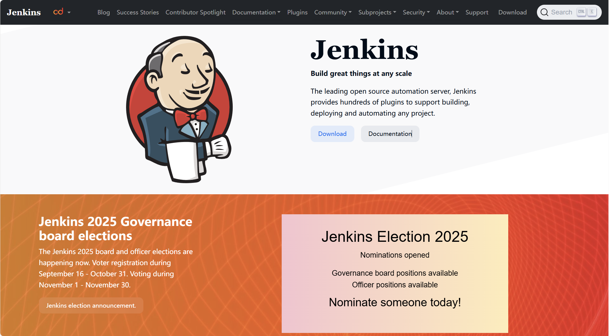

# 第二节 搭建 Jenkins CI/CD 自动化部署流水线

通过前面的实践，我们已经完成了本地 Git 版本管理、GitHub 远程仓库托管，并初步了解了 CI/CD 的基本概念。需要说明的是，目前像 GitHub Actions、GitLab CI/CD、Gitee 流水线等托管平台本身也提供了 CI/CD 能力，但在很多企业内部，团队仍然会选择自建一套 Jenkins 服务，用它作为统一的自动化平台来管理多个代码仓库、对接各种内部系统，并在私有网络环境中完成构建与部署。可以简单理解为 Git 负责管理代码版本，远程仓库负责集中托管代码，而 Jenkins 负责在代码变更后自动完成构建、测试和部署，把“提交代码 → 自动构建 → 部署上线”这个过程串成一条可观测、可配置的流水线。Jenkins 官方给自己的定位是“开源自动化服务器”，它最典型、最核心的应用场景是实现**持续集成**，并在此基础上扩展到**持续部署**，通过丰富的插件生态将构建、测试、打包、发布等步骤自动化，替代手工登录服务器反复执行命令的繁琐流程。

# 一、Jenkins 入门与安装部署

### 1.1 Jenkins 概览与应用场景

从官网 [jenkins.io](https://www.jenkins.io/) 定义来看，Jenkins 具备以下特点：

- **开源 & 跨平台**：基于 Java 开发，可以运行在主流 Linux 发行版、Windows、macOS 等多种环境；  
- **插件生态丰富**：几乎所有常见的构建工具、版本管理系统、消息通知、云平台，都可以通过插件方式集成到 Jenkins 中；  
- **易于扩展**：既可以通过图形化界面配置“自由风格项目”，也可以通过 Jenkinsfile 编写“流水线（Pipeline）脚本”，灵活适配不同团队的工作流。

<p align="center">
  
  <br />
  <em>图 15-13 Jenkins 官网</em>
</p>

可以看到 Jenkins 的 logo 是一个服务员。在典型的企业级场景中，Jenkins 通常也扮演这样一个“服务员”的角色。当研发人员将代码提交到远程仓库后，Jenkins 会通过 Webhook 或定时任务**自动拉取最新代码**，并在构建节点中自动完成编译、运行测试和打包镜像等步骤，构建通过后再将构建产物部署到测试环境、准生产环境或生产环境，如果任何一个环节失败（如单元测试不通过），团队可以在 Jenkins 控制台第一时间看到日志和失败原因。简单来说，**GitLab/GitHub 解决的是“代码管理 + 托管”的问题，而 Jenkins 负责把这些代码变成“可运行的服务”，并将其自动部署到目标环境**。

在第 14 章中，我们已经为 NER 服务准备过一台用于部署应用和 Docker 环境的 Linux 服务器。为了更贴近企业中“代码仓库 + 持续集成/交付平台 + 业务服务”这种分层架构的实践，这里我们需要**再单独准备一台服务器部署 Jenkins**，专门用来跑构建、测试和发布任务。实际上在企业中，往往还会额外准备一台或多台服务器，用来部署 GitLab 或自研的代码托管平台，然后由 Jenkins 从这些内部仓库拉取代码，当前为了聚焦 CI/CD 流水线本身，使用 GitHub 作为远程仓库，不再展开这部分搭建过程。如果条件有限、手头暂时只有一台服务器，也可以自行学习 GitHub、Gitee 等托管平台自带的 CI/CD 功能，完成本章的实践。

### 1.2 安装 Jenkins 的环境准备

在开始安装 Jenkins 之前，和上一章部署 NER 服务时一样，**先在全新的服务器上更新一次软件源与已安装包**：

```bash
sudo apt update && sudo apt upgrade -y
```

更新完成后，再来处理 Jenkins 所需的 Java 运行环境。特别要注意的一点是，**Jenkins 运行依赖 Java 环境，且新版本要求 JDK 17 及以上**。很多发行版（包括常见的 Ubuntu 长期支持版）默认自带的是 JDK 8，需要我们手动升级。

（1）查看当前 Java 版本：

```bash
java -version
```

输出如下：

```bash
Command 'java' not found, but can be installed with:
apt install openjdk-17-jre-headless  # version 17.0.17+10-1~24.04, or
apt install openjdk-21-jre-headless  # version 21.0.9+10-1~24.04
apt install default-jre              # version 2:1.17-75
apt install openjdk-11-jre-headless  # version 11.0.29+7-1ubuntu1~24.04
apt install openjdk-25-jre-headless  # version 25.0.1+8-1~24.04
apt install openjdk-8-jre-headless   # version 8u472-ga-1~24.04
apt install openjdk-19-jre-headless  # version 19.0.2+7-4
apt install openjdk-20-jre-headless  # version 20.0.2+9-1
apt install openjdk-22-jre-headless  # version 22~22ea-1
```

这个输出说明当前笔者使用的服务器还没有安装 JDK，如果输出类似 `1.8.0_xxx`，说明系统仍在使用 JDK 8，需要安装 JDK 17：

（2）安装 JDK 17（以 Ubuntu 为例）：

```bash
sudo apt install -y openjdk-17-jdk
```

（3）安装完成后再次确认版本：

```bash
java -version
```

输出如下：

```bash
openjdk version "17.0.17" 2025-10-21
OpenJDK Runtime Environment (build 17.0.17+10-Ubuntu-124.04)
OpenJDK 64-Bit Server VM (build 17.0.17+10-Ubuntu-124.04, mixed mode, sharing)
```

输出中出现 `openjdk version "17.x"` 即表示 JDK 17 已经生效，可以满足 Jenkins 的运行要求。

### 1.3 安装 Jenkins

Jenkins 官方下载页 [jenkins.io/download](https://www.jenkins.io/download/) 提供了多种安装方式，包括在线仓库安装、Docker 镜像、Helm Chart 等。

<p align="center">
  
  <br />
  <em>图 15-14 Jenkins 下载页面</em>
</p>

笔者的服务器是 Ubuntu 系统，所以这里选择 Ubuntu/Debian。按需选择安装方式后，如图 15-15，可以看到官方提供详细的安装指南。

<p align="center">
  
  <br />
  <em>图 15-15 Jenkins Linux 安装指引</em>
</p>

（1）安装 Jenkins：

```bash
# 导入 Jenkins 官方 GPG 密钥
sudo wget -O /etc/apt/keyrings/jenkins-keyring.asc https://pkg.jenkins.io/debian-stable/jenkins.io-2023.key

# 写入 Jenkins APT 软件源配置
echo "deb [signed-by=/etc/apt/keyrings/jenkins-keyring.asc]" https://pkg.jenkins.io/debian-stable binary/ | sudo tee /etc/apt/sources.list.d/jenkins.list > /dev/null

# 更新软件包索引并安装 Jenkins
sudo apt update && sudo apt install jenkins -y
```

安装完成后，Jenkins 服务通常会自动注册为一个 systemd 服务。

（2）启动 Jenkins 并设置开机自启：

```bash
sudo systemctl enable jenkins
sudo systemctl start jenkins
```

（3）确认 Jenkins 是否正常监听在 8080 端口：

```bash
sudo ss -ntlp | grep 8080
```

输出如下：
```bash
LISTEN 0 50 *:8080 *:* users:(("java",pid=555868,fd=8)) 
```

如果看到有 Java 进程占用 `0.0.0.0:8080`，说明 Jenkins 已经在监听该端口。此时，在浏览器中访问 `http://<服务器IP>:8080/`，就可以进入 Jenkins 的初始化页面。如果服务器设置了安全组或 `ufw` 等防火墙，还需要根据实际情况放行 8080 端口，才能从外网访问到 Jenkins 控制台。

### 1.4 首次访问 Jenkins 与插件安装

第一次访问 Jenkins 时，会经历以下几个步骤：

（1）输入初始管理员密码  

如图 15-16 所示，Jenkins 会提示从服务器上的一个文件中读取初始密码，我们转到服务器使用命令：

```bash
sudo cat /var/lib/jenkins/secrets/initialAdminPassword
```

将输出的一长串字符串复制到浏览器中的输入框中，即可完成解锁。

<p align="center">
  
  <br />
  <em>图 15-16 Jenkins 解锁界面</em>
</p>

（2）选择安装插件  

解锁后，Jenkins 会询问是否安装插件，通常有两种选择：

- 安装官方推荐的插件；  
- 自定义选择插件安装。

对于入门阶段，**推荐直接选择“安装推荐插件”**。安装过程中界面上会显示许多插件名称及安装进度，因为插件托管在国外服务器，网络不佳时可能会出现个别插件安装失败的情况。如果只是个别插件失败，一般可以先忽略，后续在“插件管理”界面重新安装即可。

（3）创建管理员用户或继续使用 `admin`  

插件安装完成后，Jenkins 会询问是否创建一个新的管理员用户。可以填写用户名、密码、邮箱等信息，如图 15-17 创建一个易记的管理员账号。当然，也可以选择下面的“使用admin账户继续”，会继续使用默认的 `admin` 账号。

<p align="center">
  
  <br />
  <em>图 15-17 创建管理员用户</em>
</p>

之后，如图 15-18 还需要确认 Jenkins 的访问 URL（例如 `http://192.168.88.203:8080/`），通常保持默认点击“保存并完成”即可。随后点击“开始使用 Jenkins”，就可以进入 Jenkins 的主控制台页面了。

<p align="center">
  
  <br />
  <em>图 15-18 实例配置</em>
</p>

### 1.5 常见管理操作与问题提示

（1）查看或修改管理员密码

只要当前已经成功登录 Jenkins，就可以在界面中直接修改密码。在右上角点击当前用户名，进入个人主页后切换到 **Security / 安全**，在 Password 区域输入两遍新密码并保存即可。也可以通过 “Manage Jenkins -> Manage Users（管理 Jenkins -> 管理用户）” 找到对应用户，在用户详情页该用户设置一个新密码。只有在**完全无法登录 Jenkins（忘记所有管理员账号密码）**时，才需要在服务器上暂时关闭安全认证或通过 Groovy 脚本重置密码，具体步骤会因版本和安全域配置略有不同，建议参考 Jenkins 官方文档中的说明，按最新指引操作。

（2）插件源和网络问题  

在国内环境下，Jenkins 默认的插件更新源可能较慢，安装推荐插件时偶尔会出现部分插件安装失败的情况。此时可以：

- 在“Manage Jenkins -> 管理插件 -> Advanced Setting”中找到 **升级站点** 配置，根据需要将 `https://updates.jenkins.io/update-center.json` 替换为合适的国内镜像源；  
- 或者从第三方镜像站点或其他同事的 Jenkins 实例中手动下载所需插件的 `.hpi` / `.jpi` 文件，在“管理插件”的“Advanced Setting”选项卡中通过“部署插件”功能直接上传安装。

（3）端口占用与服务状态  

当前示例使用的是基于 apt 的 Ubuntu/Debian 安装方式，Jenkins 默认监听 8080 端口。如果服务器上已经有其他服务占用了 8080 端口（例如某些 Java 应用或反向代理），可以：

- 在 `/etc/default/jenkins` 配置文件中找到并修改 `HTTP_PORT=8080` 为其他未占用端口（如 `HTTP_PORT=8090`），修改后执行 `sudo systemctl daemon-reload && sudo systemctl restart jenkins` 使配置生效；  
- 或者停止/调整占用 8080 端口的其他服务，确保 Jenkins 独占该端口。  

如果是使用 RPM 包在服务器上安装 Jenkins，端口配置通常位于 `/etc/sysconfig/jenkins`，思路与上述类似，只是配置文件路径不同。完成上述安装和基础配置之后，我们就拥有了一套可用的 Jenkins 服务端。

# 二、准备示例项目与 GitHub 仓库

在构建完整的 CI/CD 流水线之前，需要先明确“这条流水线要为谁服务”。基于已有工作，我们的目标是**让使用 FastAPI + Docker 构建的 NER 模型服务，可以在代码提交到 GitHub 后，由 Jenkins 自动拉取、构建并更新线上容器**。

### 2.1 使用已有的 `ner-demo` 仓库托管代码

我们在前面已经实践了如何在 GitHub 上创建名为 `ner-demo` 的远程仓库，并在本地通过 `git clone` 得到了一个 `ner-demo` 目录。为了避免再新建一个仓库、降低认知负担，我们直接**复用这个 `ner-demo` 仓库**，将第 14 章的 `ner_deployment` 项目代码整体迁移到 `ner-demo` 仓库中，由它来承载 NER 部署示例。只需要保留 `ner-demo` 仓库已有的 Git 历史和远程配置，把 `code/C14/ner_deployment/` 中的代码与配置文件整体复制到本地的 `ner-demo` 目录下。复制完成后，需要进入 `ner-demo` 目录执行一次完整的 Git 提交和推送：

```bash
cd ner-demo
git status

# 将新增/修改的文件纳入版本控制
git add .
git commit -m "feat: add NER service deployment demo"
git push origin main
```

完成这一步后，GitHub 上的 `ner-demo` 仓库就不再是一个简单示例，而是包含了完整的 NER 服务源码、Dockerfile 以及 `docker-compose.yml`，后续 Jenkins 和部署服务器都会以它作为“单一事实源”。此时本地 `ner-demo` 目录的核心结构大致如下（省略 `.git` 等 Git 元数据）：

```text
ner-demo/
├── checkpoints/           # 训练好的模型权重与配置
├── data/                  # 词汇表与标签文件
├── src/                   # 模型、分词器与工具代码
├── main.py                # FastAPI 应用入口
├── predict.py             # NER 预测封装
├── pyproject.toml         # 使用 uv 管理依赖的项目配置
├── Dockerfile             # 构建镜像所需指令
└── docker-compose.yml     # 使用 Docker Compose 启动服务
```

> 实际项目中，体积较大的模型权重和数据文件通常不会直接提交到 Git 仓库，而是存放在对象存储或模型仓库，通过配置或部署脚本在部署阶段拉取。当前为了便于“一次复制即可跑通示例”，才将 `checkpoints/` 等文件一并放进仓库，真实工程可以按团队规范将代码与模型存储拆分管理。

### 2.3 在部署服务器上改用 Git 拉取代码

我们在部署 NER 时是通过 FinalShell **手工上传** `ner_deployment` 目录到云服务器，并在该目录下执行 `docker compose up --build -d` 启动服务。为了与 CI/CD 流水线对齐，现在推荐改为在部署服务器上直接通过 Git 拉取代码，并以 Git 版本为准管理部署目录。

（1）登录部署 NER 服务的那台服务器。如果服务器上仍在运行之前基于手工上传目录启动的容器，建议先执行 `sudo docker compose down`（在原来的 `ner_deployment` 目录中）停止旧容器，再备份或删除旧目录，避免多个目录和容器混在一起。

（2）克隆远程仓库：

```bash
cd /root
git clone https://github.com/your-username/ner-demo.git
cd ner-demo
```

> 如果在这一步 `git clone` 访问 GitHub 很慢甚至超时（尤其是部分云服务器环境），可以尝试在服务器上为 `github.com` 手动指定一个可用 IP，例如：
> ```bash
> echo "140.82.112.4 github.com" >> /etc/hosts
> ```
> 然后重新执行 `git clone`。上面的 IP 在未来可能发生变化，可以在本机或浏览器中查询 `github.com` 的最新可用 IP 后替换为自己环境中测试通过的地址。

（3）按之前学过的步骤，确认 Docker 服务已正常运行，然后执行：

```bash
sudo docker compose up --build -d
```

从现在开始，这台部署服务器上的 `ner-demo` 目录就与 GitHub 仓库建立了关联，以后只需在该目录中执行：

```bash
git pull origin main
sudo docker compose up --build -d
```

就可以完成一次手工的“拉代码 + 构建镜像 + 重启容器”的更新。接下来要做的就是让 Jenkins 帮我们自动执行这一系列命令。

# 三、在 Jenkins 中配置流水线项目

### 3.1 安装并检查必要插件

有了示例项目和远程仓库，下一步是在 Jenkins 中创建一个流水线项目，用来完成三件事——从 GitHub 仓库拉取最新代码；通过 SSH 登录部署服务器；在部署服务器上执行 `git pull` 和 `docker compose up --build -d` 完成发布。如果安装 Jenkins 的时候选择的是“安装推荐插件”，通常已经包含了 **Git 插件** 和 **Pipeline（流水线）插件**。为了通过 SSH 登录部署服务器，还需要确认已安装 **SSH Agent Plugin**：

- 在 Jenkins 页面点击 “Manage Jenkins -> 插件管理 -> Available plugins”；  
- 搜索 `SSH Agent`，如果尚未安装则勾选后点击安装并重启 Jenkins。

### 3.2 为部署服务器配置 SSH 凭据

让 Jenkins 免密登录部署服务器的推荐做法是使用 **SSH 密钥对**。

（1）在 Jenkins 服务器上生成一对新的 SSH 密钥（如果已经有专用密钥，可复用）

```bash
ssh-keygen -t ed25519 -C "jenkins-deploy"
# 一路回车即可，默认保存在 ~/.ssh/id_ed25519 和 ~/.ssh/id_ed25519.pub
```

> `-t ed25519` 的意思是指定生成一对 Ed25519 类型的 SSH 密钥（这是 OpenSSH 当前推荐的现代椭圆曲线算法），`-C "jenkins-deploy"` 则是为这对密钥添加一段备注（comment），方便日后在 GitHub、服务器等地方区分“这把钥匙是 Jenkins 用来部署的”。

（2）将公钥追加到部署服务器上对应用户（例如 `root`）的 `authorized_keys` 中

```bash
# 在 Jenkins 服务器上查看公钥
cat ~/.ssh/id_ed25519.pub
```

会看到类似如下输出：

```bash
ssh-ed25519 AAAAC3NzaC1lZDI1NTE5AAAAIFFi0hLhcVxxxxxxxxxx/QxxhvsA14bfUxxx jenkins-deploy
```

```bash
# 登录到部署服务器，将上面的公钥内容追加到：
echo "<刚才复制的公钥内容>" >> ~/.ssh/authorized_keys
chmod 600 ~/.ssh/authorized_keys
```

（3）在 Jenkins 中添加 SSH 凭据

首先进入 “Manage Jenkins -> 凭据管理”，如图 15-19 所示，在页面中点击“全局”旁的下拉箭头并选择“添加凭据”。

<p align="center">
  
  <br />
<em>图 15-19 添加凭据</em>
</p>

接下来在“New credentials”表单中，如图 15-20 按照下面的方式依次填写各个字段：

- 在**类型**中选择 **SSH Username with private key**；  
- **范围**保持默认的全局；  
- 在 **ID** 一栏可以填写 `ner-deploy-ssh`，方便后续在流水线脚本中引用；
- （可选）在**描述**中写一段备注，便于识别，例如 `SSH key for NER deployment`；  
- **Username**填写用于登录部署服务器的用户名，例如 `root`；  
- **Treat username as secret**保持默认不勾选即可。如果勾选，日志中的用户名也会被掩码，不利于调试；
- 在 **Private Key** 一项中选择 **Enter directly**，然后将 `~/.ssh/id_ed25519` 文件的内容完整粘贴到下面的文本框中；
  > 这里粘贴的是私钥文件 `~/.ssh/id_ed25519` 的内容，而不是 `id_ed25519.pub` 公钥文件。
- 如果在生成 SSH 密钥对时（`ssh-keygen`）设置了密码，则需要在 **Passphrase** 填入。如果是一路回车生成的无密码密钥，则**留空**；
- 最后点击 **Create** 保存。

  <p align="center">
    
    <br />
    <em>图 15-20 填写凭据信息</em>
  </p>

> 配置完成后，建议先在 Jenkins 服务器的终端上手动测试一次连接，以排除防火墙或密钥配置问题：
> ```bash
> ssh -i ~/.ssh/id_ed25519 root@<部署服务器IP>
> ```
> 如果是首次连接，可能会提示 `The authenticity of host ... can't be established.`，此时输入 `yes` 并回车确认即可。如果能成功登录，说明 SSH 通道已打通。测试完毕后在远程终端中输入 `exit` 回车，即可退出登录、回到 Jenkins 服务器的终端。

### 3.3 创建 Pipeline 类型的 Jenkins 任务

（1）回到 Jenkins 首页，点击左侧 “新建 Item”。输入一个任务名称，例如 `ner-deployment-pipeline`。如图 15-21 所示，在类型列表中选择**流水线**，点击 “确定”，进入该任务的配置页面。

<p align="center">
  
  <br />
  <em>图 15-21 创建流水线任务</em>
</p>

（2）在任务配置页面中向下滚动，找到**流水线**区域，将 Definition 设置为 **Pipeline script from SCM**。在 **SCM** 一项中选择 **Git**，在 Repository URL 中填写：

```text
https://github.com/your-username/ner-demo.git
```

<p align="center">
  
  <br />
  <em>图 15-22 配置 SCM 与仓库地址</em>
</p>

如果仓库是私有并使用 SSH 方式访问，可以改为：

```text
git@github.com:your-username/ner-demo.git
```

并在此处设置对应的 Git 凭据。

（3）在 **Branches to build** 一栏填写 `*/main`，**脚本路径**保持默认的 `Jenkinsfile`，表示流水线脚本存放在仓库根目录下的 `Jenkinsfile` 文件中。检查配置无误后，点击页面底部的 “保存” 按钮。

接下来，我们只需要在 `ner-demo` 仓库中添加一个合适的 `Jenkinsfile`，整条流水线就能跑起来了。

# 四、编写 Jenkinsfile

回到本地开发环境，在 `ner-demo` 项目的根目录中创建一个名为 `Jenkinsfile` 的文件，并填入如下示例脚本（Groovy 语法）：

```groovy
// ner-demo/Jenkinsfile

pipeline {
    agent any

    environment {
        // 部署服务器 SSH 地址（按实际 IP 或域名修改）
        DEPLOY_HOST = 'root@<部署服务器公网 IP>'
        // 部署服务器上 ner-demo 代码所在目录
        DEPLOY_DIR  = '/root/ner-demo'
        // 要部署的 Git 分支
        BRANCH_NAME = 'main'
    }

    stages {
        stage('拉取代码') {
            steps {
                // 由于我们在 Jenkins 任务中选择了 "Pipeline script from SCM"
                // 这里使用 checkout scm 即可从同一仓库拉取代码
                checkout scm
            }
        }

        stage('基础检查') {
            steps {
                echo "工作空间内容如下："
                sh 'pwd && ls -lah'
            }
        }

        stage('部署到 Docker 服务器') {
            steps {
                // 使用前文在 Jenkins 中配置的 SSH 凭据 ID
                sshagent(credentials: ['ner-deploy-ssh']) {
                    sh '''
set -e
echo "开始通过 SSH 连接部署服务器并更新服务..."

ssh -o StrictHostKeyChecking=no "$DEPLOY_HOST" << EOF
set -e
cd "$DEPLOY_DIR"

echo "[部署机] 拉取最新代码..."
git pull origin "$BRANCH_NAME"

echo "[部署机] 使用 Docker Compose 构建并重启服务..."
sudo docker compose up --build -d
EOF
                    '''
                }
            }
        }
    }
}
```

这个 `Jenkinsfile` 主要做了三件事：

- **拉取代码**：`checkout scm` 会根据 “Pipeline script from SCM” 的配置，从同一个 Git 仓库拉取最新代码；  
- **基础检查**：简单输出工作空间路径和文件列表，便于在 Jenkins 控制台中查看；  
- **部署到 Docker 服务器**：借助 `sshagent` 与我们之前配置的 `ner-deploy-ssh` 凭据，通过 SSH 登录部署服务器，在远端执行 `git pull` 和 `sudo docker compose up --build -d`，从而完成构建镜像和重启容器。

> 这个 `Jenkinsfile` 只是一个模板示例，实际使用时请根据自己的环境调整几处配置。`DEPLOY_HOST` 要改成真实的部署服务器地址和用户名，例如 `ubuntu@your-server-ip`；`DEPLOY_DIR` 要对应部署机器上 `ner-demo` 项目的实际路径；`BRANCH_NAME` 要与仓库中用于部署的分支一致（如 `main` 或 `master`）；`sshagent(credentials: ['ner-deploy-ssh'])` 中的凭据 ID 也要与前文在 Jenkins 中创建的 SSH 凭据保持一致。
  
完成 `Jenkinsfile` 的编辑后，别忘了在本地 `ner-demo` 目录中将它提交到 GitHub 仓库，这样 Jenkins 才能在构建时读取到最新的流水线脚本：

```bash
cd ner-demo

git add Jenkinsfile
git commit -m "chore: add Jenkins pipeline"
git push origin main
```

至此，当我们在本地提交并推送代码到 GitHub 时，只要 Jenkins 被触发构建，就会自动登录部署服务器并完成服务更新。

# 五、从“手动构建”到 Webhook 自动触发

目前这条流水线已经可以在 Jenkins 页面中通过“立即构建”手动触发。要把它真正变成 CI/CD 流水线，还需要配置一个**自动触发机制**。接下来分别说明一下两种设置方式。

### 5.1 简单方式：轮询 SCM

回到流水线任务的配置页面中，找到 **Triggers**，勾选 **轮询 SCM**。勾选后下面会出现一个 “日程表” 区域，点击右侧的小问号会弹出一张时间表，这是用来说明 Jenkins Cron 语法的帮助页面。对于当前的任务我们只需要在输入框中填入：

```text
H/5 * * * *
```

表示 Jenkins 每 5 分钟检查一次远程仓库是否有新的提交，一旦检测到变更就自动触发流水线。优点是配置简单，不需要在 GitHub 上额外设置 Webhook。缺点是有一定延迟，并且频繁轮询会增加 Jenkins 和 GitHub 的负载。

### 5.2 更实时的 GitHub Webhook 触发

如果希望在代码一提交就立即触发构建，可以使用 GitHub Webhook。首先在 Jenkins 中确认已安装 **GitHub 插件**，并在流水线任务的 **Triggers** 中勾选 **GitHub hook trigger for GITScm polling**。下一步我们需要在 GitHub 仓库页面中如图 15-23，进入 “Settings -> Webhooks -> Add webhook”，然后在 **Payload URL** 中填写：

```text
http://<Jenkins服务器IP或域名>:8080/github-webhook/
```

<p align="center">
  
  <br />
  <em>图 15-23 添加 Webhook</em>
</p>

Content type 选择 `application/json`，触发事件选择 **Just the push event（仅 Push 事件）**。

<p align="center">
  
  <br />
  <em>图 15-24 Webhook 配置详情</em>
</p>

保存 Webhook 后，GitHub 每次有新的 push 操作，都会向上述 URL 发送通知，Jenkins 收到后会立即轮询对应仓库并触发构建。结合前面的 Jenkinsfile，我们就完成了“本地提交代码 → 推送到 GitHub → GitHub Webhook 通知 Jenkins → Jenkins 通过 SSH 在部署服务器上执行 git pull + docker compose 更新服务”的完整 CI/CD 流程。

### 5.3 做一个最小改动验证整条流水线

为了验证整条 CI/CD 流水线是否真正打通，我们可以在本地做一个**非常小的改动**，例如把首页返回的提示文案从：

```text
欢迎使用命名实体识别 (NER) API
```

临时改成：

```text
不欢迎使用 API
```

在 `ner-demo` 项目中打开 `main.py`，找到文件底部用于处理根路径请求的 FastAPI 接口（`GET /`），把其中返回的那一行字符串改成上面的新内容后，按下面步骤操作：

（1）在本地提交并推送改动：

```bash
cd ner-demo
git diff
```

输出如下：

```bash
diff --git a/main.py b/main.py
index b22b7c7..7448ae5 100644
--- a/main.py
+++ b/main.py
@@ -64,4 +64,4 @@ async def health_check():

 @app.get("/")
 async def root():
-    return {"message": "欢迎使用命名实体识别 (NER) API"}
\ No newline at end of file
+    return {"message": "不欢迎使用 API"}
\ No newline at end of file
```

确认无误后提交代码：

```bash
git add .
git commit -m "chore: tweak NER welcome message"
git push origin main
```

（2）等待 Jenkins 通过“轮询 SCM”或 GitHub Webhook 自动触发构建，并在 Jenkins 控制台日志中确认构建成功、远端 Docker 容器已重启。  

（3）在浏览器中访问 `http://<部署服务器公网 IP>:8000/`，如果能看到返回内容已经变成“**不欢迎使用 API**”，就说明这条从本地提交到线上服务更新的 Jenkins CI/CD 流水线已经完整跑通。

## 练习

- 自行查阅 GitHub / Jenkins 文档或相关文章，将 GitHub 上的 `ner-demo` 仓库改为私有仓库，并在 Jenkins 中改用 SSH（Git）方式拉取代码，重新触发构建，验证整条流水线仍能正常运行。