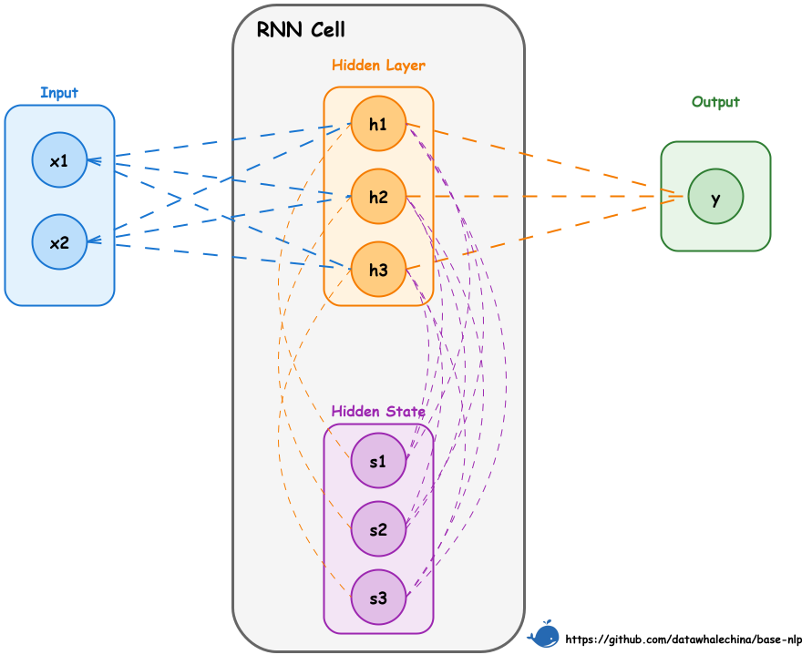

# 第一节 循环神经网络

## 一、如何处理序列信息？

我们已经学习了如何将文本进行分词，并通过词嵌入技术（如 Word2Vec）将每个独立的词元转换成一个静态的、稠密的词向量。这解决了模型输入的第一个问题，即文本数值化。

接下来的第二个关键问题是**如何从一个词向量序列中，有效地提取整个序列的特征**。例如，对于一个意图识别任务，需要将指令 **“播放周杰伦的《稻香》”** 归类到 **“音乐播放”**。目前已经能得到“播放”、“周杰伦”、“的”、“《稻香》”这几个词元各自的词向量，但如何将这些向量融合成一个能代表整句指令含义的 **“文本向量”**，并送入分类器呢？

### 1.1 简单方法的局限性

#### 1.1.1 词袋模型

最直接的思路是像词袋法一样，将所有词向量相加或取平均。但是这种方法完全忽略了语序信息。“我爱你” 和 “你爱我” 会得到完全相同的文本向量。更重要的是，它将所有词语视为同等重要。在“播放周杰伦的《稻香》”这句话中，“播放”和“《稻香》”显然比“的”包含更多分类所需的关键信息，但简单的求和无法体现这种差异。

#### 1.1.2 全连接网络

另一个想法是，可以用一个全连接网络（Fully Connected Network, FCN）来处理这些词向量。有两种方式：
1.  **先求和，后 FCN**：这与向量求和没有本质区别，依然丢失了语序和重点信息。
2.  **先 FCN，后求和**：可以对每一个词向量都进行一次全连接变换，然后再将变换后的向量相加。

为了处理变长的句子，在每个时间步（即每个词元的位置）上使用的全连接层必须**共享同一套权重参数**。这仍然存在一个致命缺陷，在计算任意一个词的输出时（如 `《稻香》` 的输出），模型仅仅使用了 `《稻香》` 自己的词向量，完全没有考虑到它前面出现了 “播放”、“周杰伦”、“的” 这些词。每个词元依然是被**孤立处理**的，模型无法理解词元之间的顺序关系和上下文依赖，即**没有捕获序列特征**。

> 在处理序列数据（如文本）时，模型按顺序逐个处理序列中的元素（如词元）。**“时间步”** 就是这个处理过程中的一个离散步骤。在文本处理的上下文中，**一个时间步通常对应于处理一个词元**。例如，对于句子“播放周杰伦的歌”，处理“播放”是时间步 1，处理“周杰伦”是时间步 2，以此类推。

#### 1.1.3 卷积神经网络（CNN）

在图像处理中大获成功的 CNN 也可以用于文本。通过使用一维卷积核（窗口）滑过整个词向量序列，CNN 能够捕捉到词语的局部依赖关系（如n-grams）。

不过，CNN 的缺陷在于它的**感受野是固定的**。一个大小为3的卷积核，只能看到附近3个词的关系。虽然可以通过堆叠多层CNN来扩大感受野，但对于句子开头和结尾的长距离依赖，CNN 仍然难以有效捕捉。无法预先设定一个适用于所有句子的“最佳”窗口大小。

## 二、引入“记忆”的 RNN

为了解决上述问题，需要一种新的网络结构，它必须能够**记住**在处理当前词元之前都看过了哪些信息。**循环神经网络（Recurrent Neural Network, RNN）**就是为满足这一需求而诞生的。

RNN 的思路是在处理序列的每一步时，网络不仅接收当前时间步的输入 $x_t$，还会接收一个来自**上一步的“记忆”**——即隐藏状态 $h_{t-1}$。网络将这两部分信息融合，生成当前步的输出 $h_t$，然后这个 $h_t$ 又会作为“记忆”传递给下一步。

可以将这个过程看作是对全连接网络的改进：
1.  **当前输入的信息**：和之前一样，用一个全连接层处理当前输入 $x_t$，得到 $U \cdot x_t$。
2.  **过去记忆的信息**：引入另一个全连接层，处理来自上一步的隐藏状态 $h_{t-1}$，得到 $W \cdot h_{t-1}$。
3.  **融合与激活**：将两部分信息相加，并通过一个激活函数（如 $\tanh$），得到当前步的隐藏状态 $h_t$。

如此一来， $h_t$ 就同时包含了当前输入 $x_t$ 的信息和之前所有步的信息摘要 $h_{t-1}$。

### 2.1 RNN 结构

这种最基础的 RNN 结构通常被称为**简单循环神经网络（Simple Recurrent Network，SRN）** 或 **Elman Network** [^1]。

如图 3-1 展示了 RNN 单元在单个时间步内的计算流程。需要注意，为了可视化，此图将隐藏状态拆分成了两个部分（`Hidden State` 和 `Hidden Layer`），但在计算上它们是紧密关联的。

<div align="center">
  
  <p>图 3-1 RNN 单元结构</p>
</div>

可以将图中的流程分解如下，并与公式 $h_t = \tanh(U x_t + W h_{t-1} + b)$ 对应起来：

（1）**输入（$x_t$）**: 左侧的 `Input` 块代表当前时间步的输入向量 $x_t$。它通过权重矩阵 $U$ 连接到隐藏层（图中的蓝色虚线），对应公式中的 $U x_t$ 部分。

（2）**前一时刻的隐藏状态（$h_{t-1}$）**: 紫色的 "Hidden State" 块（图中用 $s$ 表示）代表了来自**上一个时间步**的记忆，即 $h_{t-1}$。它通过循环权重矩阵 $W$ 连接到隐藏层（图中的橙色虚线），对应公式中的 $W h_{t-1}$ 部分。

（3）**当前时刻的隐藏状态（$h_t$）**: 橙色的 "Hidden Layer" 块（图中用 $h$ 表示）代表了**当前时间步**计算出的新隐藏状态 $h_t$。它是输入信息和旧状态信息融合并经过激活函数计算后的结果。

（4）**状态更新**: 新计算出的隐藏状态 $h_t$ 将作为“记忆”传递给下一个时间步，成为下一个时间步计算中的 $h_{t-1}$（图中从 `Hidden Layer` 指向 `Hidden State` 的紫色虚线）。

（5）**输出（$o_t$）**: 当前的隐藏状态 $h_t$ 也可以被用来计算当前步的最终输出（如图中从 `Hidden Layer` 指向 `Output` 的橙色虚线），这通常需要再经过一个独立的输出层。

通过这种循环，RNN 单元在每个时间步都融合了当前输入和历史记忆，实现了信息的持续传递。

> 在所有的时间步中，权重矩阵 $U$（输入到隐藏层）和 $W$（隐藏层到隐藏层）是**共享**的。这一机制让 RNN 能够处理任意长度的序列，并且大幅减少了模型参数。

## 三、RNN 工作原理解析

### 3.1 文本分类示例

回到最初的例子，看看 RNN 是如何解决 **“播放周杰伦的《稻香》”** 的分类问题的。

1. **准备输入**

- **分词**：["播放", "周杰伦", "的", "《稻香》"]
- **ID化**：[23, 58, 102, 203]（假设）
- **词嵌入**：得到4个词向量 $x_1, x_2, x_3, x_4$。假设每个向量是128维。输入序列的形状为 $(T, E) = (4, 128)$。

2. **RNN 逐步处理**

RNN 会按顺序处理这个向量序列，并不断更新其内部的“记忆”（隐藏状态 $h$）。假设隐藏状态是64维（$H=64$）。
- **初始状态**：在处理第一个词之前，隐藏状态 $h_0$ 通常被初始化为零向量。
- **第1步（t=1）**：
  - 输入：第一个词向量 $x_1$（“播放”）和初始隐藏状态 $h_0$。
  - 计算： $h_1 = \tanh(U \cdot x_1 + W \cdot h_0 + b)$
  - $h_1$ 现在包含了“播放”的信息。
- **第2步（t=2）**：
  - 输入：第二个词向量 $x_2$（“周杰伦”）和上一步的隐藏状态 $h_1$。
  - 计算： $h_2 = \tanh(U \cdot x_2 + W \cdot h_1 + b)$
  - $h_2$ 现在融合了“播放”和“周杰伦”的信息。
- **第3步（t=3）**：
  - 输入：第三个词向量 $x_3$（“的”）和 $h_2$。
  - 计算： $h_3 = \tanh(U \cdot x_3 + W \cdot h_2 + b)$
  - $h_3$ 融合了“播放周杰伦的”的信息。
- **第4步（t=4）**：
  - 输入：第四个词向量 $x_4$（“《稻香》”）和 $h_3$。
  - 计算： $h_4 = \tanh(U \cdot x_4 + W \cdot h_3 + b)$
  - $h_4$ 融合了整个句子的信息。

3. **获取文本向量并分类**

当 RNN 处理完最后一个词元后，得到的最终隐藏状态 $h_4$ 就被认为是整个句子的**动态上下文表示**，即我们需要的 **“文本向量”**。这个向量捕获了整个句子的语序和语义信息。最后，我们将这个 $h_4$ 向量送入一个标准的全连接分类层，就可以得到各个类别（如“音乐播放”、“天气查询”）的置信度了。通过这种方式，RNN 成功地将一个变长的词向量序列，编码成了一个蕴含序列信息的固定长度的特征向量。

### 3.2 从静态到动态的飞跃

通过上面的例子，能够发现 RNN 解决了静态词向量的局限性，实现了从 **Type** 到 **Token** 的跨越：

> 这里的 token 并不是词元的概念。在语言学中，**Type**（类型）指抽象的、通用的概念，而 **Token**（标记/实例）指该概念在特定时空下的具体表现。例如，“我一边玩黑神话悟空，一边等黑神话钟馗”这句话中，有 2 个“黑神话”的 Token，但只有一个“黑神话”的 Type。

1.  **静态的 Type（词嵌入）**：Word2Vec 等模型学到的是词在字典中的静态含义。无论“周杰伦”出现在哪里，它的输入向量 $x_t$ 都是一样的。这代表了 **Type**。
2.  **动态的 Token（隐藏状态）**：RNN 的隐藏状态 $h_t$ 是动态的。
    -   在“**播放**周杰伦”中，RNN 会生成一个包含“播放”上下文的“周杰伦”向量。
    -   在“**我喜欢**周杰伦”中，RNN 会生成一个包含“我喜欢”上下文的“周杰伦”向量。
    -   代表 **Token**，即具体的、上下文相关的实例。

Jeffrey Elman 在其论文 [^1]中通过实验发现，即使不给网络任何语法规则，仅仅通过训练 RNN 预测序列中的下一个词，网络的隐藏状态空间也会自发地组织出**层级结构**：
-   **动词**和**名词**会被映射到隐藏空间的不同区域。
-   在名词区域内部，**有生命**和**无生命**的名词又会进一步区分。
-   甚至具体的词（如 "Boy"）在不同句子位置的 Token 表示，也会根据句法角色（主语 vs 宾语）聚类在一起。

这证明了 RNN 不仅仅是在“记忆”历史，它实际上是在通过**预测任务**，隐式地学会了语言的**句法和语义结构**。

> **动态表示 vs. 动态词向量**
> 
> 如果你听说过 ELMo 可能会有疑问：**“实现从静态到动态跨越的，究竟是 RNN 还是后来的 ELMo？”**
> 
> 1.  **从原理机制上讲，是 RNN**：正如本节所述，RNN 的隐藏状态 $h_t$ 本质上就是一个随上下文变化的动态向量。它最早具备了“根据语境改变数值”的核心能力。
> 2.  **从 NLP 发展范式上讲，是 ELMo**：在 ELMo (2018) 之前，大家通常只把 Word2Vec 这种**查表**得到的向量称为“词向量”，而把 RNN 的输出视为特定任务的**中间状态**。ELMo 的贡献在于它确立了**“动态词向量”**这一概念，并将其作为一种通用的、可迁移的预训练特征，改变了 NLP 的开发模式。
> 
> 所以，RNN 发明了机制，而 ELMo 普及了范式。

## 四、从零实现一个 RNN

为了将理论付诸实践并加深理解，接下来从底层的数学公式出发，用 NumPy 手写一个 RNN。

> [本节完整代码](https://github.com/FutureUnreal/base-nlp/blob/main/code/C3/01_RNN.py)

### 4.1 RNN 公式简化

为了与后续的代码实现保持一致，此处采用一个不含偏置项（bias）的简化版 RNN，其核心计算公式如下：

$$
h_t = \tanh(U x_t + W h_{t-1})
$$

其中， $h_t$ 是当前时刻的隐藏状态， $x_t$ 是当前输入， $h_{t-1}$ 是上一时刻的隐藏状态， $U$ 和 $W$ 是共享的权重矩阵。

> 上述公式采用的是数学通用的**列向量**表示法（即 $x_t$ 是列向量，矩阵 $U$ 在左）。而在后续的代码实现中，为了利用计算机内存布局的优势，通常采用**行向量**表示法（即 $x_t$ 是行向量，矩阵 $U$ 在右，计算 $x_t U$）。两者在数学上是转置关系，本质一致。

### 4.2 数据准备

在实现 RNN 的计算过程之前，首先需要准备输入数据。下面的代码定义了模型的一些基本参数，并实现了 `prepare_inputs` 函数，用以构造一个代表句子 **“播放周杰伦的《稻香》”** 的词向量序列。

```python
import numpy as np

# (B, T, E, H) 分别表示 批次/序列长度/输入维度/隐藏维度
B, E, H = 1, 128, 3

def prepare_inputs():
    """
    使用 NumPy 准备输入数据
    使用示例句子: "播放 周杰伦 的 《稻香》"
    构造最小词表和随机(可复现)词向量, 生成形状为 (B, T, E) 的输入张量。
    """
    np.random.seed(42)
    vocab = {"播放": 0, "周杰伦": 1, "的": 2, "《稻香》": 3}
    tokens = ["播放", "周杰伦", "的", "《稻香》"]
    ids = [vocab[t] for t in tokens]

    # 词向量表: (V, E)
    V = len(vocab)
    emb_table = np.random.randn(V, E).astype(np.float32)

    # 取出序列词向量并加上 batch 维度: (B, T, E)
    x_np = emb_table[ids][None]
    return tokens, x_np
```
首先定义一个简单的词表，然后为句子中的每个词生成一个随机的词向量，最终组合成一个形状为 `(1, 4, 128)` 的张量，作为 RNN 模型的输入。依照前文 RNN 的图示结构，将隐藏节点设置为3个 (`H=3`)，以便于理解（实际使用不会这么少）。

### 4.3 基于 NumPy 实现 RNN

```python
def manual_rnn_numpy(x_np, U_np, W_np):
    B_local, T_local, _ = x_np.shape
    # 初始化 h_0 为零向量
    h_prev = np.zeros((B_local, H), dtype=np.float32)
    
    steps = []
    # 按时间步循环
    for t in range(T_local):
        x_t = x_np[:, t, :]
        # 核心公式实现
        h_t = np.tanh(x_t @ U_np + h_prev @ W_np)
        steps.append(h_t)
        h_prev = h_t # 更新状态
        
    return np.stack(steps, axis=1), h_prev
```
这段代码展示了 RNN 的工作原理，将公式 $h_t = \tanh(U x_t + W h_{t-1})$ 转换为了具体的计算步骤：

（1）**初始化**: `h_prev = np.zeros(...)` 创建了一个全零的初始隐藏状态，作为处理**每个序列**开始前的“空白记忆”。

（2）**逐帧处理**: `for t in range(T_local):` 循环遍历序列中的每一个时间步（即每一个词元）。

（3）**核心计算**: 在循环内部，`h_t = np.tanh(x_t @ U_np + h_prev @ W_np)` 这一行完美复现了 RNN 的核心逻辑：
    -   `x_t @ U_np`：对当前时间步的输入 $x_t$ 进行线性变换。
    -   `h_prev @ W_np`：对上一步的隐藏状态 $h_{t-1}$ 进行线性变换。
    -   将两者相加，再通过 `tanh` 激活函数，就得到了融合了当前输入和过去记忆的新隐藏状态 $h_t$。

（4）**状态更新**: `h_prev = h_t` 实现了“循环”的精髓。当前计算出的 $h_t$ 会作为下一个时间步的 `h_prev`，将信息传递下去。

（5）**结果保存**: `steps.append(h_t)` 将每一步计算出的隐藏状态都保存下来，最终通过 `np.stack` 组合成一个包含所有时间步输出的张量。

### 4.4 PyTorch 的 `nn.RNN` 实现

PyTorch 提供了高度封装的 `nn.RNN` 模块，它内部完成了与我们手写版本相同的循环计算，但经过了优化，效率更高。

```python
def pytorch_rnn_forward(x, U, W):
    rnn = nn.RNN(
        input_size=E,
        hidden_size=H,
        num_layers=1,
        nonlinearity='tanh',
        bias=False,
        batch_first=True,
        bidirectional=False,
    )
    with torch.no_grad():
        # PyTorch 内部存放的是转置后的权重
        rnn.weight_ih_l0.copy_(U.T)
        rnn.weight_hh_l0.copy_(W.T)
    y, h_n = rnn(x)
    return y, h_n.squeeze(0)
```

**`nn.RNN` 参数解析：**

  - `input_size`（$E$）: 输入特征 $x_t$ 的维度。在NLP中，这通常是词嵌入的维度 `embedding_dim`。
  - `hidden_size`（$H$）: 隐藏状态 $h_t$ 的维度。这代表了RNN“记忆”的容量，也是其隐藏层的节点数。
  - `num_layers`: RNN的层数。默认是1。如果大于1，会构成一个“堆叠RNN”（Stacked RNN），即前一层RNN在所有时间步的输出，会作为后一层RNN的输入。
  - `bias`: 是否使用偏置项。默认为 `True`。如果为真，则公式会变为 $h_t = \tanh(U x_t + b_{ih} + W h_{t-1} + b_{hh})$。在示例中设为 `False` 以便与手写版本对齐。
  - `batch_first`: 一个非常重要的维度顺序参数。默认为 `False`，此时输入张量的形状应为 `(T, B, E)`。在代码中设为 `True`，使得输入形状为更符合直觉的 `(B, T, E)`，其中 `B`是批次大小，`T`是序列长度。
  - `bidirectional`: 是否构建一个双向RNN。默认为 `False`。双向RNN能同时考虑过去和未来的上下文，后续章节将对此进行介绍。

### 4.5 数值对齐验证

验证用 NumPy 手写的 RNN 和 PyTorch 官方的`nn.RNN`模块在给定相同输入和相同权重时，其输出是否完全相同。

```python
# 将NumPy结果转回PyTorch张量
out_manual = torch.from_numpy(out_manual_np)

# 使用 allclose 进行浮点数精度下的严格比较
print("逐步输出一致:", torch.allclose(out_manual, out_torch, atol=1e-6))
# 输出: True
```

得到 `True` 的结果，证明我们对 RNN 数学原理的理解是正确的，而且 `nn.RNN` 模块内部确实执行了所理解的循环计算过程。

## 五、双向循环神经网络

在前面的讨论中，RNN 结构在处理序列时，信息是单向流动的——即在计算任意时刻 $t$ 的状态时，只利用了 $t$ 时刻及之前的信息。但在很多自然语言处理任务中，一个词的含义往往不仅依赖于它前面的词，还与它后面的词密切相关。例如，在句子“**苹果**味道不错。”中，仅凭“**苹果**”，模型很难断定“苹果”是指水果还是苹果公司。但如果能看到后文“味道不错”，就能基本确定它指的是水果；反之，如果后文是“股票大涨”，则指的是公司。

为了利用未来的信息，一种早期的尝试是**引入“时间延迟”（Time Delay）**：即在预测 $t$ 时刻的输出时，允许模型看到 $t+M$ 时刻的输入。然而，这个延迟窗口 $M$ 是一个需要人工调整的超参数——窗口太小，未来信息不足；窗口太大，模型反而难以聚焦于局部。为了更优雅地同时利用过去（前文）和未来（后文）的上下文信息，**双向循环神经网络（Bidirectional RNN, BiRNN）** 被提出 [^2]。

### 5.1 BiRNN 的结构与原理

BiRNN 的原理很简单：它由两个完全独立的 RNN 构成，并将它们叠加在一起处理信息。

（1）**一个正向 RNN**：按照从左到右的顺序读取输入序列（例如，从 $x_1$到 $x_T$），计算出一系列正向隐藏状态 $(\overrightarrow{h_1}, \overrightarrow{h_2}, ..., \overrightarrow{h_T})$。

（2）**一个反向 RNN**：按照从右到左的顺序读取输入序列（例如，从 $x_T$ 到 $x_1$），计算出一系列反向隐藏状态 $(\overleftarrow{h_1}, \overleftarrow{h_2}, ..., \overleftarrow{h_T})$。

在任意时间步 $t$，BiRNN 的最终输出 $h_t$ 是将该时间步对应的正向 RNN 隐藏状态 $\overrightarrow{h_t}$ 和反向 RNN 隐藏状态 $\overleftarrow{h_t}$ 进行拼接（Concatenate）得到的：

$$
h_t = [\overrightarrow{h_t} ; \overleftarrow{h_t}]
$$

通过这种方式， $h_t$ 就同时包含了输入序列中 $t$ 时刻左右两侧的上下文信息。需要注意，正向和反向的两个 RNN 拥有各自独立的权重参数，它们在训练过程中被 **同时优化**。

> **为什么不直接训练两个独立的 RNN 然后合并结果？**
>
> 当然可以分别训练一个正向 RNN 和一个反向 RNN，最后将它们的输出取平均（线性意见池）或几何平均（对数意见池）。但 BiRNN 的优势在于它是在同一个损失函数下**同时训练**两个方向的权重。所以正向和反向的特征提取是协同进行的，能够更好地适应目标任务，而不需要假设两个方向的预测是相互独立的。而且，BiRNN 彻底消除了对“时间延迟”参数 $M$ 的依赖，模型自动利用所有可用的过去和未来信息。

由于最终的输出是两个独立 RNN 隐藏状态的拼接，如果每个 RNN 的 `hidden_size` 都为 $H$，那么 BiRNN 在每个时间步的输出维度将变为 $2H$。

在 PyTorch 的 `nn.RNN` 模块中，只需将 `bidirectional` 参数设置为 `True` 即可轻松构建一个双向 RNN。其输出 `y` 的最后一个维度（特征维度）将是 `hidden_size` 的两倍，而最终隐藏状态 `h_n` 的第一个维度将是 `num_layers * 2`，分别存储了正向和反向 RNN 在最后一个时间步的隐藏状态。

### 5.2 BiRNN 的作用与局限

-   **作用**：BiRNN 的价值在于，它为序列中的每个元素都提取了更完整的上下文相关的特征，而不是像单向 RNN 那样只依赖于过去的信息。这使得它在许多 NLP 任务中（如命名实体识别、情感分析、机器翻译等）都取得了比单向 RNN 更好的效果。

-   **局限**：
    1.  BiRNN 并没有解决 RNN 的**长距离依赖**问题。无论是正向还是反向的 RNN，它们本身依然会面临梯度消失或梯度爆炸的挑战。
    2.  由于需要处理完整的序列才能计算反向信息，BiRNN 无法被用于需要实时预测的场景（例如，根据用户已输入的内容实时推荐下一个词）。

## 六、随时间反向传播

前面已经了解了 RNN 如何通过正向传播逐个处理序列信息。接下来，将探讨其训练机制。RNN 的训练实质是标准反向传播（Backpropagation, BP）在时间展开图上的直接应用，称为**随时间反向传播（Backpropagation Through Time, BPTT）** [^3]。具体而言，该方法将 RNN 沿时间维度展开，可视作一个各层参数共享的深层前馈网络，进而在此结构上执行通用的反向传播算法。

假设整个序列的总损失 $L$ 是所有时间步损失 $L_t$ 的总和： $L = \sum_{t=1}^{T} L_t$。我们的目标是计算损失 $L$ 对共享参数 $U$ 和 $W$ 的梯度。

根据加法求导法则，总梯度等于每个时间步损失所贡献的梯度的总和：

$$
\frac{\partial L}{\partial W} = \sum_{t=1}^{T} \frac{\partial L_t}{\partial W}
$$

主要的挑战在于计算单个时间步的梯度 $\frac{\partial L_t}{\partial W}$。由于 $W$ 在每个时间步都参与了计算，当前时刻的隐藏状态 $h_t$ 不仅依赖于当前输入 $x_t$，还通过 $h_{t-1}$ 间接依赖于之前所有时间步的输入和状态。因此，在 $t$ 时刻的损失，其梯度必须沿着时间反向传播，一直追溯到序列的开端。

使用链式法则（向量-导数矩阵形式）， $\frac{\partial L_t}{\partial W}$ 可分解为：

$$
\frac{\partial L_t}{\partial W} = \sum_{k=1}^{t} \underbrace{\frac{\partial L_t}{\partial h_t}}_{\text{梯度}} \cdot \underbrace{\frac{\partial h_t}{\partial h_k}}_{\text{导数矩阵连乘}} \cdot \underbrace{\frac{\partial h_k}{\partial W}}_{\text{直接影响}}
$$

其中， $\frac{\partial h_k}{\partial W}$ 是 $h_k$ 关于参数 $W$ 的导数矩阵； $\frac{\partial h_t}{\partial h_k}$ 表示从第 $k$ 步到第 $t$ 步的“传播的导数矩阵”，其本身是导数矩阵的连乘：

$$
\frac{\partial h_t}{\partial h_k} = \prod_{i=k+1}^{t} \frac{\partial h_i}{\partial h_{i-1}}
$$

这个连乘的形式正是 RNN 产生问题的根源所在。

## 七、RNN 的局限性

尽管 RNN 在理论上可以捕捉长距离依赖，但在实践中，基于 BPTT 的反向传播在时间维度上的导数矩阵连乘，带来了以下问题：

### 7.1 梯度消失与梯度爆炸

BPTT 链式求导的关键，在于梯度的反向传播路径上会形成一个连乘项 $\prod_{i=k+1}^{t} \frac{\partial h_i}{\partial h_{i-1}}$。以 $h_i = \tanh(U x_i + W h_{i-1})$ 为例，其传播的导数矩阵近似为：

$$
\frac{\partial h_i}{\partial h_{i-1}} \approx J_{\tanh}(U x_i + W h_{i-1}) \cdot W
$$

其中 $J_{\tanh}$ 表示 $\tanh$ 的导数矩阵。这意味着，从遥远的 $k$ 步到当前 $t$ 步的梯度传递，需要经历 $t-k$ 次与权重矩阵 $W$ 和激活函数导数矩阵的相乘。

1.  **梯度消失（Vanishing Gradients）**：在 RNN 中，权重矩阵 $W$ 的值通常会被初始化为较小的值。如果 $W$ 的范数（可以理解为其对向量的缩放能力）小于1，或者激活函数的导数（如 $\tanh'$ 最大为 1，通常小于 1）导致连乘项变小，那么多次相乘之后，梯度值会以指数级速度衰减，迅速趋近于0。当序列很长时（即 $t-k$ 很大），来自遥远过去的梯度信号在传播到当前步时，几乎完全消失。

2.  **梯度爆炸（Exploding Gradients）**：反之，如果 $W$ 的范数大于1，梯度值则会指数级增长，最终变成一个非常大的数值（Inf 或 NaN），导致模型训练崩溃。梯度爆炸问题相对容易发现和处理，一种常见的解决方法是**梯度裁剪（Gradient Clipping）**，即当梯度的范数超过某个阈值时，就将其缩放到该阈值。

### 7.2 长距离依赖

梯度消失在实践中比梯度爆炸更棘手，它直接导致了**长距离依赖问题（Long-term Dependency Problem）** [^4]。

-   **反向传播视角**：梯度消失意味着，模型无法学习到序列中相距遥远的词之间的依赖关系。正如 Werbos 所指出的，BPTT 本身是计算梯度的精确方法，但深层网络（或长序列）中的连乘效应是数学上的必然。例如，在句子 “孙悟空初到天庭时，被玉帝封为‘**弼马温**’，他嫌官小，心中不忿，便打出天门，返回花果山，自封‘齐天大圣’，后来又大闹天宫，搅乱了蟠桃盛会，偷吃了老君的金丹，最终被如来佛祖镇压在五行山下。五百年后，当有神仙旧事重提，用这个官职来称呼他时，依然是在**嘲讽**他。” 中，要正确理解结尾处“**嘲讽**”的含义，模型必须能关联到句子最开头的“**弼马温**”是一个低微官职这一事实。但由于两者之间间隔了极长的叙述，误差梯度在从“嘲讽”反向传播到“弼马温”时，可能已经衰减为零，导致模型无法捕捉到这种关键的远距离语义依赖。

-   **正向传播视角**：也可以理解为**信息遗忘**或**近期偏置**。在正向计算过程中，每一步的信息都会被新的输入和循环权重 $W$ “稀释”或“覆盖”。经过足够多的时间步后，序列最初的信息在隐藏状态中可能已所剩无几。这就好像两个句子，即使开头的词不同，在经过很长的相同后续序列后，它们最终的隐藏状态也可能变得几乎没有差别，模型“遗忘”了最初的差异。

### 7.3 单向性

常规 RNN 的信息流是单向的， $t$ 时刻的计算只能利用 $t$ 时刻之前的信息，无法利用未来的上下文信息。但在很多 NLP 任务中（如完形填空、机器翻译），一个词的含义同时取决于它的前文和后文。

> **双向循环神经网络** 能够通过结合正向和反向的信息流来解决单向性的问题。此外，为了学习更复杂的特征表示，还可以将多个 RNN 层堆叠起来，构成**深度循环神经网络**。然而，这些变体都未能从根本上解决梯度传播带来的长距离依赖问题。为了攻克这一核心难题，研究者们设计了两种更为精巧的门控 RNN 结构——**长短期记忆网络**和**门控循环单元**，下一节将对此进行详细探讨。

## 练习

- 不使用大模型自行实现 RNN 手写代码，数据准备部分可直接复制 `prepare_inputs`

---

## 参考文献

[^1]: [Elman, J. L. (1990). *Finding structure in time*. Cognitive Science, 14(2), 179-211.](https://doi.org/10.1207/s15516709cog1402_1)

[^2]: [Schuster, M., & Paliwal, K. K. (1997). *Bidirectional recurrent neural networks*. IEEE Transactions on Signal Processing, 45(11), 2673-2681.](https://doi.org/10.1109/78.650093)

[^3]: [Werbos, P. J. (1990). *Backpropagation through time: what it does and how to do it*. Proceedings of the IEEE, 78(10), 1550-1560.](https://doi.org/10.1109/5.58337)

[^4]: [Bengio, Y., Simard, P., & Frasconi, P. (1994). *Learning long-term dependencies with gradient descent is difficult*. IEEE Transactions on Neural Networks, 5(2), 157-166.](https://doi.org/10.1109/72.279181)