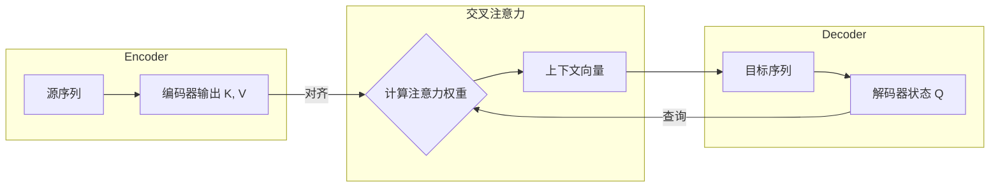
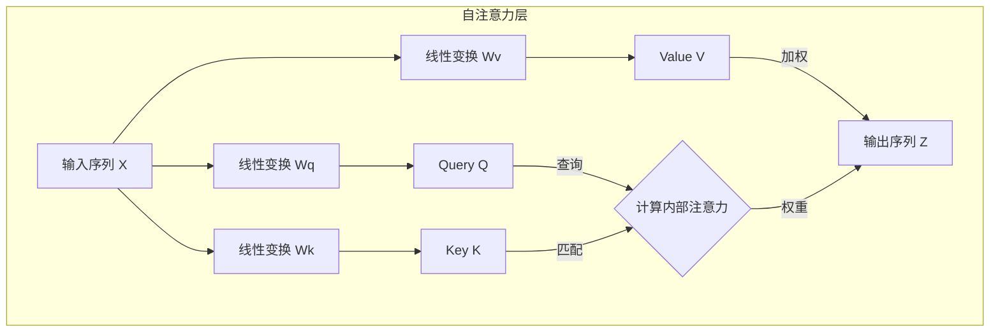

# 第三节 深入解析 Transformer

注意力机制通过动态加权的方式，克服了传统 Seq2Seq 模型中的“信息瓶颈”问题。然而，这些模型依然依赖于循环神经网络（RNN）来处理序列信息，这意味着它们必须按顺序、一个词元接一个词元地进行计算，这在处理长序列时效率低下，并且存在长距离依赖信息丢失的问题。

2017年，Google 的研究团队发表了一篇名为《Attention Is All You Need》的论文，提出了一种全新的架构——**Transformer** [^1]。这篇论文的标题很有冲击力，其思想也同样有颠覆性。它抛弃了传统的 RNN 和卷积网络，整个模型基于注意力机制来构建。Transformer 的提出在自然语言处理领域具有划时代的意义。它不仅凭借其出色的并行计算能力极大地提升了训练效率，还更有效地捕捉了文本中的长距离依赖关系，为后续的 BERT、GPT 等大规模预训练模型的诞生提供了架构基础。

## 一、自注意力机制

从根本上说，要让模型理解一段文本，就需要提取其“序列特征”，即将文本中所有词元的信息以某种方式整合起来。RNN 通过依次传递隐藏状态来顺序地整合信息，而 Transformer 则选择了一条截然不同的道路。其核心是 **自注意力机制**。它不再依赖于顺序计算，而是将提取序列特征的过程看作是输入序列“自己对自己进行注意力计算”。序列中的每个词元都会“审视”序列中的所有其他词元，来动态地计算出最能代表当前词元上下文含义的新表示。

与上一节介绍的交叉注意力不同，在自注意力中，**Query、Key、Value 均来源于同一个输入序列**。

举个例子，在句子“苹果公司发布了新款手机，**它**采用了最新的芯片”中，要理解代词“它”指的是“新款手机”而不是“苹果公司”，模型就需要将“它”与句子中的其他词元进行关联。自注意力机制正是通过计算“它”对句中其他所有词的注意力权重来实现这一点的。

### 1.1 自注意力与交叉注意力的区别

从结构上看，自注意力与交叉注意力的区别在于**信息的来源和流动方向**。

在交叉注意力机制中，信息在两个不同的序列之间流动。通常，**Query** 来自解码器（代表当前的目标序列状态），而 **Key** 和 **Value** 来自编码器的所有输出（代表完整的源序列信息）。其目的是在生成目标序列的每一步时，从源序列中寻找最相关的信息。



而在**自注意力**机制中，信息则是在**同一个序列内部**进行流动和重组。它的 **Query, Key, 和 Value 都来自同一个输入序列**。其目的是为了捕捉输入序列内部的依赖关系，重新计算序列中每个词元的表示，使其包含更丰富的上下文信息。



总结来说，尽管底层的加权求和计算方式相似，但两者在架构上的目标完全不同：

-   **交叉注意力**：用于**对齐**和**整合**两个**不同**序列之间的信息。
-   **自注意力**：用于**理解**和**重构**单个序列**内部**的依赖关系。

### 1.2 自注意力的计算过程

自注意力的计算过程与上一节介绍的 QKV 范式完全一致，关键区别在于 Q, K, V 的来源。

1.  **生成 Q, K, V 向量**：

    对于输入序列中的**每一个**词元，首先获取其词嵌入向量 $x_i$。然后，将该向量分别与三个可学习的、在整个模型中共享的权重矩阵 $W^Q, W^K, W^V$ 相乘，生成该词元专属的 Query 向量 $q_i$、Key 向量 $k_i$ 和 Value 向量 $v_i$。

    $$
    q_i = x_i W^Q \\
    k_i = x_i W^K \\
    v_i = x_i W^V
    $$

    这三个矩阵的作用是将原始的词嵌入向量投影到不同的、专门用于注意力计算的表示空间中，赋予了模型更大的灵活性。

2.  **计算注意力分数**：

    为了计算第 $i$ 个词元的新表示，需要用它的 Query 向量 $q_i$ 去和**所有**词元（包括它自己）的 Key 向量 $k_j$ 计算点积，得到注意力分数。

    $$
    \text{score}(i, j) = q_i \cdot k_j
    $$

3.  **缩放与归一化**：
    将得到的分数除以一个缩放因子 $\sqrt{d_k}$（$d_k$ 是 Key 向量的维度），然后通过 Softmax 函数进行归一化，得到最终的注意力权重 $\alpha_{ij}$。这个缩放步骤的目的与上一节中介绍的一致，都是为了在训练过程中保持梯度稳定。当向量维度 $d_k$ 较大时，点积结果的方差会增大，可能将 Softmax 函数推向其梯度极小的区域，从而导致梯度消失，影响模型学习。进行缩放可以有效缓解这个问题。

    $$
    \alpha_{ij} = \text{softmax}\left(\frac{q_i \cdot k_j}{\sqrt{d_k}}\right)
    $$

4.  **加权求和**：
    使用计算出的权重 $\alpha_{ij}$ 对**所有**词元的 Value 向量 $v_j$ 进行加权求和，得到第 $i$ 个词元经过自注意力计算后得到的新表示 $z_i$。

    $$
    z_i = \sum_j \alpha_{ij} v_j
    $$

通过这个过程，输出向量 $z_i$ 不再仅仅包含原始词元 $x_i$ 的信息，而是融合了整个序列中所有与之相关词元的信息，成为一个上下文感知的、更丰富的表示。其本质可以理解为：序列中的每个词元都同时扮演着“查询（Q）”、“键（K）”和“值（V）”三种角色。通过计算查询与其他所有词元的键之间的相关性，来决定如何加权融合所有词元的值，从而为每个词元生成一个全新的、深度融合了全局上下文信息的表示。

> 既然 Q, K, V 都来自同一个输入 X，为什么不直接用 X 计算，而要引入三个独立的权重矩阵 $W^Q, W^K, W^V$？甚至，为什么是三个，而不是两个或四个？
>
> 这可以类比于在图书馆查资料的过程：
> 1.  **Query (Q) - 你要问的问题**：代表了你主动想查询的意图。
> 2.  **Key (K) - 书的索引/标签**：代表了书本内容的关键特征，用于被动地和你的问题进行匹配。
> 3.  **Value (V) - 书的具体内容**：代表了书本实际包含的信息。
>
> 你的“问题”和你书本的“索引”可能都源于同一个知识领域（同一个输入 X），但它们在信息检索这个任务中扮演的角色是截然不同的。$W^Q, W^K, W^V$ 这三个矩阵的作用，就是让模型学会将原始输入 X 投影到三个功能不同的空间中，分别去扮演好“查询者”、“被查询的索引”和“信息提供者”这三种角色。Q-K 配对解决了“如何定位相关信息”的问题，而 V 提供了“应该提取什么信息”的答案。这个三元组结构在功能上是完备且高效的，因此成为了注意力机制的标准范式。

### 1.3 矩阵运算与并行化

上述步骤描述的是单个词元 $i$ 的计算过程。在实际应用中，如果采用循环的方式逐个计算每个词元的 $z_i$，效率会非常低下。自注意力的巨大优势在于其**并行计算**能力，这通过将整个过程表达为矩阵运算来实现。

假设整个输入序列的词嵌入矩阵为 $X$（维度为 `[sequence_length, embedding_dim]`），可以一次性计算出所有词元的 Q, K, V 矩阵：

$$
Q = X W^Q \\
K = X W^K \\
V = X W^V
$$

然后，整个自注意力的输出矩阵 $Z$ 可以通过一个公式完成计算：

$$
Z = \text{Attention}(Q, K, V) = \text{softmax}\left(\frac{QK^T}{\sqrt{d_k}}\right)V
$$

这个公式与上一节中介绍的通用注意力公式完全相同。这里的核心区别不在于数学运算，而在于**输入的来源**：

-   在上一节的**交叉注意力**中，Q 来自一个序列（解码器），而 K 和 V 来自另一个序列（编码器）。
-   在当前的**自注意力**中，矩阵 Q、K 和 V **全部派生自同一个输入序列 X**。

因此，同一个数学范式，根据输入来源的不同，被用于解决两个不同的问题：一个是两个序列之间的对齐，另一个是单个序列内部的依赖关系建模。

在这个公式中， $QK^T$ 的计算结果是一个维度为 `[sequence_length, sequence_length]` 的注意力分数矩阵，其中第 $i$ 行第 $j$ 列的元素表示第 $i$ 个词元对第 $j$ 个词元的注意力分数（未归一化的 logits）。注意力权重来自对缩放分数应用 Softmax 后得到的归一化系数。

### 1.4 PyTorch 实现自注意力

> [本节完整代码](https://github.com/FutureUnreal/base-nlp/blob/main/code/C4/03_Self-Attention.py)

从概念上讲，自注意力的计算可以分解为对序列中每个词元进行循环操作，这种方式虽然直观但效率极低。因此，现代深度学习框架中的实现都采用了**矩阵运算**的方式。通过将整个序列的 Q, K, V 看作矩阵，利用一次大规模的矩阵乘法，就能并行地完成所有词元之间的相关性计算。

下面是这种并行化版本的实现：

```python
class SelfAttention(nn.Module):
    """自注意力模块"""
    def __init__(self, hidden_size):
        super(SelfAttention, self).__init__()
        self.hidden_size = hidden_size
        self.q_linear = nn.Linear(hidden_size, hidden_size)
        self.k_linear = nn.Linear(hidden_size, hidden_size)
        self.v_linear = nn.Linear(hidden_size, hidden_size)
        
    def forward(self, x):
        q = self.q_linear(x)
        k = self.k_linear(x)
        v = self.v_linear(x)
        
        scores = torch.matmul(q, k.transpose(-2, -1)) / math.sqrt(self.hidden_size)
        attention_weights = torch.softmax(scores, dim=-1)
        context = torch.matmul(attention_weights, v)
        
        return context
```

- **`__init__`**: 初始化了三个 `nn.Linear` 层，它们分别对应将输入映射到 Q, K, V 空间的权重矩阵 $W^Q, W^K, W^V$。
- **`forward`**:
    1.  `q_linear(x)`, `k_linear(x)`, `v_linear(x)`：将形状为 `[batch_size, seq_len, hidden_size]` 的输入张量 `x` 分别通过三个线性层，一次性地为序列中的所有词元计算出 Q, K, V 矩阵。
    2.  `torch.matmul(q, k.transpose(-2, -1))`: 这是实现并行计算的核心。通过将 K 矩阵的最后两个维度转置（`seq_len, hidden_size` -> `hidden_size, seq_len`），再与 Q 矩阵相乘，直接得到了一个 `[batch_size, seq_len, seq_len]` 的分数矩阵。该矩阵中的 `scores[b, i, j]` 代表了批次 `b` 中第 `i` 个词元对第 `j` 个词元的注意力分数。
    3.  `/ math.sqrt(self.hidden_size)`：执行缩放操作，防止梯度消失。
    4.  `torch.softmax(scores, dim=-1)`：对分数的最后一个维度（`seq_len`）进行 Softmax，得到归一化的注意力权重。
    5.  `torch.matmul(attention_weights, v)`：将权重矩阵与 V 矩阵相乘，完成了对所有词元的 Value 向量的加权求和，得到最终的上下文感知表示。

## 二、多头注意力机制

仅仅用一组 $W^Q, W^K, W^V$ 矩阵进行一次自注意力计算，相当于只从一个“视角”来审视文本内在的关系。然而，文本中的关系是多层次的，例如，一组参数可能学会了关注代词（如 “它” 指向谁）的关系，但可能忽略了动作的执行者（主谓宾）等其他类型的关系。

为了让模型能够综合利用从不同维度和视角提取出的信息，Transformer 引入了**多头注意力机制 (Multi-Head Attention)**。其思想非常直接：并行地执行多次自注意力计算，每一次计算都是一个独立的“头 (Head)”。每个头都拥有一组自己专属的 $W^Q_i, W^K_i, W^V_i$ 权重矩阵，并且可以学习去关注一种特定类型的上下文关系。

> 那么，多头注意力与我们之前讨论的“增加 A, B, C 等新角色”有什么不同呢？
>
> 一个关键的区别：多头注意力**不是**通过增加 A, B, C 等新角色来**深化**单次注意力计算的复杂性，而是通过并行运行多个独立的 QKV 计算单元来**拓宽**其广度。
>
> 再次使用图书馆的类比：
> *   **增加 A, B, C**：相当于给**一个**图书管理员一套更复杂的工具，让他一次性处理问题(Q)、索引(K)、内容(V)之外，还要考虑主题(A)、背景(B)等，这会使单次查询过程变得非常复杂。
> *   **多头注意力**：相当于**雇佣一个各有所长的专家团队**（比如 8 个管理员，即 8 个“头”）。每个专家都只使用标准高效的 QKV 工具，但他们各自有独特的视角（独立的 $W^Q_i, W^K_i, W^V_i$ 矩阵）。一个专家可能专攻语法，另一个专攻语义。最后，将所有专家的报告汇总起来，得到一个更全面、更丰富的结论。
>
> 因此，多头注意力机制为模型提供了从不同子空间、不同视角审视信息的能力，而不是改变注意力计算本身的范式。

具体流程如下：

1.  **并行计算**：假设有 $h$ 个头，那么就初始化 $h$ 组不同的权重矩阵 $(W^Q_0, W^K_0, W^V_0), (W^Q_1, W^K_1, W^V_1), \dots, (W^Q_{h-1}, W^K_{h-1}, W^V_{h-1})$。
2.  **独立注意力**：对于输入序列，每个头都独立地执行一次完整的自注意力计算，产生一个输出矩阵 $Z_i$。
3.  **拼接与投影**：将所有 $h$ 个头的输出矩阵 $Z_0, Z_1, \dots, Z_{h-1}$ 在特征维度上进行**拼接 (Concatenate)**。
4.  **最终输出**：将拼接后的巨大矩阵乘以一个新的权重矩阵 $W^O$，将其投影回原始的输入维度，得到多头注意力机制的最终输出。

多头机制允许模型在不同的表示子空间中共同学习上下文信息。例如，一个头可能专注于捕捉长距离的语法依赖，而另一个头可能更关注局部的词义关联。这种设计极大地增强了模型的表达能力。

在实践中，为了保持计算总量不变，通常会将原始的词嵌入维度 `embedding_dim` 均分给 $h$ 个头。例如，如果 `embedding_dim=512`，有 `h=8` 个头，那么每个头产生的 Q, K, V 向量维度就是 `d_k = d_v = 512 / 8 = 64`。计算时，先将输入 $X$ 分别投影到 $h$ 组低维的 Q, K, V 向量，并行计算后，再将结果拼接并投影回 `embedding_dim` 维度。

### 2.1 PyTorch 实现多头注意力

多头注意力是通过并行运行多个独立的自注意力“头”，并融合它们的输出来增强模型的表达能力。一个低效的实现是简单地创建多个 `SelfAttention` 实例并拼接结果。而高效的实现则是将多个头的计算逻辑合并到一次矩阵运算中。

```python
class MultiHeadSelfAttention(nn.Module):
    """多头自注意力模块"""
    def __init__(self, hidden_size, num_heads):
        super(MultiHeadSelfAttention, self).__init__()
        assert hidden_size % num_heads == 0, "hidden_size 必须能被 num_heads 整除"
        
        self.hidden_size = hidden_size
        self.num_heads = num_heads
        self.head_dim = hidden_size // num_heads
        
        self.q_linear = nn.Linear(hidden_size, hidden_size)
        self.k_linear = nn.Linear(hidden_size, hidden_size)
        self.v_linear = nn.Linear(hidden_size, hidden_size)
        self.wo = nn.Linear(hidden_size, hidden_size)

    def forward(self, x):
        batch_size, seq_len, _ = x.shape
        
        q = self.q_linear(x)
        k = self.k_linear(x)
        v = self.v_linear(x)
        
        # 拆分多头
        q = q.view(batch_size, seq_len, self.num_heads, self.head_dim).transpose(1, 2)
        k = k.view(batch_size, seq_len, self.num_heads, self.head_dim).transpose(1, 2)
        v = v.view(batch_size, seq_len, self.num_heads, self.head_dim).transpose(1, 2)
        
        # 并行计算注意力
        scores = torch.matmul(q, k.transpose(-2, -1)) / math.sqrt(self.head_dim)
        attention_weights = torch.softmax(scores, dim=-1)
        context = torch.matmul(attention_weights, v)
        
        # 合并多头结果
        context = context.transpose(1, 2).contiguous().view(batch_size, seq_len, self.hidden_size)
        
        # 输出层
        output = self.wo(context)
        
        return output
```

- **`__init__`**:
    - `head_dim`：计算出每个头的维度，即 `hidden_size / num_heads`。
    - `q_linear, k_linear, v_linear`：与单头类似，但这里的线性层输出维度仍然是 `hidden_size`。这是为了**一次性计算出所有头所需的总特征**。
    - `wo`：对应于多头注意力机制中的输出权重矩阵 $W^O$，用于融合所有头的信息。
- **`forward`**:
    1.  **线性变换**: 与单头版本相同，得到总的 Q, K, V 矩阵。
    2.  **拆分多头**: 
        -   `.view(batch_size, seq_len, self.num_heads, self.head_dim)`: 首先，将 `hidden_size` 维度逻辑上拆分为 `num_heads` 和 `head_dim` 两个维度。此时张量形状变为 `[batch, seq_len, num_heads, head_dim]`。
        -   `.transpose(1, 2)`: 然后，交换 `seq_len` 和 `num_heads` 维度，得到 `[batch, num_heads, seq_len, head_dim]`。这一步是为了让 `num_heads` 成为一个类似批次 (batch) 的维度，使得后续的矩阵乘法可以在每个头内部独立、并行地进行。
    3.  **并行计算注意力**: `torch.matmul(q, k.transpose(-2, -1))` 现在是一个四维张量的乘法。PyTorch 会自动地将其解释为在第 0 和第 1 维（`batch` 和 `num_heads`）上进行批处理，而对最后两个维度执行矩阵乘法。这样就实现了所有头的注意力分数计算的并行化。
    4.  **合并多头**: 这是拆分操作的逆过程。
        -   `.transpose(1, 2)`: 先将 `num_heads` 和 `seq_len` 维度换回来，形状变为 `[batch, seq_len, num_heads, head_dim]`。
        -   `.contiguous()`: 由于 `transpose` 操作可能导致张量在内存中不是连续存储的，需要调用 `.contiguous()` 来确保内存连续，之后才能安全地使用 `.view()`。
        -   `.view(batch_size, seq_len, self.hidden_size)`: 最后，将 `num_heads` 和 `head_dim` 两个维度重新合并成 `hidden_size` 维度，完成了所有头输出的拼接。
    5.  **输出投影**: 将合并后的结果通过 `wo` 线性层，得到最终输出。

## 三、Transformer 整体结构

理解了自注意力和多头注意力之后，就可以从一个更高的视角来审视 Transformer 的整体结构了。通过图 4-3 可以看出它依然是一个 Encoder-Decoder 架构，但其内部是由几个标准化的“积木”堆叠而成的。

<div align="center">
    
    <p>图 4-3 Transformer 架构</p>
</div>

Transformer 的 Encoder 和 Decoder 都是由 N 个（原论文中 N=6）功能相同的层 (Layer) 堆叠而成。下面我们分别来看它们的内部构造。

### 3.1 编码器 (Encoder)

编码器的作用是“理解”和“消化”输入的整个序列，为序列中的每个词元生成一个富含上下文信息的表示。

一个标准的**编码器层**由两个主要的**子层**构成：

1.  **多头自注意力层 (Multi-Head Self-Attention Layer)**
2.  **位置前馈网络 (Position-wise Feed-Forward Network)**

每个子层的输出都经过了 **残差连接 (Add)** 与 **层归一化 (Norm)** 处理（详见 3.3.2 节）。所以，一个编码器层内部的数据流可以表示为：

`x -> Sublayer1(x) -> Add & Norm -> Sublayer2(...) -> Add & Norm`

**关键特性**：
-   **注意力类型**：编码器中的多头注意力层是**双向的自注意力**。这意味着在计算时，序列中的任何一个词元都可以“看到”序列中的所有其他词元（包括它自己、它前面的和它后面的）。
-   **功能**：由于其双向性，编码器非常擅长**理解**完整的输入文本，并为每个词元生成一个深度融合了上下文信息的表示。
-   **应用**：通过大量堆叠编码器层而构建的模型（Encoder-Only 架构），如 **BERT**，在文本分类、命名实体识别等自然语言理解（NLU）任务上取得了巨大成功。

### 3.2 解码器 (Decoder)

解码器的作用是基于编码器对原始输入的理解，并结合已经生成的部分，来逐个生成下一个词元。

为了完成这个更复杂的任务，一个标准的 **解码器层 (Decoder Layer)** 比编码器层多了一个注意力子层，总共包含 **三个子层**：

1.  **带掩码的多头自注意力层 (Masked Multi-Head Self-Attention Layer)**
2.  **交叉注意力层 (Cross-Attention Layer)**
3.  **位置前馈网络 (Position-wise Feed-Forward Network)**

同样，解码器的每个子层也都采用了残差连接和层归一化。

**关键特性**：
-   **子层 1：带掩码的自注意力**
    -   与编码器层相比，这是解码器的第一个主要区别。解码器在生成序列时必须是**自回归**的，即在生成第 $t$ 个词元时，只能依赖于已经生成的前 $t-1$ 个词元，而不能“看到”未来的信息。
    -   为了在并行的自注意力计算中实现这一点，需要引入**掩码 (Masking)**。在计算 Softmax 之前，一个“未来词元掩码”会被应用到注意力分数上，将所有未来位置的分数设置为一个极小的负数（如 `-inf`），这样在经过 Softmax 之后，这些位置的注意力权重就会变为 0，从而确保了模型的单向性。
-   **子层 2：交叉注意力**
    -   这是连接编码器和解码器的桥梁。这一层的实现与上一节中描述的交叉注意力一致。
    -   它的 **Key 和 Value 来自于编码器的最终输出**，而 **Query 则来自于解码器前一个子层（即带掩码的自注意力层）的输出**。
    -   这一层允许解码器在生成每个词元时，能够“关注”到输入序列的所有部分，从而有针对性地提取所需信息。
-   **子层 3：逐位置前馈网络 (FFN)**
    -   这部分与编码器中的 FFN 相同，为模型提供非线性变换能力。
-   **大模型应用**：通过大量堆叠解码器层而构建的模型（Decoder-Only 架构），如 **GPT** 系列，由于其天然的自回归生成能力，引领了当前大语言模型（LLM）的发展浪潮。

### 3.3 组件解析

下面来详细解析一下构成上述“层”的几个重要组件。

#### 3.3.1 位置前馈网络 (FFN)

这是一个由两次线性变换和一个激活函数组成的全连接网络，它独立地应用于序列中的**每一个位置**。
-   **作用**：特征变换。注意力子层内部主要包含 Softmax 归一化；逐位置的非线性主要由 FFN 提供（常见 ReLU/GELU[^2]）。
-   **内部结构**：其常见的结构是“升维-激活-降维”。
    
    $$
    \text{FFN}(x) = \text{ReLU}(xW_1 + b_1)W_2 + b_2
    $$
    
    1.  第一次线性变换（ $W_1$ ）通常会将输入维度 `embedding_dim` 放大到 4 倍（`4 * embedding_dim`）。这种**升维**操作的作用是将特征投影到一个更高维的空间，以便提取更丰富、更复杂的模式。
    2.  使用一个激活函数（如 ReLU）进行非线性处理。
    3.  第二次线性变换（ $W_2$ ）再将维度从 `4 * embedding_dim` 压缩回原始的 `embedding_dim`。这种**降维**操作可以看作是对高维特征的筛选和压缩，保留最重要的信息。

> 将中间层维度设为 4 倍的做法，主要是继承自原始论文的经验设定，并因其良好效果而被后续模型广泛采用，并非有严格的理论证明。

#### 3.3.2 残差连接与层归一化 (Add & Norm)

为了让这些层能够成功地“堆叠”起来，每个子层的后面都连接了这个组合。

-   **Add (残差连接)**：解决了深度网络的“模型退化”问题。从反向传播的角度看，子层的输出可以写成 $y = x + \text{Sublayer}(x)$。在计算梯度时， $\frac{\partial y}{\partial x} = 1 + \frac{\partial \text{Sublayer}(x)}{\partial x}$。其中“1”的存在为梯度创建了一条“高速公路”，确保无论网络有多深，梯度都能至少以大小为 1 的程度回传到最浅层，极大地稳定了训练过程。同时，这也要求模型中所有子层的输入和输出维度必须保持一致，以便进行元素相加。
-   **Norm (层归一化)** [^3]：用于稳定训练过程。它独立地对**每个样本的每个词元**的特征向量（即 `hidden_size` 维度）进行标准化，使其均值变为 0，方差变为 1（但这并不假设其原始分布为正态分布）。更重要的是，它引入了两个可学习的参数 $\gamma$（缩放）和 $\beta$（偏移），让模型可以自主学习最佳的数据分布，其完整公式为：

    $$
    y = \frac{x - \mu}{\sqrt{\sigma^2 + \epsilon}} \cdot \gamma + \beta
    $$
    
    这使得模型既能享受到归一化带来的稳定性，又具备了根据任务需要恢复或调整原始分布的能力。与主要用于计算机视觉的 Batch Normalization（对一个批次中所有样本的同一特征进行归一化）相比，Layer Normalization 不受批次大小的影响，更适合处理长度可变的自然语言序列。

这个设计使得模型可以通过简单地增加“层”的数量（即深度）和特征维度（即宽度）来进行扩展，为后来参数量巨大的语言模型奠定了基础。

> 原论文采用 Post-LN（Sublayer → Add → LayerNorm）。许多现代实现（如 GPT 系列）采用 Pre-LN（LayerNorm → Sublayer → Add），训练更稳定、更易加深，但功能等价。

### 3.4 位置编码

自注意力机制的主要缺陷在于其 **位置无关性**。由于计算是完全并行的，模型无法感知词元的顺序。例如，“猫追狗”和“狗追猫”这两个句子，在自注意力看来，它们的词元集合完全相同，因此会为“猫”和“狗”生成相同的上下文表示，这显然是错误的。

为了解决这个问题，Transformer 在将词嵌入向量输入模型之前，为它们加入了一个 **位置编码 (Positional Encoding)** 向量。其工作方式非常直接：

$$ input_\text{embedding} = token_\text{embedding} + positional_\text{encoding} $$

这个额外注入的向量为每个词元提供了其在序列中的位置信息。这是一种 **绝对位置编码**，即每个位置（如第 0、1、2 个位置）都有一个固定的编码向量。在实践中，主要有两种实现方式：

1.  **可学习的位置编码 (Learned Positional Encoding)**
    -   在 Encoder-only 模型（如 BERT）中常见；而近年的大型解码器式模型多采用相对/旋转类位置编码（如 RoPE[^4]）。
    -   其实现非常简单：创建一个 `nn.Embedding` 层，大小为 `[max_sequence_length, hidden_size]`。`max_sequence_length` 是模型能处理的最大序列长度，这是一个重要的超参数（在很多模型配置文件中被称为 `max_position_embeddings`）。在训练时，模型会像学习词嵌入一样，自动学习出每个位置（0, 1, 2, ...）最合适的向量表示。

2.  **基于三角函数的固定编码 (Sinusoidal Positional Encoding)**
    -   这是原版 Transformer 论文中使用的方法，它不需要学习。
    -   使用不同频率的正弦和余弦函数来为每个位置生成一个独特的、固定的编码向量：

        $$
        PE_{(\text{pos}, 2i)} = \sin\left(\frac{\text{pos}}{10000^{\frac{2i}{d_{\text{embedding}}}}}\right) \\
        PE_{(\text{pos}, 2i+1)} = \cos\left(\frac{\text{pos}}{10000^{\frac{2i}{d_{\text{embedding}}}}}\right)
        $$

        其中：
        -   $pos$ 是词元在序列中的绝对位置（如第 0 个、第 1 个词...）。
        -   $i$ 是编码向量中的维度索引（从 0 到 $d_{embedding}$/2）。公式通过 $i$ 来同时计算偶数维度 $2i$ 和奇数维度 $2i+1$ 的值，因此 $i$ 的取值范围只需达到维度总数的一半。
        -   $d_{embedding}$ 是词嵌入的维度。
        
        公式利用不同频率的正弦和余弦函数，为 $d_{embedding}$ 维编码向量的每一个维度（$2i$ 对应偶数位，$2i+1$ 对应奇数位）计算一个特定的值。由于每个位置 $pos$ 和每个维度 $i$ 的组合都是独一无二的，所以这种方法能为序列中的每个位置生成一个完全独特的编码向量。

        该方法的优势在于，不同位置的编码向量之间存在固定的线性关系，这可能有助于模型推断出词元间的相对位置。其主要优点是不需要训练，并且理论上可以外推到比训练时遇到的更长的序列。

> **绝对 vs. 相对位置编码**
>
> 上述两种方法都属于**绝对位置编码**，因为它们为每个绝对位置（第 1 个、第 10 个等）分配一个特定的编码。然而，这种方式在处理超长文本时可能存在泛化性问题。因此，许多现代的大语言模型（如 Transformer-XL, Llama）转而采用**相对位置编码**。这种方法不再关注词元的绝对位置，而是直接在注意力计算中建模词元之间的相对距离（例如，“当前词”与“前 2 个词”之间的关系），这被证明在处理长序列时更有效、更灵活。

### 3.5 注意力掩码

掩码是 Transformer 模型中一个重要的机制。其**主要目的**是确保解码器在生成序列时的**自回归**特性，即不能“看到”未来的信息。此外，作为一个**通用的工程实践**，掩码也被用来处理批量训练中因句子长度不同而引入的填充（Padding）问题。

Transformer 主要使用以下两种掩码：

#### 1. 因果掩码

-   **作用**：仅应用于解码器的“带掩码的自注意力”（Masked Self-Attention）子层，以确保解码过程的自回归（auto-regressive）特性。
-   **原理**：解码器在生成第 `i` 个词元时，只能依赖于 `1` 到 `i-1` 位置的词元信息，绝不能接触到 `i` 及之后位置的信息。因果掩码通过屏蔽未来位置来实现这一点。
-   **实现**：它通常是一个下三角矩阵。对于一个长度为 `T` 的序列，会生成一个 `[T, T]` 的掩码矩阵。在这个矩阵中，主对角线及以下的元素为 `True`（或 0），表示可以关注；而主对角线以上的元素为 `False`（或 1），表示需要被屏蔽。与填充掩码类似，在计算 Softmax 之前，所有需要被屏蔽的位置的注意力分数会被加上一个极大的负数，使其 Softmax 后的权重变为 0。

#### 2. 填充掩码

-   **作用**：应用于编码器和解码器的所有注意力层，用于忽略输入序列中的填充部分。
-   **原理**：由于填充词元（如 `<pad>`）本身不携带语义信息，让模型关注它们会引入噪声，影响模型性能。填充掩码的作用就是在计算注意力分数后，将所有由填充词元产生的位置（无论是作为查询 Query 还是作为键 Key）对应的分数设置为一个极大的负数（如 `-1e9` 或负无穷）。
-   **实现**：假设有一个注意力分数矩阵，维度为 `[batch_size, num_heads, seq_len, seq_len]`。填充掩码会是一个 `[batch_size, 1, 1, seq_len]` 的矩阵（或可广播的形状），标记了哪些位置是填充。在进行 Softmax 之前，这个掩码会被加到分数矩阵上。经过 Softmax 运算后，这些负无穷位置的注意力权重会趋近于 0，从而在后续的加权求和中被完全忽略。

在解码器的自注意力层中，这两种掩码通常会结合使用，确保模型既不会关注到未来的信息，也不会关注到填充位。

### 3.6 解码器推理与 KV 缓存

解码器在训练和推理时的行为有很大不同。训练时，模型可以看到完整的“正确答案”序列，并通过注意力掩码来并行计算所有位置的损失。

然而，在**推理**时，模型必须逐个生成词元，这是一个**自回归**的过程：
1.  输入 `[BOS]`（开始符），生成第一个词 `token_1`。
2.  输入 `[BOS], token_1`，生成第二个词 `token_2`。
3.  输入 `[BOS], token_1, token_2`，生成第三个词 `token_3`。
4.  ... 直到生成 `[EOS]`（结束符）或达到最大长度。

如果按照这个流程直接计算，效率会非常低下。例如，在生成 `token_3` 时，模型需要为 `[BOS]` 和 `token_1` 重新计算它们的 Q, K, V 向量并参与注意力计算。但事实上，`[BOS]` 和 `token_1` 的 Key 和 Value 向量在之前的步骤中已经被计算过了。

为解决这种冗余计算，推理时会采用一项关键的优化技术：**KV 缓存**。
-   **基本原理**：对于解码器的每一层，都缓存下截至当前时刻已经计算出的所有词元的 **Key** 和 **Value** 向量。
-   **工作流程**：在生成第 $t$ 个词元时，模型只需要为当前输入的第 $t-1$ 个词元计算出它自己的 $q_{t-1}, k_{t-1}, v_{t-1}$。然后，它从缓存中取出历史的 $K_{cache} = [k_0, k_1, ..., k_{t-2}]$ 和 $V_{cache} = [v_0, v_1, ..., v_{t-2}]$。最后，将新的 $k_{t-1}, v_{t-1}$ 追加到缓存中，并用 $q_{t-1}$ 与更新后的完整 $K_{cache}, V_{cache}$ 进行注意力计算。

通过 KV 缓存，每次解码步骤的计算量从与整个已生成序列长度的平方（$O(T^2)$）相关，降低到只与序列长度（$O(T)$）线性相关，极大地加速了文本生成的速度，是实现高效大模型推理的常用技术之一。需要注意，KV 缓存占用会随步数线性增长（$O(T)$），在多层多头设置下需关注显存开销。

---

## 参考文献

[^1]: [Vaswani, A., Shazeer, N., Parmar, N., et al. (2017). *Attention Is All You Need*. NeurIPS 2017.](https://arxiv.org/abs/1706.03762)

[^2]: [Hendrycks, D., Gimpel, K. (2016). *Gaussian Error Linear Units (GELUs)*.](https://arxiv.org/abs/1606.08415)

[^3]: [Ba, J. L., Kiros, J. R., Hinton, G. E. (2016). *Layer Normalization*.](https://arxiv.org/abs/1607.06450)

[^4]: [Su, J., Lu, Y., Pan, S., Wen, Y. (2021). *RoFormer: Enhanced Transformer with Rotary Position Embedding*.](https://arxiv.org/abs/2104.09864)