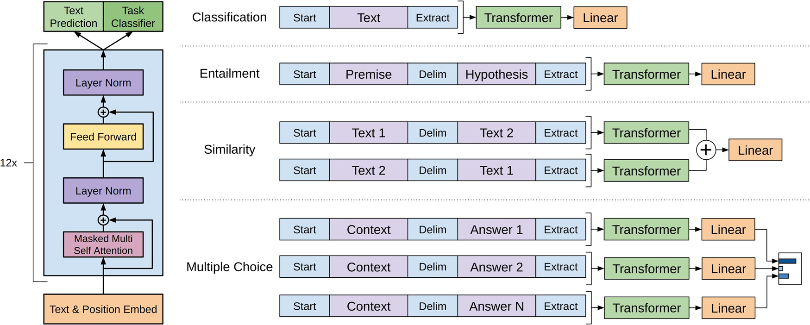

# 第二节 GPT 架构及应用

在 Transformer 催生的众多预训练模型中，除了应用广泛的 BERT 还有另一条技术路线。那就是完全基于 **Transformer 解码器** 构建的 **GPT（Generative Pre-trained Transformer）** 系列模型。与 BERT 致力于通过双向上下文来“理解”语言不同，GPT 的重心在“生成”语言。它的设计初衷就是为了根据给定的上文，以自回归的方式预测下一个最可能的词元，这种特性使其在文本生成、对话系统、内容续写等任务上展现出无与伦比的能力。从早期的 GPT-1，到引爆全球AI热潮的 ChatGPT (其背后是 GPT-3.5/4)，OpenAI 沿着解码器这条路，不断刷新着我们对语言模型能力的认知。

## 一、GPT 的设计思想与技术发展

与 BERT 类似，早期的 GPT 也遵循 **“预训练 + 微调”** 的思路。不过，随着模型规模的指数级增长（尤其是到了 GPT-3），**提示（Prompt）** 和**上下文学习（In-context Learning）** 开始成为主流，允许用户在不更新参数的情况下完成任务。虽然现代大模型依然会使用微调，但目的和形式已与 BERT 时代针对特定任务的微调有了本质不同。

### 1.1 因果语言模型

GPT 的成功根植于一个非常简洁而强大的预训练任务——**因果语言模型 (Causal Language Model, CLM)**。通俗地讲，就是 **预测下一个词**。给定一段文本序列 $x_1, x_2, ..., x_t$，模型的目标是最大化预测出下一个词元 $x_{t+1}$ 的概率。它在预训练过程中，不断地在海量文本上重复这个“续写”任务。

$$
P(x_1, ..., x_T) = \prod_{t=1}^{T} P(x_t | x_1, ..., x_{t-1})
$$

这个看似简单的目标，却迫使模型必须学习到语言的深层规律，包括语法结构、事实知识、上下文逻辑关系等，因为只有真正“理解”了前面的内容，才能准确地预测后面会说什么。由于在预测第 `t` 个词时，模型只能看到它前面的 `t-1` 个词，这种单向的、自回归的特性是 GPT 与 BERT 最根本的区别。

### 1.2 从微调到提示

1.  **GPT-1：有监督微调（Supervised Fine-tuning）** [^1]
    *   **核心理念**：先在无标注数据上进行**无监督预训练**，学习通用的语言表示；然后在特定任务的有标注数据上进行**有监督微调**。
    *   **关键创新**：提出了**任务特定的输入变换**。为了解决不同任务输入格式不一致的问题（如问答需要输入文章、问题、答案），GPT-1 不改变模型架构，而是通过在输入文本中加入特殊的分隔符（如 Start, Delimiter, Extract）将结构化输入转换为有序的序列。例如，对于文本蕴含任务，将前提（Premise）和假设（Hypothesis）用 `$` 符号拼接后输入模型。

2.  **GPT-2：零样本学习（Zero-shot Learning）** [^2]
    *   **核心理念**：**语言模型即多任务学习者**。研究者发现，当模型规模扩大（1.5B 参数）并使用更高质量的数据集（**WebText**，过滤后的 Reddit 高赞链接内容）训练后，模型展现出了无需微调的**零样本**能力。
    *   **表现**：可以直接给模型输入指令，如 “Translate English to French: cheese =>”，模型就能自动续写出 “fromage”。证明模型在预训练中已经隐式地学会了各种任务。
    *   **架构微调**：将 LayerNorm 移到了每个子层的输入端（**Pre-activation**），并增加了上下文窗口大小（512 -> 1024）。

3.  **GPT-3：上下文学习（In-context Learning）** [^3]
    *   **核心理念**：**少样本学习者（Few-Shot Learners）**。GPT-3 将参数量推向了惊人的 1750 亿。此时，模型展现出了强大的**上下文学习**能力。
    *   **什么是 In-context Learning？**：模型在推理阶段，不需要更新任何权重（即不需要微调），仅凭输入提示中给出的**少量示例（Demonstrations）**，就能理解并完成新任务。
        *   **Zero-shot**: 仅给出任务描述。例如：“将中文翻译成英文：你好 ->”
        *   **One-shot**: 给出一个示例。例如：“将中文翻译成英文：\n苹果 -> apple\n你好 ->”
        *   **Few-shot**: 给出多个示例。这通常能显著提升模型性能，甚至达到微调模型的效果。
    *   **意义**：这标志着范式的转变——我们不再为每个任务训练一个专用模型，而是通过设计**提示 (Prompt)** 来激发通用大模型的能力。

通过这种方式，几乎所有的自然语言处理任务都可以被转换成一个统一的“问答”或“续写”模式。

-   **文本分类**：
    -   **旧方法（微调）**: 输入句子 -> `[CLS]`向量 -> 分类头 -> 类别标签
    -   **新方法（提示）**: 输入一段文本，如：`请判断以下评论的情感类别（正面/负面）："这家餐厅的菜品味道惊艳，服务也很周到。"`，然后让模型续写出 `正面`。
-   **文本相似度**：
    -   **旧方法（微调）**: 输入句子对 -> `[CLS]`向量 -> 分类头 -> 相似/不相似
    -   **新方法（提示）**: 输入：`请判断下面两个句子的意思是否相似。句子1："今天天气真好" 句子2："天气晴朗的一天"`，然后让模型续写出 `相似`。

## 二、GPT 架构解析

### 2.1 模型基本结构

GPT 的架构本质就是将 Transformer 的解码器模块进行堆叠。我们在 transformer 那节学习的关于解码器的知识，大部分都适用于 GPT。

一个标准的 Transformer 解码器层包含两个核心子层：

1.  **掩码多头自注意力**: 这是实现单向、自回归生成的关键。通过一个“掩码”机制，确保在计算任何一个位置的表示时，只能关注到它左侧（即已经生成）的词元，而不能“看到”未来的信息。
2.  **位置前馈网络**: 与编码器中的结构完全相同，负责对每个位置的表示进行非线性变换。

需要注意，原始的 Transformer 解码器还有一个用于与编码器交互的“交叉注意力”层，但由于 GPT 模型完全没有编码器部分，所以**这一层被移除了**。

图 5-4 详细展示了 GPT-1 的模型架构与微调策略。**左侧**是基于 Transformer 解码器的模型主体，可以看到在微调阶段，模型除了输出任务分类结果（Task Classifier），还可以保留语言模型预测（Text Prediction）作为辅助目标。具体来说，我们在优化特定任务（如分类）的损失 $L_{task}$ 时，会加上一个权重的语言模型损失 $L_{lm}$，即 $L = L_{task} + \lambda L_{lm}$。这种多任务学习的策略不仅能帮助模型泛化，还能加速收敛。**右侧**则直观地描绘了如何通过**输入变换**将不同类型的任务适配到预训练模型中：
*   **分类任务**：在文本前后添加起始 (`Start`) 和提取 (`Extract`) 标记。
*   **蕴含任务**：将前提和假设用分隔符 (`Delim`) 拼接。
*   **相似度任务**：由于 GPT 是单向模型，无法像 BERT 那样同时“看到”两个句子，所有它对句子顺序敏感。为了消除这种顺序偏差，将两个句子按不同顺序拼接（Text1-Text2 和 Text2-Text1），分别输入模型，最后将两者的特征相加作为最终表示。
*   **多选题任务**：将上下文与每一个答案选项分别拼接，独立输入模型计算得分。

<div align="center">
  
  <p>图 5-4 GPT-1 模型架构（左）与针对不同任务的输入变换（右）</p>
</div>

### 2.2 关键架构演进

虽然大体框架不变，但 GPT 各代模型在细节上有一些关键演进：

1.  **归一化位置**:
    *   **GPT-1**: Post-Norm（LayerNorm 在残差连接之后）。
    *   **GPT-2/3**: **Pre-Norm**（LayerNorm 在子层输入之前）。这一改进大大改善了深层 Transformer 的训练稳定性，使得训练更深的模型成为可能。

2.  **输入表示**:
    *   **词元嵌入**: 采用**字节级 BPE（Byte-level BPE）** [^4]。这种机制的基础词表是 UTF-8 字节，确保了模型可以处理任何 Unicode 字符串，彻底解决了未登录词问题。
    *   **位置嵌入**: 始终采用**可学习的位置嵌入**。
        *   GPT-1 上下文窗口: 512
        *   GPT-2 上下文窗口: 1024
        *   GPT-3 上下文窗口: 2048 (GPT-4 进一步扩展)

3.  **无片段嵌入**:
    *   GPT 的输入总是一个连续的文本流，不区分句子片段，所以没有 BERT 那样的 Segment Embeddings。

表 5-1 展示了 GPT-3 系列不同规模模型的具体参数配置，可以看到随着层数和维度的增加，模型容量呈指数级增长。

<div align="center">

<table border=1 style='margin: auto; width: max-content;'>
  <tr>
    <td style='text-align: center;'>Model Name</td>
    <td style='text-align: center;'><i>n</i><sub>params</sub></td>
    <td style='text-align: center;'><i>n</i><sub>layers</sub></td>
    <td style='text-align: center;'><i>d</i><sub>model</sub></td>
    <td style='text-align: center;'><i>n</i><sub>heads</sub></td>
    <td style='text-align: center;'><i>d</i><sub>head</sub></td>
    <td style='text-align: center;'>Batch Size</td>
    <td style='text-align: center;'>Learning Rate</td>
  </tr>
  <tr>
    <td style='text-align: center;'>GPT-3 Small</td>
    <td style='text-align: center;'>125M</td>
    <td style='text-align: center;'>12</td>
    <td style='text-align: center;'>768</td>
    <td style='text-align: center;'>12</td>
    <td style='text-align: center;'>64</td>
    <td style='text-align: center;'>0.5M</td>
    <td style='text-align: center;'>6.0 &times; 10<sup>-4</sup></td>
  </tr>
  <tr>
    <td style='text-align: center;'>GPT-3 Medium</td>
    <td style='text-align: center;'>350M</td>
    <td style='text-align: center;'>24</td>
    <td style='text-align: center;'>1024</td>
    <td style='text-align: center;'>16</td>
    <td style='text-align: center;'>64</td>
    <td style='text-align: center;'>0.5M</td>
    <td style='text-align: center;'>3.0 &times; 10<sup>-4</sup></td>
  </tr>
  <tr>
    <td style='text-align: center;'>GPT-3 Large</td>
    <td style='text-align: center;'>760M</td>
    <td style='text-align: center;'>24</td>
    <td style='text-align: center;'>1536</td>
    <td style='text-align: center;'>16</td>
    <td style='text-align: center;'>96</td>
    <td style='text-align: center;'>0.5M</td>
    <td style='text-align: center;'>2.5 &times; 10<sup>-4</sup></td>
  </tr>
  <tr>
    <td style='text-align: center;'>GPT-3 XL</td>
    <td style='text-align: center;'>1.3B</td>
    <td style='text-align: center;'>24</td>
    <td style='text-align: center;'>2048</td>
    <td style='text-align: center;'>24</td>
    <td style='text-align: center;'>128</td>
    <td style='text-align: center;'>1M</td>
    <td style='text-align: center;'>2.0 &times; 10<sup>-4</sup></td>
  </tr>
  <tr>
    <td style='text-align: center;'>GPT-3 2.7B</td>
    <td style='text-align: center;'>2.7B</td>
    <td style='text-align: center;'>32</td>
    <td style='text-align: center;'>2560</td>
    <td style='text-align: center;'>32</td>
    <td style='text-align: center;'>80</td>
    <td style='text-align: center;'>1M</td>
    <td style='text-align: center;'>1.6 &times; 10<sup>-4</sup></td>
  </tr>
  <tr>
    <td style='text-align: center;'>GPT-3 6.7B</td>
    <td style='text-align: center;'>6.7B</td>
    <td style='text-align: center;'>32</td>
    <td style='text-align: center;'>4096</td>
    <td style='text-align: center;'>32</td>
    <td style='text-align: center;'>128</td>
    <td style='text-align: center;'>2M</td>
    <td style='text-align: center;'>1.2 &times; 10<sup>-4</sup></td>
  </tr>
  <tr>
    <td style='text-align: center;'>GPT-3 13B</td>
    <td style='text-align: center;'>13.0B</td>
    <td style='text-align: center;'>40</td>
    <td style='text-align: center;'>5140</td>
    <td style='text-align: center;'>40</td>
    <td style='text-align: center;'>128</td>
    <td style='text-align: center;'>2M</td>
    <td style='text-align: center;'>1.0 &times; 10<sup>-4</sup></td>
  </tr>
  <tr>
    <td style='text-align: center;'>GPT-3 175B or “GPT-3”</td>
    <td style='text-align: center;'>175.0B</td>
    <td style='text-align: center;'>96</td>
    <td style='text-align: center;'>12288</td><td style='text-align: center;'>96</td>
    <td style='text-align: center;'>128</td>
    <td style='text-align: center;'>3.2M</td>
    <td style='text-align: center;'>0.6 &times; 10<sup>-4</sup></td>
  </tr>
</table>
<p><em>表 5-1 不同规模 GPT-3 模型的架构参数配置</em></p>

</div>

### 2.3 GPT 与 BERT 的主要差异

尽管都基于 Transformer，但由于选择了编码器和解码器两条不同的路线，BERT 和 GPT 在设计和应用上有着明显区别（此处主要对比原始版本的 BERT 和 GPT-1/2/3，不包含后续的各类变体）。

| 特性 | BERT (Encoder) | GPT (Decoder) |
| :--- | :--- | :--- |
| **核心结构** | Transformer 编码器 | Transformer 解码器 |
| **注意力机制** | 标准自注意力（双向，能看到全文） | 掩码自注意力（单向，只能看左边） |
| **预训练任务** | 掩码语言模型, 下一句预测 | 因果语言模型 / 预测下一个词 |
| **输入表示** | 词元 + 位置 + **片段** | 词元 + 位置 |
| **最大长度** | 通常 512 | 1024 (GPT-2) / 2048 (GPT-3) |
| **归一化** | Post-Norm | Pre-Norm (GPT-2/3) |
| **应用模式** | **微调（Fine-tuning）**: 加分类头，更新权重 | **提示（Prompting）**: 设计提示词，不更新权重 (Zero/Few-shot) |
| **适用场景** | 语言理解（NLU）: 分类、NER、抽取式问答 | 语言生成（NLG）: 写作、对话、生成式任务 |

## 三、GPT 代码实战

为了更好地理解 GPT 模型自回归生成的内部原理，以及 `gpt2` 这类英文预训练模型处理不同语言时的差异，下面的示例将并列展示它处理英文和中文时的不同表现。

> [本节完整代码](https://github.com/datawhalechina/base-nlp/blob/main/code/C5/02_gpt_usage.py)

### 3.1 代码示例

以下代码将分别对英文和中文进行手动地逐字生成，以观察其内部过程和差异。

```python
import torch
from transformers import AutoTokenizer, AutoModelForCausalLM

# 1. 环境配置
device = torch.device("cuda" if torch.cuda.is_available() else "cpu")
model_name = "gpt2"
tokenizer = AutoTokenizer.from_pretrained(model_name)
model = AutoModelForCausalLM.from_pretrained(model_name).to(device)
model.eval()

# 2. 英文示例
prompt_en = "I like eating fried"
input_ids_en = tokenizer(prompt_en, return_tensors="pt")['input_ids'].to(device)

print(f"英文输入: '{prompt_en}'")
print(f"被编码为 {input_ids_en.shape[1]} 个 token: {tokenizer.convert_ids_to_tokens(input_ids_en[0])}")
print("开始为英文逐个 token 生成...")

generated_ids_en = input_ids_en
with torch.no_grad():
    for i in range(5): # 只生成 5 个 token 作为示例
        outputs = model(generated_ids_en)
        next_token_logits = outputs.logits[:, -1, :]
        next_token_id = torch.argmax(next_token_logits, dim=-1).unsqueeze(-1)
        new_token = tokenizer.decode(next_token_id[0])
        print(f"第 {i+1} 步, 生成 token: '{new_token.strip()}'")
        generated_ids_en = torch.cat([generated_ids_en, next_token_id], dim=1)

full_decoded_text_en = tokenizer.decode(generated_ids_en[0], skip_special_tokens=True)
print(f"\n英文最终生成结果: \n'{full_decoded_text_en}'\n")


# 3. 中文示例
prompt_zh = "我喜欢吃炸"
input_ids_zh = tokenizer(prompt_zh, return_tensors="pt")['input_ids'].to(device)

print(f"中文输入: '{prompt_zh}'")
print(f"被编码为 {input_ids_zh.shape[1]} 个 token: {tokenizer.convert_ids_to_tokens(input_ids_zh[0])}")
print("开始为中文逐个 token 生成...")

generated_ids_zh = input_ids_zh
with torch.no_grad():
    for i in range(5): # 只生成 5 个 token 作为示例
        outputs = model(generated_ids_zh)
        next_token_logits = outputs.logits[:, -1, :]
        next_token_id = torch.argmax(next_token_logits, dim=-1).unsqueeze(-1)
        new_token = tokenizer.decode(next_token_id[0])
        print(f"第 {i+1} 步, 生成 token: '{new_token.strip()}'")
        generated_ids_zh = torch.cat([generated_ids_zh, next_token_id], dim=1)

full_decoded_text_zh = tokenizer.decode(generated_ids_zh[0], skip_special_tokens=True)
print(f"\n中文最终生成结果 (出现乱码是正常现象): \n'{full_decoded_text_zh}'")
```

1.  **加载模型和分词器**:
    -   使用 `AutoModelForCausalLM.from_pretrained(model_name)` 加载模型。注意这里使用的是 `ForCausalLM` 类，它比标准的 `AutoModel` 多了一个 `lm_head` 层，专门用于将隐藏层状态映射回词表大小，从而预测下一个词。

2.  **文本预处理**:
    -   `tokenizer(prompt_en, ...)`: 将文本转换为 token ID 序列。与 BERT 不同，GPT 通常不需要 `token_type_ids`。

3.  **模型推理 (自回归循环)**:
    -   `outputs = model(generated_ids_en)`: 将当前的完整序列输入模型。
    -   `next_token_logits = outputs.logits[:, -1, :]`: GPT 模型的输出 `logits` 形状为 `(batch_size, sequence_length, vocab_size)`。我们只关心序列中**最后一个位置** (`-1`) 的输出，因为它是对“下一个未知词”的预测。
    -   `torch.argmax(..., dim=-1)`: 在词表维度上取概率最大的那个 token ID，作为预测结果（这是最简单的**贪心搜索**策略）。

4.  **拼接与更新**:
    -   `torch.cat([generated_ids_en, next_token_id], dim=1)`: 将新预测出的 token 拼接到原输入序列的末尾。
    -   **关键点**: 这个新的、更长的序列将在下一次循环中再次被送入模型。这就是**自回归 (Auto-Regressive)** 的本质——用自己的输出作为下一次的输入。

5.  **对比结论**:
    
    上面的代码通过并列对比 `gpt2` 模型处理英文和中文时的不同表现，可以得到两个关于原始 GPT2 预训练模型的结论：

    1.  **分词效率**：
        -   **英文**: 输入 `"I like eating fried"` 包含 4 个单词，被分词器高效地编码成了 4 个有意义的 token: `['I', 'Ġlike', 'Ġeating', 'Ġfried']` (带 `Ġ` 前缀表示一个词的开始)。
        -   **中文**: 输入 `"我喜欢吃炸"` 同样是 4 个字，但通常会被编码成更多的字节级 token（数量会随 transformers 版本和分词细节略有差异）。这说明 `gpt2` 的分词机制导致了中文编码效率的下降，具体原因详见 4.3 节的分析。

    2.  **生成质量**：
        -   **英文**: 对于英文输入，模型能够理解其语义，并生成流畅、有逻辑的续写，例如 `I like eating fried chicken...`。这证明了模型在其“母语”环境下的强大能力。
        -   **中文**: 对于中文输入，由于模型完全不理解这些字节组合的含义，它只能根据在英文世界里学到的统计规律来预测下一个字节，最终呈现为一片乱码。其深层原因同样与分词机制和训练语料有关。

### 3.2 模型结构分解

通过 `print(model)` 可以得到 GPT-2 模型的结构图。

```bash
GPT2LMHeadModel(
  (transformer): GPT2Model(
    (wte): Embedding(50257, 768)
    (wpe): Embedding(1024, 768)
    (drop): Dropout(p=0.1, inplace=False)
    (h): ModuleList(
      (0-11): 12 x GPT2Block(
        (ln_1): LayerNorm((768,), eps=1e-05, elementwise_affine=True)
        (attn): GPT2Attention(
          (c_attn): Conv1D(nf=2304, nx=768)
          (c_proj): Conv1D(nf=768, nx=768)
          (attn_dropout): Dropout(p=0.1, inplace=False)
          (resid_dropout): Dropout(p=0.1, inplace=False)
        )
        (ln_2): LayerNorm((768,), eps=1e-05, elementwise_affine=True)
        (mlp): GPT2MLP(
          (c_fc): Conv1D(nf=3072, nx=768)
          (c_proj): Conv1D(nf=768, nx=3072)
          (act): NewGELUActivation()
          (dropout): Dropout(p=0.1, inplace=False)
        )
      )
    )
    (ln_f): LayerNorm((768,), eps=1e-05, elementwise_affine=True)
  )
  (lm_head): Linear(in_features=768, out_features=50257, bias=False)
)
```

整个 `GPT2LMHeadModel` 由两大部分组成：核心的 `transformer` 主体 (即 `GPT2Model`)，和顶层的 `lm_head` (语言模型头)。

1.  **`transformer` (GPT2Model)**: 这是模型的主体，负责从输入 token ID 序列中提取深层特征。
    *   **嵌入层 (Embeddings)**:
        *   `(wte): Embedding(50257, 768)`: **词元嵌入 (Word Token Embedding)**。这里的 `50257` 是 GPT-2 的词汇表大小，`768` 是模型的隐藏层维度 H。
        *   `(wpe): Embedding(1024, 768)`: **位置嵌入 (Word Position Embedding)**。这正是在理论部分提到的**可学习的位置嵌入**，其 `[1024, 768]` 的大小也直接解释了为什么标准 GPT-2 模型的最大输入长度是 1024 个词元。
        *   与 BERT 不同，这里没有片段嵌入（`token_type_embeddings`），具体原因已在 2.1 节中阐述。

    *   **解码器堆栈 (Decoder Stack)**:
        *   `(h): ModuleList((0-11): 12 x GPT2Block)`: `ModuleList` 中包含了 12 个完全相同的 `GPT2Block`，即 12 层的 Transformer 解码器。每一层的输出都会作为下一层的输入。
        *   在每一个 `GPT2Block` 内部，都包含了理论中所述的两个核心子层（被 `LayerNorm` 包裹）：
            *   `(attn): GPT2Attention`: **掩码多头自注意力模块**。其内部的 `c_attn` 和 `c_proj` 使用 `Conv1D` 来实现。`Conv1D` 在这里被巧妙地用作全连接层。`c_attn` 一次性将 768 维的输入映射到 2304 维 (768 * 3)，正好对应 Q, K, V 三个矩阵的拼接。`c_proj` 则是注意力机制中的输出映射矩阵 $W^O$。
            *   `(mlp): GPT2MLP`: **位置前馈网络模块**。它同样使用 `Conv1D` 实现。`c_fc` 将维度从 768 **升维** 到 3072，经过激活函数后，`c_proj` 再将维度从 3072 **降维** 回 768。这个“先升维再降维”的结构与 BERT 中的前馈网络完全一致。

2.  **`lm_head` (语言模型头)**:
    *   这是 `GPT2LMHeadModel` 与基础的 `GPT2Model` 的唯一区别，也是它能够生成文本的关键。它是一个简单的线性层（全连接层）。
    *   **功能对比**: 它与 BERT 的 `pooler` 层形成了鲜明对比。BERT 的 `pooler` 层只接收 `[CLS]` 词元的输出，用于 NSP 任务的**句子级别**二分类。而 GPT 的 `lm_head` 接收**序列中每一个位置**的输出向量，并将其从 `768` 维映射到词汇表大小 `50257` 维，得到每个位置上所有词元的 logits 分布，专门用于**词元级别**的“预测下一个词”任务。
    *   **与手动生成的关联**: 在我们手动实现的贪心搜索循环中，`next_token_logits = outputs.logits[:, -1, :]` 这一步，实际上就是 `transformer` 主体输出最后一个位置的 768 维向量后，再通过这个 `lm_head` 转换成 50257 维 logits 的结果。`lm_head` 正是连接模型特征与最终词元预测的桥梁。

### 3.3 分词器工作原理

理解 GPT 与 BERT 在分词器设计上的差异，是理解 GPT 模型特性的一个关键。GPT 使用的 **字节对编码 (Byte-Pair Encoding, BPE)**，特别是**字节级 (Byte-level)** 的实现，使它能够从根本上杜绝 `[UNK]` (未知词) 。

其工作原理如下：

1.  **基础词汇表**：BPE 的基础词汇表是所有的单个字节，即 0-255。这意味着任何文本，无论是什么语言、什么符号，都可以被无损地表示为一个字节序列。
2.  **贪心合并**：在训练分词器时，算法会贪心地、迭代地合并最高频出现的相邻字节对，形成新的、更长的子词（subword），并将其加入词汇表。例如，`t` 和 `h` 经常一起出现，就会被合并成 `th`；之后 `th` 和 `e` 经常一起出现，就可能被合并成 `the`。
3.  **编码过程**：当对新文本进行编码时，会先将其转换为字节序列，然后在这个序列上，贪心地用词汇表里最长的子词来替换对应的字节序列。

这个机制带来了两大特点：

-   **优点：无未知词**
    -   因为最坏情况下，任何在词汇表中找不到的词，都可以被拆分成最基础的单个字节，所以模型永远不会遇到它完全不认识的 token。
    -   通过代码可以直观地看到这一点。对于一个非常生僻的汉字 `龘`，BERT 的分词器可能会直接判为 `[UNK]`，但 GPT-2 的分词器会将其分解为对应的 UTF-8 字节表示。

    ```python
    from transformers import AutoTokenizer
    
    tokenizer = AutoTokenizer.from_pretrained("gpt2")
    
    text = "一个生僻字：龘"
    tokens = tokenizer.tokenize(text)
    
    # 这类不在词表的字符会被拆成若干字节级 token
    print(tokens)
    ```

-   **缺点：对非核心语言效率低**
    -   `gpt2` 的 BPE 词汇表是为英文构建的，**不包含任何独立的中文词语作为 token**。虽然其字节级机制能表示任意汉字，但它会将这些汉字拆分成多个基础的字节 token。
    -   这导致在处理中文时，一个汉字通常会被拆分成 2-3 个字节级别的 token。这不仅增加了序列的长度，也让模型学习中文语义变得更加困难。如代码示例所示，英文提示词被编码为 10 个 token，而几乎同样长度的中文提示词，则被编码为了 19 个 token，极大地消耗了模型的上下文长度预算。

> **为什么 `gpt2` 模型生成中文会是乱码？**
>
> 这就是由上述的分词机制和模型的英文训练背景共同导致的。
>
> 1.  **分词层面**：模型看到的不是“汉字”，而是一堆无意义的字节组合。
> 2.  **模型层面**：模型是在英文语料上训练的，它只懂得按英文的规律来预测下一个字节。
>
> 最终，模型会续写出一串符合**英文统计规律**但完全不符合**中文编码规则**的字节序列，解码时自然就成了一片乱码。要解决此问题，必须使用在中文语料上预训练的模型，例如 `uer/gpt2-chinese-cluecorpussmall`，这类模型的分词器和模型本身都为中文进行了适配。

### 3.4 使用 pipeline

手动实现循环有助于理解原理，但在实际应用中，`transformers` 库提供了更高阶、更便捷的工具——`pipeline`。它将所有步骤（分词、模型调用、解码）封装在一起，一行代码即可完成文本生成[^5]。下面的示例将用 `pipeline` 快速复现前面的英文生成任务。

```python
# pipeline 应用
from transformers import pipeline

print("\n\n--- Pipeline 快速演示 (英文) ---")
generator = pipeline("text-generation", model=model_name, device=device)
pipeline_outputs = generator("I like eating fried", max_new_tokens=5, num_return_sequences=1)
print(pipeline_outputs[0]['generated_text'])
```

-   `pipeline("text-generation", ...)`: 创建一个专门用于文本生成的 `pipeline` 对象，它自动处理了分词、模型推理和解码的所有细节。
-   `generator(...)`: 仅用一行代码就完成了我们之前手动循环实现的全部功能。其输出结果与我们手动实现的英文生成结果是一致的，这证明了 `pipeline` 是在底层执行了相似的逻辑，但为开发者提供了极其便利的接口。

---

## 参考文献

[^1]: [Radford, A., Narasimhan, K., Salimans, T., & Sutskever, I. (2018). *Improving Language Understanding by Generative Pre-Training*.](https://cdn.openai.com/research-covers/language-unsupervised/language_understanding_paper.pdf)

[^2]: [Radford, A., Wu, J., Child, R., Luan, D., Amodei, D., & Sutskever, I. (2019). *Language Models are Unsupervised Multitask Learners*.](https://cdn.openai.com/better-language-models/language_models_are_unsupervised_multitask_learners.pdf)

[^3]: [Brown, T. B., Mann, B., Ryder, N., et al. (2020). *Language Models are Few-Shot Learners*.](https://arxiv.org/abs/2005.14165)

[^4]: [Sennrich, R., Haddow, B., & Birch, A. (2015). *Neural Machine Translation of Rare Words with Subword Units*.](https://arxiv.org/abs/1508.07909)

[^5]: [Hugging Face. GPT-2 tokenizer and model documentation.](https://huggingface.co/docs/transformers/model_doc/gpt2)
