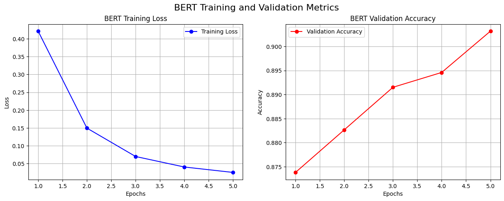

# 第三节 微调 BERT 模型进行文本分类

在前两节中，我们分别构建了一个基于全连接网络的“词袋”模型和一个基于 LSTM 的序列模型。实验结果揭示了一个有趣的现象，对于当前的新闻分类任务，结构更复杂的 LSTM 模型在性能上并未超越更简单的全连接模型。这说明，对于这个特定任务，捕捉“关键词”比分析“词序”更关键。不过，这两种模型都是从零开始训练的，它们对语言的理解完全依赖于我们提供的小规模 `20 Newsgroups` 数据集。那么我们能否利用在更大、更通用语料库上预先学到的知识，来帮助模型更好地理解文本，从而提升分类性能呢？

这就是**预训练语言模型**，特别是 BERT，所要解决的问题。在**第五章第一节**中，我们已经学习了 BERT 的原理。它通过在海量原始文本上以**自监督**的方式构造“掩码语言模型”和“下一句预测”等训练任务（无需人工标注标签），学习到了丰富的语言学知识和世界知识。

本节将是文本分类系列实战的最后一站。我们将把模型架构迁移为 BERT，探索从“从零训练”到“微调”这一范式转变所带来的性能提升。

## 一、从“序列建模”到“预训练微调”

回顾前两个模型，它们的核心都是在我们的特定任务数据上，从随机初始化的词向量开始，学习如何进行分类。而基于 BERT 的微调则完全不同：

1.  **加载预训练权重**：我们不再随机初始化模型，而是加载一个已经在海量数据（如维基百科、书籍）上训练好的 BERT 模型。这个模型已经是一个通用的“语言理解专家”。
2.  **附加任务相关的“头”**：在 BERT 模型的主体结构之上，我们添加一个简单的、未经训练的分类层（通常就是一个全连接层）。
3.  **在下游任务上“微调”**：使用我们的新闻分类数据，对整个模型（或者仅仅是顶部的分类层）进行训练。由于 BERT 部分已经具备了强大的语言理解能力，整个模型可以很快地适应新的分类任务，并且通常只需要很少的训练轮次和较小的学习率。

这个“预训练-微调”的范式是现代 NLP 领域最主流、最有效的方法之一。它极大地降低了对特定任务标注数据的依赖，并显著提升了模型性能的上限。

## 二、代码修改实践

将 LSTM 模型改造为 BERT 模型，同样遵循之前的思路，主要修改涉及数据处理和模型结构，同时也要相应地调整训练超参数。

> [本节完整代码](https://github.com/datawhalechina/base-nlp/blob/main/code/C7/03_bert_text_classification.ipynb)

### 2.1 替换为 `BertTokenizer`

我们不再需要手动构建词典。`transformers` 库为每个预训练模型都提供了配套的 `Tokenizer`。对于英文 `20 Newsgroups` 数据集，选择 `bert-base-uncased` 模型及其对应的分词器。

```python
from transformers import BertTokenizer

bert_model_name = 'bert-base-uncased'
tokenizer = BertTokenizer.from_pretrained(bert_model_name)

# 查看特殊token
print(f"UNK token: '{tokenizer.unk_token}', ID: {tokenizer.unk_token_id}")
print(f"PAD token: '{tokenizer.pad_token}', ID: {tokenizer.pad_token_id}")
print(f"CLS token: '{tokenizer.cls_token}', ID: {tokenizer.cls_token_id}")
print(f"SEP token: '{tokenizer.sep_token}', ID: {tokenizer.sep_token_id}")
print(f"Vocab size: {tokenizer.vocab_size}")
```

输出：
```bash
UNK token: '[UNK]', ID: 100
PAD token: '[PAD]', ID: 0
CLS token: '[CLS]', ID: 101
SEP token: '[SEP]', ID: 102
Vocab size: 30522
```

`BertTokenizer` 会自动处理文本的预处理（如小写转换、标点分割），并为文本添加特殊的 `[CLS]` 和 `[SEP]` 标记。
- **`[CLS]`**：位于序列开头，它在 BERT 输出中对应的向量通常被用作整个序列的聚合表示，非常适合用于分类任务。
- **`[SEP]`**：用于分隔两个句子，在单句分类任务中则标志着句子的结束。

### 2.2 改造 `Dataset` 与 `collate_fn`

为了适配 BERT，数据处理流程需要进行如下调整：

1. **`Dataset`**: `BertTextClassificationDataset` 现在直接调用 `BertTokenizer` 来进行分词和ID转换。处理长文本的滑窗分割逻辑保持不变。

```python
class BertTextClassificationDataset(Dataset):
    def __init__(self, texts, labels, tokenizer, max_len=128):
        self.tokenizer = tokenizer
        self.max_len = max_len
        self.processed_data = []

        for text, label in tqdm(zip(texts, labels), total=len(labels), desc="Processing Dataset"):
            # 直接使用BertTokenizer进行编码
            encoding = self.tokenizer(text, add_special_tokens=True, truncation=False)
            input_ids = encoding['input_ids']
            
            # 滑窗分割逻辑保持不变
            if len(input_ids) <= self.max_len:
                self.processed_data.append({"input_ids": input_ids, "label": label})
            else:
                stride = max(1, int(self.max_len * 0.8))
                for i in range(0, len(input_ids) - self.max_len + 1, stride):
                    chunk = input_ids[i:i + self.max_len]
                    self.processed_data.append({"input_ids": chunk, "label": label})
    ...
```

2. **`collate_fn`**: BERT 的一个重要输入是 `attention_mask`（注意力掩码）。它是一个与 `input_ids` 形状相同的张量，用 `1` 标记真实 Token，用 `0` 标记填充（Padding）的 Token。模型会根据这个掩码，在计算注意力时忽略填充部分。所以，我们需要修改 `collate_fn` 以生成并返回 `attention_mask`。

```python
def bert_collate_fn(batch):
    max_batch_len = max(len(item["input_ids"]) for item in batch)
    
    batch_input_ids, batch_attention_masks, batch_labels = [], [], []

    for item in batch:
        input_ids = item["input_ids"]
        padding_len = max_batch_len - len(input_ids)
        
        padded_ids = input_ids + [tokenizer.pad_token_id] * padding_len
        # 新增：生成 attention_mask
        attention_mask = [1] * len(input_ids) + [0] * padding_len
        
        batch_input_ids.append(padded_ids)
        batch_attention_masks.append(attention_mask)
        batch_labels.append(item["label"])
        
    return {
        "input_ids": torch.tensor(batch_input_ids, dtype=torch.long),
        # 新增：返回 attention_mask
        "attention_mask": torch.tensor(batch_attention_masks, dtype=torch.long),
        "labels": torch.tensor(batch_labels, dtype=torch.long),
    }
```

### 2.3 构建 `TextClassifierBERT` 模型

得益于 `transformers` 库的高度封装，从代码实现的角度来看，新的模型结构非常简洁，一个预训练的 BERT 主干网络 + 一个线性分类头。尽管 BERT 模型内部结构极其复杂，但我们只需几行代码便可调用。

```python
from transformers import BertModel

class TextClassifierBERT(nn.Module):
    def __init__(self, model_name, num_classes, freeze_bert=False):
        super(TextClassifierBERT, self).__init__()
        # 1. 加载预训练的BERT模型
        self.bert = BertModel.from_pretrained(model_name)
        # 2. 定义分类头
        self.classifier = nn.Linear(self.bert.config.hidden_size, num_classes)
        
        # 3. (可选) 冻结BERT参数
        if freeze_bert:
            for param in self.bert.parameters():
                param.requires_grad = False
        
    def forward(self, input_ids, attention_mask):
        # 将输入传入BERT
        outputs = self.bert(input_ids=input_ids, attention_mask=attention_mask)
        
        # 使用[CLS] token的输出(pooler_output)进行分类
        pooled_output = outputs.pooler_output
        
        # 传入分类头得到logits
        logits = self.classifier(pooled_output)
        return logits
```

**模型解析**:

- **`__init__`**:
    - `BertModel.from_pretrained(model_name)` 会自动下载并加载指定名称的预训练模型权重。
    - 分类头的输入维度直接从 `self.bert.config.hidden_size` 获取，这是一个非常好的实践，避免了硬编码。
    - 提供了 `freeze_bert` 选项，如果为 `True`，则 BERT 部分的参数不会在训练中更新。这被称为“特征提取”模式，训练速度更快，但效果通常不如全量微调。
    - 实战中还可以更细粒度地“冻结”部分层（例如仅冻结 Embedding 和前几层 Transformer Block，或按层号前缀选择参数，将其 `requires_grad=False`），在**训练速度 / 显存占用**与**微调效果**之间做折中；这里为了示例清晰，仅展示了“全部冻结 BERT 主干”这一简单形式。
- **`forward`**:
    - `forward` 函数现在接收 `input_ids` 和 `attention_mask`。
    - BERT 模型的输出 `outputs` 中，`outputs.pooler_output` 是 `[CLS]` Token 对应的隐藏状态经过进一步处理后得到的向量，专门用于句子级别的任务。我们直接取用这个向量送入分类层即可。

### 2.4 调整 `Trainer` 与 `Predictor`

`Trainer` 的 `_run_epoch` 和 `_evaluate` 方法需要修改，以将 `attention_mask` 传递给模型。同时，保存模型的逻辑也应更新为 `transformers` 推荐的方式。

```python
# 在 Trainer._run_epoch 方法中
...
input_ids = batch["input_ids"].to(self.device)
attention_mask = batch["attention_mask"].to(self.device) # 新增
labels = batch["labels"].to(self.device)

outputs = self.model(input_ids=input_ids, attention_mask=attention_mask) # 修改
...

# 在 Trainer._save_checkpoint 方法中
...
# 对于transformers模型，推荐使用save_pretrained来保存
self.model.bert.save_pretrained(self.output_dir)
# 单独保存分类头
classifier_path = os.path.join(self.output_dir, "classifier.pth")
torch.save(self.model.classifier.state_dict(), classifier_path)
...
```

另外，别忘了在训练脚本中将 `tokenizer` 一并保存到同一个目录，方便推理阶段直接从该目录恢复分词器配置与词表，例如：

```python
# 训练脚本中
tokenizer.save_pretrained(hparams["output_dir"])
```

`Predictor` 的逻辑与 LSTM 版本非常相似，同样采用**分块+投票**的策略。主要区别在于，现在需要为每个 `chunk` 创建对应的 `attention_mask`。

```python
# 在 Predictor.predict 方法中
...
# (分块逻辑不变)...
padded_chunks, attention_masks = [], []
for chunk in chunks:
    padding_len = max_chunk_len - len(chunk)
    padded_chunks.append(chunk + [self.tokenizer.pad_token_id] * padding_len)
    attention_masks.append([1] * len(chunk) + [0] * padding_len) # 新增

input_ids_tensor = torch.tensor(padded_chunks, dtype=torch.long).to(self.device)
attention_mask_tensor = torch.tensor(attention_masks, dtype=torch.long).to(self.device) # 新增

with torch.no_grad():
    # 将input_ids和attention_mask都传入
    outputs = self.model(input_ids=input_ids_tensor, attention_mask=attention_mask_tensor)
    preds = torch.argmax(outputs, dim=1)
...
# (投票逻辑不变)
```

### 2.5 更新训练超参数

微调 BERT 时，超参数的选择与从零训练有很大不同：

- **学习率**：通常设置得非常小，例如 `2e-5` 到 `5e-5` 之间。这是因为我们希望在预训练学到的知识基础上做“微小”的调整，过大的学习率会破坏这些知识。
- **训练轮次**：通常只需要 3-5 个轮次就足以收敛。

```python
hparams = {
    "model_name": 'bert-base-uncased',
    "num_classes": len(train_dataset_raw.target_names),
    "freeze_bert": False,
    "epochs": 5,             # 减少轮次
    "learning_rate": 2e-5,   # 降低学习率
    "device": "cuda" if torch.cuda.is_available() else "cpu",
    "output_dir": "output_bert"
}
```

### 2.6 推理阶段资源加载

推理阶段的整体流程与 LSTM 版本保持一致，但在**加载推理所需资源**时有几个容易忽略的细节。训练时我们使用 `save_pretrained` 将 BERT 主干和 tokenizer 一并保存到 `output_bert` 目录，所以推理阶段不再手动构建或加载词表，而应该直接从该目录恢复：

```python
labels_path = os.path.join(hparams["output_dir"], "label_map.json")
with open(labels_path, "r", encoding="utf-8") as f:
    label_map_loaded = json.load(f)

inference_tokenizer = BertTokenizer.from_pretrained(hparams["output_dir"])

inference_model = TextClassifierBERT(
    model_name=hparams["output_dir"],
    num_classes=len(label_map_loaded),
).to(hparams["device"])

classifier_path = os.path.join(hparams["output_dir"], "classifier.pth")
inference_model.classifier.load_state_dict(
    torch.load(classifier_path, map_location=hparams["device"])
)
```

这里有两个关键点：

- **不再单独加载 vocab**，而是依赖 `BertTokenizer.from_pretrained` 从输出目录恢复完整的分词器配置与词表；
- `TextClassifierBERT` 的 `model_name` 也改为输出目录，从而加载微调后的 BERT 权重。

## 三、实验结果与分析

完成所有改造后，我们启动训练。由于 BERT 模型参数量远大于之前的模型（`bert-base-uncased` 约有1.1亿参数），每个 `epoch` 的训练时间会更长，对计算资源（特别是 GPU 显存）的要求也更高。下面是本次实验的训练日志：

```bash
Epoch 1 [训练中]: 100%|██████████| 625/625 [01:53<00:00,  5.53it/s]
Epoch 1 [评估中]: 100%|██████████| 467/467 [00:29<00:00, 16.02it/s]
Epoch 1/5 | 训练损失: 0.4214 | 验证集准确率: 0.8738
新最佳模型已保存! Epoch: 1, 验证集准确率: 0.8738
Epoch 2 [训练中]: 100%|██████████| 625/625 [02:14<00:00,  4.64it/s]
Epoch 2 [评估中]: 100%|██████████| 467/467 [00:31<00:00, 14.84it/s]
Epoch 2/5 | 训练损失: 0.1495 | 验证集准确率: 0.8827
新最佳模型已保存! Epoch: 2, 验证集准确率: 0.8827
Epoch 3 [训练中]: 100%|██████████| 625/625 [02:18<00:00,  4.51it/s]
Epoch 3 [评估中]: 100%|██████████| 467/467 [00:31<00:00, 14.66it/s]
Epoch 3/5 | 训练损失: 0.0698 | 验证集准确率: 0.8915
新最佳模型已保存! Epoch: 3, 验证集准确率: 0.8915
Epoch 4 [训练中]: 100%|██████████| 625/625 [02:20<00:00,  4.46it/s]
Epoch 4 [评估中]: 100%|██████████| 467/467 [00:32<00:00, 14.44it/s]
Epoch 4/5 | 训练损失: 0.0404 | 验证集准确率: 0.8946
新最佳模型已保存! Epoch: 4, 验证集准确率: 0.8946
Epoch 5 [训练中]: 100%|██████████| 625/625 [02:22<00:00,  4.37it/s]
Epoch 5 [评估中]: 100%|██████████| 467/467 [00:32<00:00, 14.48it/s]
Epoch 5/5 | 训练损失: 0.0251 | 验证集准确率: 0.9032
新最佳模型已保存! Epoch: 5, 验证集准确率: 0.9032
训练完成！
Tokenizer 和标签映射 (output_bert\label_map.json) 已保存。
```

<p align="center">
  
  <br />
  <em>图 7-6 BERT 模型训练损失与验证集准确率变化曲线</em>
</p>

我们将三个模型的最佳性能进行对比：

- **全连接模型 (基线)**：最佳验证集准确率 **~0.8469**。
- **LSTM 模型 (正则化后)**：最佳验证集准确率 **~0.8415**。
- **BERT 微调模型**：最佳验证集准确率 **~0.9032**。

**结果分析**:

通过日志可以看出，BERT 模型的性能远超前两个从零开始训练的模型。具体来看，BERT的优势体现在以下几点：
1.  **性能上限更高**：BERT 微调模型最终达到了约 **90.32%** 的准确率，比之前两个模型高出 **超过 5 个百分点**，这是一个显著的提升。
2.  **收敛速度快**：仅仅在第一个 `epoch` 结束后，BERT 模型的准确率（87.38%）就已经超过了前两个模型经过20个 `epoch` 充分训练后的最佳水平。
3.  **强大的上下文理解能力**：BERT 的核心是 Transformer 的自注意力机制，它能够捕捉句子中任意两个词之间的依赖关系，无论它们相隔多远。使得 BERT 能够生成真正“上下文相关”的词向量，深刻理解词语在不同语境下的含义。
4.  **海量预训练知识的迁移**：BERT 在预训练阶段已经学习了丰富的语法、语义和世界知识。在微调时，这些知识被有效地迁移到了下游的新闻分类任务中。模型不再是一个“新生儿”，而是一个知识渊博的“专家”，只需要少量数据就能学会如何应用已有知识来完成新任务。
5.  **成熟的范式**：相比于需要精心设计网络结构、调整正则化策略的从零训练，BERT 的“预训练-微调”范式更加成熟和标准化。它为各种 NLP 任务提供了一个更高的起点，通过这种方式我们能够用相对少的代码和调试，就达到了出色的效果。

这个结果初看似乎与上一节“如无必要，勿增实体”的结论有所矛盾。但这并不意味着奥卡姆剃刀原理失效了，而是提醒我们要在正确的维度上应用它。当然，这并不绝对否定简单模型（如全连接或LSTM）通过更精细的特征工程、算法优化和超参数调优，**有可能**在特定任务上接近甚至超越 BERT 的效果。但是，那通常需要耗费巨大的精力。

相比之下，BERT 的成功揭示了“预训练-微调”范式的巨大优势：
- **强大的预训练知识**：BERT 并非从零学习，而是将从海量文本中学到的通用语言知识**迁移**到了我们的任务中。所以它对词汇和语境的理解深度远超任何从头训练的模型。
- **更便捷的路径**：我们不再需要为特定任务从头设计复杂的网络或特征，而是可以方便地在一个强大的通用模型基础上进行微调，用更少的努力达到更高的性能上限。

所以，这里的结论并非“模型越复杂越好”，而是“**利用高质量的预训练模型进行微调，通常是在下游任务中以更少的开发精力和数据量达成更优性能的更优实践**”。与此同时，我们也必须认识到，微调所带来的便捷和高效，是建立在 BERT 等大模型在预训练阶段已经消耗了巨大计算资源和时间的基础之上的。

## 四、小结

综合三节的实践，我们完成了一次 NLP 文本分类任务的探索之旅。整个过程为我们提供了宝贵的实践经验，并最终指向一个现代 NLP 模型开发的工作流程：

1.  **从一个简单、快速的基线模型开始**（如第一节的全连接模型）。建立基线有助于我们评估任务的难度，并为后续的优化提供一个比较标准。

2.  **审慎地增加模型的复杂性**。第二节的实验证明，对于特定任务，更复杂的结构（从零训练的LSTM）未必能带来性能提升，其结果恰好印证了“奥卡姆剃刀原理”。

3.  **优先考虑利用高质量的预训练模型进行微调**。当基线模型无法满足需求时，与其从零开始构建更复杂的模型，不如优先采用“预训练-微调”的范式。第三节的实验清晰地展示了，采用此范式通常是通往较优性能的高效路径。

整个探索过程侧面反映了 NLP 技术的发展脉络，也提供了一个更全面、辩证的实践准则，帮助我们在未来的项目中做出更明智的技术选型。
